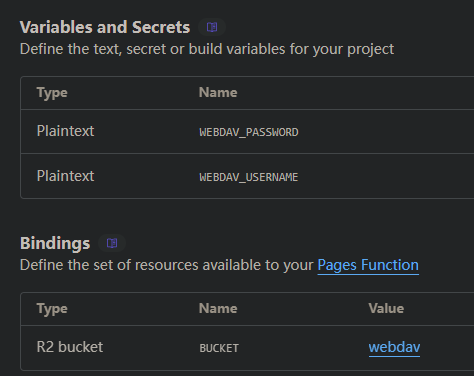

+++

date = '2025-05-02'
draft = false
title = 'Diary'

+++

老是会忘记自己的配置，以下做一些记录

## cloudflared

```shell
cloudflared install service 
cloudflared.exe tunnel run --token <上一步的token>
```

## jupyter-lab

```shell
jupyter-lab.exe
```

## copilot代理

最近在使用copilot的代理，但是遇到了一些问题， auto completion不起作用，显示和127.0.0.1:443的连接失败，无需多言，肯定是网络问题。

C+S+P 进入vscode设置，搜索proxy，设置http proxy 为 http://127.0.0.1:20112，也就是你的clash或者anyway的代理端口就行。

另外cherry studio 使用copilot的api貌似会触发风控，不太清除这是怎么实现的。

## 记录vscode的git bash 不能识别conda的问题

在vscode中使用git bash时，可能会遇到conda命令无法识别的问题。解决方法如下：
1. 打开vscode的settings.json文件, 设置"terminal.integrated.shellIntegration.enabled": false
2. 还要记得把默认shell设置成git bash

主要问题在于vscode的shell集成会覆盖默认的bash配置，导致conda命令无法识别。

## vscode-server 连接问题
首先，vscode从3月开始要求glibc>=2.28,我的centos7的glibc版本是2.17，连接不上了，解决方案如下：
https://github.com/MikeWang000000/vscode-server-centos7
thx 开源

## docker权限问题
vscode docker插件在centos7上使用时，可能会遇到权限问题，看不到container。
1. 新建用户组docker
2. 将当前用户加入docker组
```shell
sudo groupadd docker
sudo usermod -aG docker $USER
```

但是这时候重启vscode还是不行，需要服务器上重启vscode0-server
```shell
ps uxa | grep .vscode-server | awk '{print $2}' | xargs kill -9
```

## Clash ip段直连规则

```yaml
rules:
  - IP-CIDR,2.2.2.3/24,DIRECT
  # 从2.2.2.0-2.2.2.256 —> direct
```


---

25-06-17更新

## 一些build方法

Github上一些项目没有提供build教程，但是某个分支是给了action自动build release的。

我们需要做的就是手动执行这些release，某一些会直接打包到action workflow的artifacts，一些直接就发布release了，还需要注意，如果某平台build不成功，是可能会出现无法release的。

## NMD windows

通过MS账户创建的账户里面有个空格，直接anaconda识别不出来，真是蠢货windows，通过管理员安装此计算机就好了

fuck you ms

## 遇到一个git-bash的字符问题

问题如下

```
Exception in thread Thread-5 (_readerthread):
Traceback (most recent call last):
  File "C:\ProgramData\anaconda3\Lib\threading.py", line 1075, in _bootstrap_inn
er
    self.run()
  File "C:\ProgramData\anaconda3\Lib\threading.py", line 1012, in run
    self._target(*self._args, **self._kwargs)
  File "C:\ProgramData\anaconda3\Lib\subprocess.py", line 1599, in _readerthread
    buffer.append(fh.read())
                  ^^^^^^^^^
UnicodeDecodeError: 'gbk' codec can't decode byte 0xae in position 1714: illegal
 multibyte sequence
Unexpected cygpath error, fallback to manual path conversion
  AttributeError: 'NoneType' object has no attribute 'strip'
```

解决方案：

修改字体为GBK

```
vim ~/.minttyrc

BellType=0
Locale=C
Charset=GBK

```

主要是不能在环境变量里面引入中文字符，就会出现这个问题，vscode的默认配置不走.minttyrc

## 继续折腾conda

我们知道在使用git-bash的时候，直接conda是没有用的，要先使用conda init bash，对bash激活conda环境，但是这会导致bash启动的时候就自动进入base环境，所以我们要通过配置关闭「自动激活 base 环境」

```sh
conda config --set auto_activate_base false
```

这样就不会自动进入conda环境了，主要是通过

```
npm install -t yarn
```

会导致yarn被安装到conda虚拟环境里面，因此解决。

## code runner问题

遇到一个windows下的coder-runner问题

```
//初始配置
cd $dir && g++ -std=c++11 $fileName -o $fileNameWithoutExt && $dir$fileNameWithoutExt
//修改后配置
"cpp": "cd $dirWithoutTrailingSlash && g++ -std=c++11 $fileName -o $fileNameWithoutExt && ./$fileNameWithoutExt",
```


实际上是一个git-bash问题

git bash是模拟类 Unix shell，只能用正斜杠（/）；并且它不能识别 Windows 的 `C:\xxx\yyy.exe` 作为可执行打开命令。

或者在反斜杠前面再加一个反斜杠表示转义

## 关于我的cloudflare r2 webdav配置

> https://github.com/longern/FlareDrive



像这样设置就可以了

然后可能某些软件备份webdav会出现问题，比如cherry studio


最新版打开这个就可以了

## vllm 指定chat template

````markdown
你的错误信息如下：

```
openai.BadRequestError: Error code: 400 - {'object': 'error', 'message': 'As of transformers v4.44, default chat template is no longer allowed, so you must provide a chat template if the tokenizer does not define one. None', 'type': 'BadRequestError', 'param': None, 'code': 400}
```

这个报错的**核心信息**是：
> "As of transformers v4.44, default chat template is no longer allowed, so you must provide a chat template if the tokenizer does not define one."

---

# 原因分析

**vLLM** 新版本（配合 transformers >=4.44）现在**强制要求 tokenizer 有明确的 chat template**（即 SFT 或聊天模型的 prompt 格式定义）。如果你的模型分词器（tokenizer）没有这个 chat template（或者是 None），vllm 就会拒绝服务并报这个错。

常见于两个情况：

1. **你加载的模型 tokenizer._chat_template=None**，但 transformers 新版不再允许缺省。
2. 你用的是**自定义或不带聊天模版的模型权重**（如 base、未微调的 Llama、Qwen、Baichuan等）。

````

但是vllm现在还不支持ampere架构的gpu，所以报错

> https://github.com/vllm-project/vllm/issues/22265

```
docker run --runtime nvidia --gpus all \
	--name oss \
    -v ~/.cache/huggingface:/root/.cache/huggingface \
    -d \
    --restart=always \
    --env "HF_ENDPOINT=https://hf-mirror.com" \
    --env "VLLM_ATTENTION_BACKEND=TRITON_ATTN_VLLM_V1" \
    --env "TORCH_CUDA_ARCH_LIST=8.6" \
    -p 8001:8000 \
    --ipc=host \
    vllm/vllm-openai:gptoss \
    --model openai/gpt-oss-20b
```

```
docker run --runtime nvidia --gpus all \
	--name oss \
    -v /data/.cache/huggingface:/root/.cache/huggingface \
    -d \
    --restart=always \
    --env "HF_ENDPOINT=https://hf-mirror.com" \
    --env "VLLM_ATTENTION_BACKEND=TRITON_ATTN_VLLM_V1" \
    --env "TORCH_CUDA_ARCH_LIST=8.6" \
    -p 8001:8000 \
    --ipc=host \
    vllm/vllm-openai:gptoss \
    --model openai/gpt-oss-120b --tensor-parallel-size 2
```

```shell
docker run --network host -e http_proxy="http://192.168.103.201:7890" -e https_proxy="http://192.168.103.201:7890" -v  /home/sunyatao_B/Tagphoto/project2:/root/project2 -d --name ubuntu  -it ubuntu:noble-20250716 /bin/bash
```


```shell
curl https://ipinfo.io/ip
```


- tranformer报错如下

> ValueError: MXFP4 quantized models is only supported on GPUs with compute capability >= 9.0 (e.g H100, or B100)

## Vllm docker运行models--google--gemma-3n-E4B-it

1. docker pull
2. huggingface-cli download
3. ducker run

```
docker run --runtime nvidia --gpus all \
    -v ~/.cache/huggingface:/root/.cache/huggingface \
    -d \
    --restart=always \
    --env "HUGGING_FACE_HUB_TOKEN=" \
    --env "HF_ENDPOINT=https://hf-mirror.com" \
    -p 8001:8000 \
    --ipc=host \
    vllm/vllm-openai:latest \
    --model Qwen/Qwen3-Coder-30B-A3B-Instruct-FP8 --tensor-parallel-size 2
```

汗，不知道怎么把驱动搞坏了，只有重装，3.10的内核还不能装高了，只能535,然后装container-toolkit

https://docs.nvidia.com/datacenter/cloud-native/container-toolkit/latest/install-guide.html#with-dnf-rhel-centos-fedora-amazon-linux


## easyconnect

之前激活学校的专业win10，安装了easyconnect，但这个软件在系统安装了不安全的证书(Untrusted certificate)，删除sangfor的所有程序之后，对其卸载

```powershell
certmgr.msc
```


## cherry studio的知识库

一点小memo

首先搞明白嵌入和重排，我尝试过了基于两篇论文构建CS的知识库，通过以下设置

- doubao large 嵌入, 无重排，效果可以，文本描述足以检索到论文内容
- qwen 4b嵌入，无重排，效果可以，也可以通过文本检索
- qwen 4b嵌入，8b重排，非常烂，出现极其抽象的幻觉
- text-embedding-ada-002 嵌入，无重排，开始乱编文献名

一个简单的小实验，可能我的设置也有一点问题，附上，CS的全局记忆是很好的设计。

pdf文件是先本地处理，再通过文本发到api上的。

