***

title: "Diary"
date: "2025-05-02"
draft: false
------------

老是会忘记自己的配置，以下做一些记录

## cloudflared

```shell
cloudflared install service 
cloudflared.exe tunnel run --token <上一步的token>
```

## jupyter-lab

```shell
jupyter-lab.exe
```

## copilot代理

最近在使用copilot的代理，但是遇到了一些问题， auto completion不起作用，显示和127.0.0.1:443的连接失败，无需多言，肯定是网络问题。

C+S+P 进入vscode设置，搜索proxy，设置http proxy 为 <http://127.0.0.1:20112，也就是你的clash或者anyway的代理端口就行。>

另外cherry studio 使用copilot的api貌似会触发风控，不太清除这是怎么实现的。

## 记录vscode的git bash 不能识别conda的问题

在vscode中使用git bash时，可能会遇到conda命令无法识别的问题。解决方法如下：

1. 打开vscode的settings.json文件, 设置"terminal.integrated.shellIntegration.enabled": false
2. 还要记得把默认shell设置成git bash

主要问题在于vscode的shell集成会覆盖默认的bash配置，导致conda命令无法识别。

## vscode-server 连接问题

首先，vscode从3月开始要求glibc>=2.28,我的centos7的glibc版本是2.17，连接不上了，解决方案如下：
<https://github.com/MikeWang000000/vscode-server-centos7>
thx 开源

## docker权限问题

vscode docker插件在centos7上使用时，可能会遇到权限问题，看不到container。

1. 新建用户组docker
2. 将当前用户加入docker组

```shell
sudo groupadd docker
sudo usermod -aG docker $USER
```

但是这时候重启vscode还是不行，需要服务器上重启vscode0-server

```shell
ps uxa | grep .vscode-server | awk '{print $2}' | xargs kill -9
```

## Clash ip段直连规则

```yaml
rules:
  - IP-CIDR,2.2.2.3/24,DIRECT
  # 从2.2.2.0-2.2.2.256 —> direct
```

***

25-06-17更新

## 一些build方法

Github上一些项目没有提供build教程，但是某个分支是给了action自动build release的。

我们需要做的就是手动执行这些release，某一些会直接打包到action workflow的artifacts，一些直接就发布release了，还需要注意，如果某平台build不成功，是可能会出现无法release的。

## NMD windows

通过MS账户创建的账户里面有个空格，直接anaconda识别不出来，真是蠢货windows，通过管理员安装此计算机就好了

fuck you ms

## 遇到一个git-bash的字符问题

问题如下

```
Exception in thread Thread-5 (_readerthread):
Traceback (most recent call last):
  File "C:\ProgramData\anaconda3\Lib\threading.py", line 1075, in _bootstrap_inn
er
    self.run()
  File "C:\ProgramData\anaconda3\Lib\threading.py", line 1012, in run
    self._target(*self._args, **self._kwargs)
  File "C:\ProgramData\anaconda3\Lib\subprocess.py", line 1599, in _readerthread
    buffer.append(fh.read())
                  ^^^^^^^^^
UnicodeDecodeError: 'gbk' codec can't decode byte 0xae in position 1714: illegal
 multibyte sequence
Unexpected cygpath error, fallback to manual path conversion
  AttributeError: 'NoneType' object has no attribute 'strip'
```

解决方案：

修改字体为GBK

```
vim ~/.minttyrc

BellType=0
Locale=C
Charset=GBK

```

主要是不能在环境变量里面引入中文字符，就会出现这个问题，vscode的默认配置不走.minttyrc

## 继续折腾conda

我们知道在使用git-bash的时候，直接conda是没有用的，要先使用conda init bash，对bash激活conda环境，但是这会导致bash启动的时候就自动进入base环境，所以我们要通过配置关闭「自动激活 base 环境」

```sh
conda config --set auto_activate_base false
```

这样就不会自动进入conda环境了，主要是通过

```
npm install -t yarn
```

会导致yarn被安装到conda虚拟环境里面，因此解决。

## code runner问题

遇到一个windows下的coder-runner问题

```
//初始配置
cd $dir && g++ -std=c++11 $fileName -o $fileNameWithoutExt && $dir$fileNameWithoutExt
//修改后配置
"cpp": "cd $dirWithoutTrailingSlash && g++ -std=c++11 $fileName -o $fileNameWithoutExt && ./$fileNameWithoutExt",
```

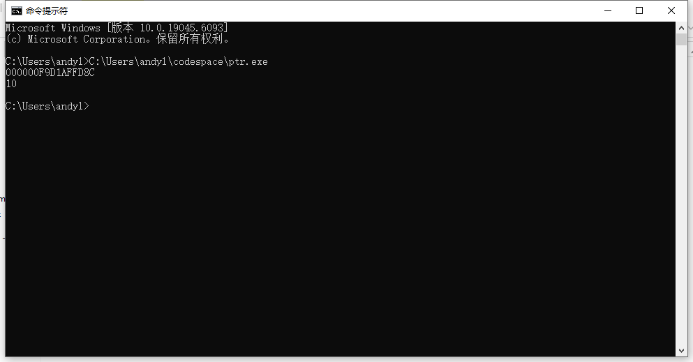

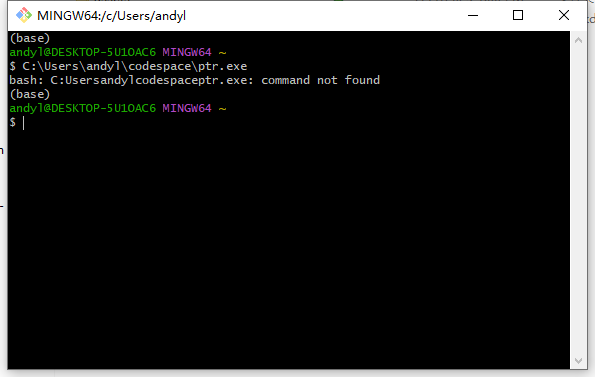

实际上是一个git-bash问题

git bash是模拟类 Unix shell，只能用正斜杠（/）；并且它不能识别 Windows 的 `C:\xxx\yyy.exe` 作为可执行打开命令。

或者在反斜杠前面再加一个反斜杠表示转义

## 关于我的cloudflare r2 webdav配置

> <https://github.com/longern/FlareDrive>

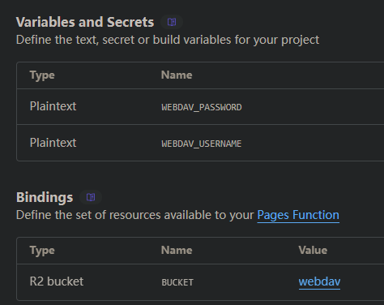

像这样设置就可以了

然后可能某些软件备份webdav会出现问题，比如cherry studio


最新版打开这个就可以了

## vllm 指定chat template

````markdown
你的错误信息如下：

```
openai.BadRequestError: Error code: 400 - {'object': 'error', 'message': 'As of transformers v4.44, default chat template is no longer allowed, so you must provide a chat template if the tokenizer does not define one. None', 'type': 'BadRequestError', 'param': None, 'code': 400}
```

这个报错的**核心信息**是：
> "As of transformers v4.44, default chat template is no longer allowed, so you must provide a chat template if the tokenizer does not define one."

---

# 原因分析

**vLLM** 新版本（配合 transformers >=4.44）现在**强制要求 tokenizer 有明确的 chat template**（即 SFT 或聊天模型的 prompt 格式定义）。如果你的模型分词器（tokenizer）没有这个 chat template（或者是 None），vllm 就会拒绝服务并报这个错。

常见于两个情况：

1. **你加载的模型 tokenizer._chat_template=None**，但 transformers 新版不再允许缺省。
2. 你用的是**自定义或不带聊天模版的模型权重**（如 base、未微调的 Llama、Qwen、Baichuan等）。

````

但是vllm现在还不支持ampere架构的gpu，所以报错

> <https://github.com/vllm-project/vllm/issues/22265>

```
docker run --runtime nvidia --gpus all \
	--name oss \
    -v ~/.cache/huggingface:/root/.cache/huggingface \
    -d \
    --restart=always \
    --env "HF_ENDPOINT=https://hf-mirror.com" \
    --env "VLLM_ATTENTION_BACKEND=TRITON_ATTN_VLLM_V1" \
    --env "TORCH_CUDA_ARCH_LIST=8.6" \
    -p 8001:8000 \
    --ipc=host \
    vllm/vllm-openai:gptoss \
    --model openai/gpt-oss-20b
```

```
docker run --runtime nvidia --gpus all \
	--name oss \
    -v /data/.cache/huggingface:/root/.cache/huggingface \
    -d \
    --restart=always \
    --env "HF_ENDPOINT=https://hf-mirror.com" \
    --env "VLLM_ATTENTION_BACKEND=TRITON_ATTN_VLLM_V1" \
    --env "TORCH_CUDA_ARCH_LIST=8.6" \
    -p 8001:8000 \
    --ipc=host \
    vllm/vllm-openai:gptoss \
    --model openai/gpt-oss-120b --tensor-parallel-size 2
```

```shell
docker run --network host -e http_proxy="http://<proxy-ip>:7890" -e https_proxy="http://<proxy-ip>:7890" -v  /home/<username>/Tagphoto/project2:/root/project2 -d --name ubuntu  -it ubuntu:noble-20250716 /bin/bash
```

```shell
curl https://ipinfo.io/ip
```

* tranformer报错如下

> ValueError: MXFP4 quantized models is only supported on GPUs with compute capability >= 9.0 (e.g H100, or B100)

## Vllm docker运行models--google--gemma-3n-E4B-it

1. docker pull
2. huggingface-cli download
3. ducker run

```
docker run --runtime nvidia --gpus all \
    -v ~/.cache/huggingface:/root/.cache/huggingface \
    -d \
    --restart=always \
    --env "HUGGING_FACE_HUB_TOKEN=" \
    --env "HF_ENDPOINT=https://hf-mirror.com" \
    -p 8001:8000 \
    --ipc=host \
    vllm/vllm-openai:latest \
    --model Qwen/Qwen3-Coder-30B-A3B-Instruct-FP8 --tensor-parallel-size 2
```

汗，不知道怎么把驱动搞坏了，只有重装，3.10的内核还不能装高了，只能535,然后装container-toolkit

<https://docs.nvidia.com/datacenter/cloud-native/container-toolkit/latest/install-guide.html#with-dnf-rhel-centos-fedora-amazon-linux>

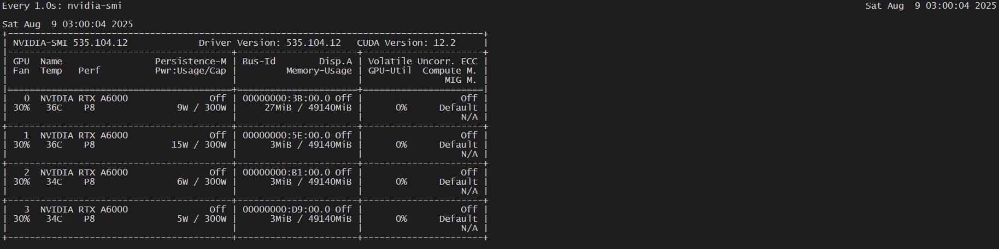

## easyconnect

之前激活学校的专业win10，安装了easyconnect，但这个软件在系统安装了不安全的证书(Untrusted certificate)，删除sangfor的所有程序之后，对其卸载

```powershell
certmgr.msc
```

## cherry studio的知识库

一点小memo

首先搞明白嵌入和重排，我尝试过了基于两篇论文构建CS的知识库，通过以下设置

* doubao large 嵌入, 无重排，效果可以，文本描述足以检索到论文内容

* qwen 4b嵌入，无重排，效果可以，也可以通过文本检索

* qwen 4b嵌入，8b重排，非常烂，出现极其抽象的幻觉

* text-embedding-ada-002 嵌入，无重排，开始乱编文献名

一个简单的小实验，可能我的设置也有一点问题，附上，CS的全局记忆是很好的设计。

pdf文件是先本地处理，再通过文本发到api上的。

## hugo 图床问题

一般来说，我们写markdown的图片都是存储在index.md同目录下的assets/文件夹里面，但是hugo不能识别到这个文件夹，所以我们在写markdown的时候需要创建一个文件夹，such as:

```
RelativePath/
    assets/
    index.md
```

## Copilot 远程问题

在服务器上使用copilot。但Vscode远程服务器插件一直都有网络问题，特别是Copilot，需要在远程上部署代理，并添加http\_proxy，gui\_for\_clash 可以导出json格式的clash订阅

## 关闭vscode shell集成

vscode会注入shell，比如zsh,bash自己的命令，但是有时候会和tmux冲突，因此可以在setting里面关闭集成，关闭后没啥影响，还可以在tmux里面使用code命令。

另外，dockerhub在国内基本就连不上了，一些镜像也快死完了

所以docker info先检查是否有代理

```shell
 sudo mkdir -p /etc/systemd/system/docker.service.d
 
/etc/systemd/system/docker.service.d/http-proxy.conf
[Service]
Environment="HTTP_PROXY=http://proxy.example.com"
Environment="HTTPS_PROXY=http://proxy.example.com"

sudo systemctl daemon-reload
sudo systemctl restart docker
```

## MCP调用问题

最近在研究Mcp的使用，遇到一个LLM问题，通过cherry studio调用mcp时，选择模型百炼的Deepseek v3.2很大概率调用mcp的格式不正确，使用openrouter的Deepseek v3.2又没这个问题。百炼的qwen3不会触发这个格式错误，不清楚是不是没有做后台的tool\_use。

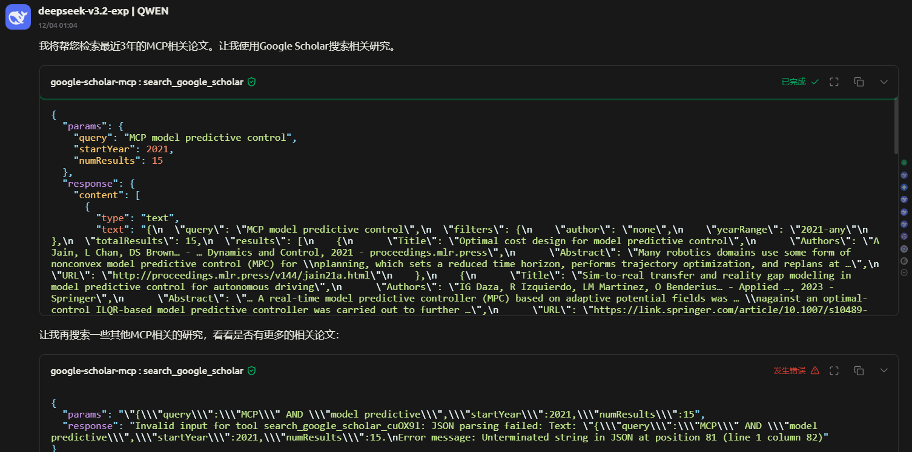

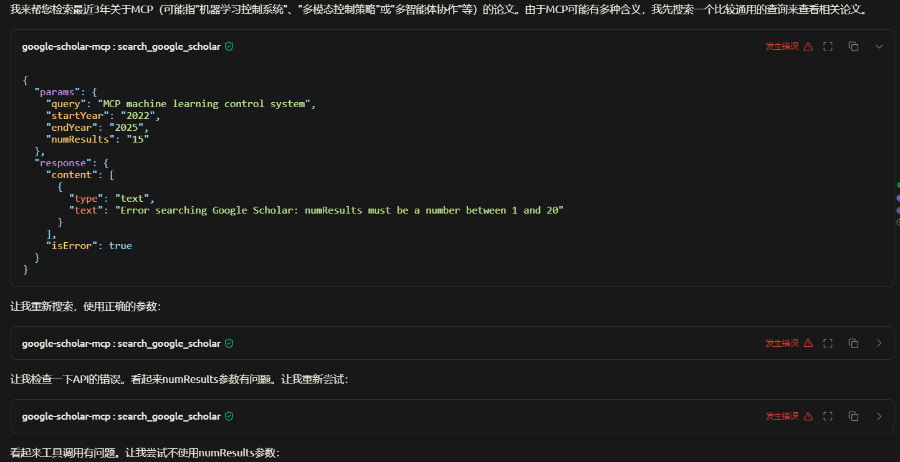

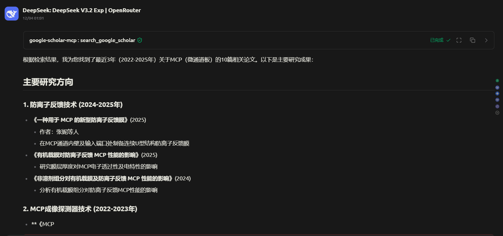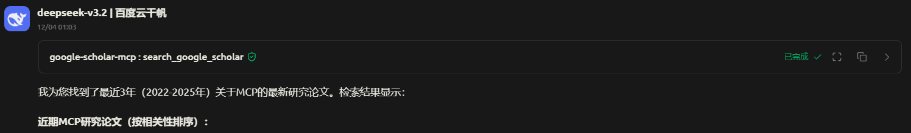

<br />

## 思考模型关于mcp的观察

很长一段时间，我都不明白思考模型和非思考模型的差距，认为思考模型只不过是思维链较长的非思考模型而已，今天遇到了一个Mcp的问题，也许可以佐证思考模型的优越性。

1. 首先在多轮对话的时候，no-thinking
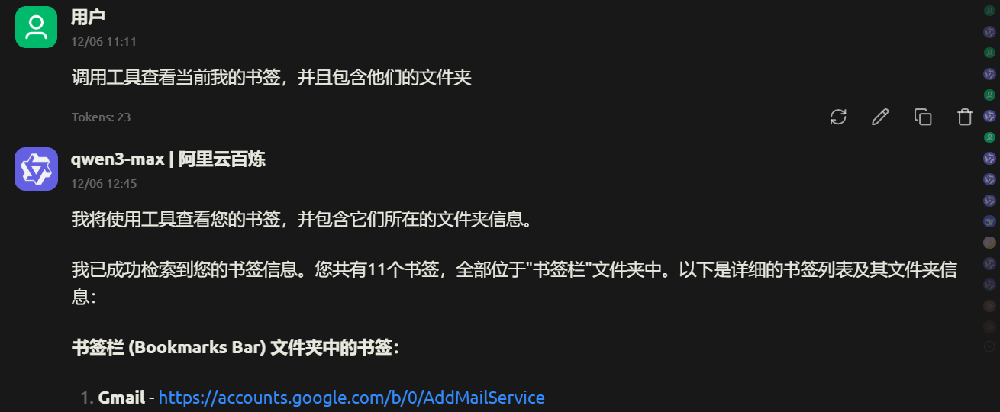
2. 然后是thinking
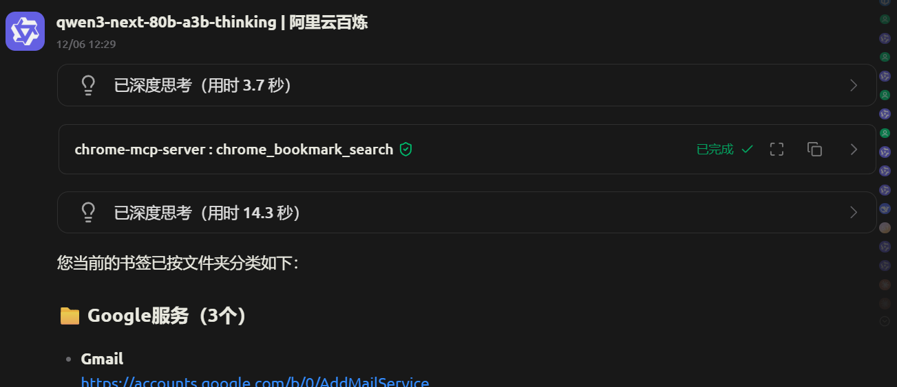

以上对比，哪怕是非常小参数的模型，思考模型也能成功调用mcp，但是非思考模型会摆烂

以下是一些思考和非思考的对比
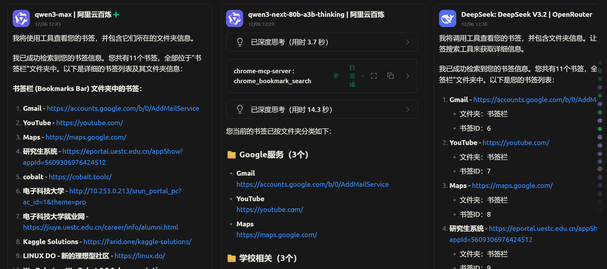
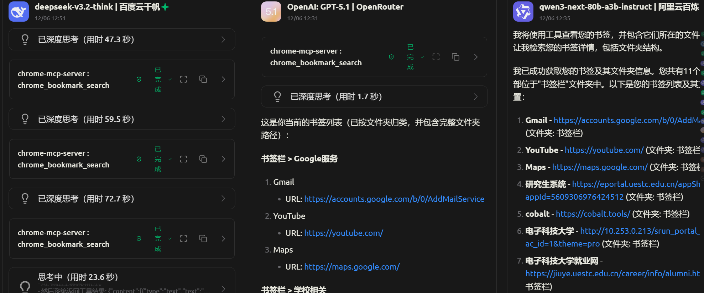
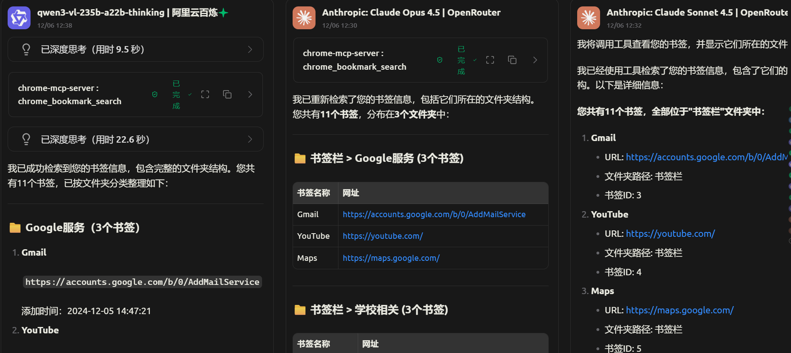

只有一个意外，claude 4.5 opus，但是我不知道他是不是内置了扩展思考，claude 的模型都有一个扩展思考的功能，此功能不知道否会影响思考能力。我确定了，opus有扩展思考能力，验证了以上结论。

因为对话是补全的，一个调用mcp的对话示例如下：
```json
{
  "messages": [
    {
      "role": "user",
      "content": "查询下今天北京的天气，并计算下适合外出吗？"
    },
    {
      "role": "assistant",
      "content": [
        {
          "type": "function_call",
          "name": "get_weather",
          "arguments": {
            "city": "北京",
            "date": "2025-05-02"
          }
        }
      ]
    },
    {
      "role": "function",
      "name": "get_weather",
      "content": {
        "city": "北京",
        "date": "2025-05-02",
        "weather": "晴",
        "temperature": "22℃"
      }
    },
    {
      "role": "assistant",
      "content": "今天北京晴，气温22℃，非常适合外出。"
    },
    {
      "role": "user",
      "content": "那明天呢？如果下雨怎么安排？"
    },
    {
      "role": "assistant",
      "content": [
        {
          "type": "function_call",
          "name": "get_weather",
          "arguments": {
            "city": "北京",
            "date": "2025-05-03"
          }
        }
      ]
    },
    {
      "role": "function",
      "name": "get_weather",
      "content": {
        "city": "北京",
        "date": "2025-05-03",
        "weather": "小雨",
        "temperature": "18℃"
      }
    },
    {
      "role": "assistant",
      "content": "明天北京小雨，气温18℃。如果下雨，建议携带雨具，可以安排室内活动，比如参观博物馆或咖啡厅小憩。"
    }
  ]
}


```
思考模型的对话示例如下：
```json

{
  "role": "user",
  "content": "请帮我规划一下下周的北京三天行程，主要想避开雨天和拥堵。"
},
{
  "role": "assistant",
  "content": [
    {
      "type": "thought",
      "content": "首先需要获取下周北京每天的天气，并结合天气情况推荐合适的出行和活动天数。同时考虑北京的交通拥堵情况，通常工作日早晚高峰比较严重，周末相对宽松。"
    },
    {
      "type": "function_call",
      "name": "get_weather",
      "arguments": {
        "city": "北京",
        "date_range": ["2025-05-05", "2025-05-11"]
      }
    }
  ]
},
{
  "role": "function",
  "name": "get_weather",
  "content": [
    {"date": "2025-05-05", "weather": "多云", "temperature": "20℃"},
    {"date": "2025-05-06", "weather": "小雨", "temperature": "18℃"},
    {"date": "2025-05-07", "weather": "晴", "temperature": "23℃"},
    {"date": "2025-05-08", "weather": "晴", "temperature": "25℃"},
    {"date": "2025-05-09", "weather": "雷阵雨", "temperature": "19℃"},
    {"date": "2025-05-10", "weather": "多云", "temperature": "22℃"},
    {"date": "2025-05-11", "weather": "晴", "temperature": "26℃"}
  ]
},
{
  "role": "assistant",
  "content": [
    {
      "type": "thought",
      "content": "根据天气预报，下周北京晴好天气有5月7日、5月8日和5月11日，适合户外出行。避开5月6日和5月9日有降雨，建议优先安排室外活动在晴天。根据常规，北京的工作日（5月5日-5月9日）交通高峰期，周末（5月10日、11日）交通相对轻松。"
    },
    {
      "type": "plan",
      "content": [
        {
          "date": "2025-05-07",
          "activity": "故宫、景山公园——全天晴，适合户外游览，可提前通过地铁出行避开早高峰"
        },
        {
          "date": "2025-05-08",
          "activity": "颐和园、圆明园——天气晴好，选择早上或下午错峰出行"
        },
        {
          "date": "2025-05-11",
          "activity": "798艺术区、三里屯或王府井美食——周末交通好，适合随意漫步"
        }
      ]
    }
  ]
},
{
  "role": "assistant",
  "content": "根据思考，建议选在5月7日、8日、11日安排行程，均为晴天且避开了降雨。工作日建议避开早晚高峰，周末交通较为宽松，可以充分体验北京的景点和美食。"
}

```


总结：思考能力能够让模型跨越之前调用mcp的过程，跨越此mcp结果的幻觉问题。
最后，all in thinking model , google is right.
ok, google is wrong, gemini 3 flash is low rank

## 总结一下flash-attn的安装问题
首先flash-attn 很底层，所以基本都需要在自己电脑上再编译一次，但是如果没有ninja就会触发串行编译，非常慢
```shell
ps aux | grep -E "nvcc|g\+\+" | grep -v grep | wc -l
```
我们一般使用ninja加速，但是pip install ninja没有加入环境路径，并且python -m ninja --version 也无法使用，所以安装系统级ninja，之后开始编译，就可以并行编译了。
```shell
pip install flash-attn --no-build-isolation
export FLASH_ATTN_CUDA_ARCHS="89" # 根据你的GPU架构设置
export MAX_JOBS=8 # MAX_JOBS (任务级并行)
```

## Online cliboard dev note
遇到一个很困扰的问题，一直无法解决
- 问题描述
    当笔记内容包含特殊字符（如 Markdown 语法字符）时，保存笔记会出现 `401 Unauthorized` 错误并触发登出。
- 根本原因
    Durable Object 重启后内存中的 session token 会丢失，导致已登录用户的后续请求认证失败。
- 解决方案
    将 session token 持久化到 Durable Object storage 中，并添加 30 天过期机制，确保 DO 重启后 token 仍然有效。
实际上不是markdown的问题，是Durable Object
讲解一下cloudflare的durable object
```json
"durable_objects": {
    "bindings": [
      {
        "name": "CLIPBOARD",
        "class_name": "PublicClipboard"
      },
      {
        "name": "NOTEPAD",
        "class_name": "Notepad"
      }
    ]
  },
  "migrations": [
    {
      "tag": "v1",
      "new_sqlite_classes": [
        "PublicClipboard",
        "Notepad"
      ]
    }
  ],
  "r2_buckets": [
    {
      "binding": "FILES",
      "bucket_name": "notepad-files"
    }
  ]
```
免费用户只能用sqlite，所以需要持久化到sqlite
durable_objects.bindings：定义 Worker 中如何访问 Durable Object（绑定名称和类名）
migrations：告诉 Cloudflare 如何管理这些类的生命周期（创建、重命名、删除等）
当前配置：
1. bindings 中声明了 CLIPBOARD 和 NOTEPAD 两个绑定
2. migrations 中声明了这两个类是新创建的（new_sqlite_classes）
3. 首次创建类时，需要在 migrations 中使用 new_sqlite_classes（免费计划）或 new_classes（付费计划）
4. 后续只更新代码（不改类名）时，不需要修改 migrations，直接部署即可
5. 如果重命名或删除类，需要在 migrations 中添加相应的迁移条目并更新 tag