## 移动最小乘法（MLS）

- 主动贝叶斯推断
信息增益采样、最大化后验提升、主动控制资源采集数据等

**变分贝叶斯推断**

- 贝叶斯神经网络
- 高斯过程
- 移动最小二乘法

1. 生成模型
2. 使用协方差（半变异）作为数据点之间的相关关系
3. 先验的信念会使得任何采样函数都经过采样点

# ToDo

- [x] 多目标优化

- pareto frontiers
- episilon

- [x] 单纯形法 + 梯度

- lp问题

- [ ] NPs

- 非常奇怪的输入，字符串？图？

- 为什么我实现不了像单个函数接近那样的性能

## 跑程序

U_complexmethod_visvr_example3.m

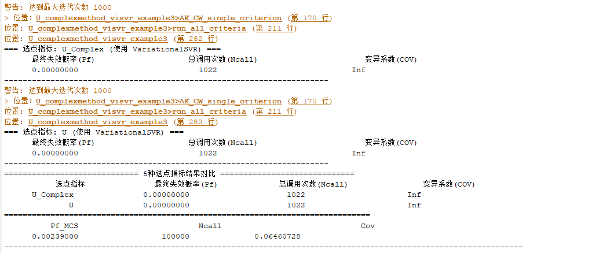

example6

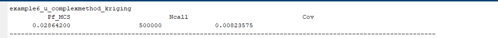

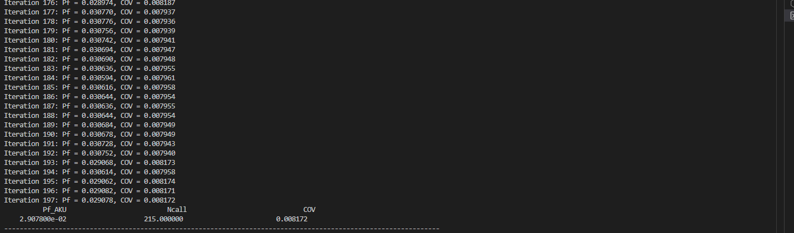

example5


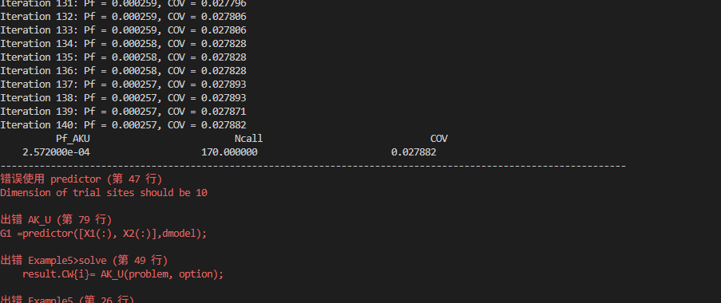


- 貌似是代码的问题，明天来解决

这里应该是example6 kriging u

失效概率已经收敛了，但是没有自动停止


这里是example5 kriging u

明天好好看一下AK_U的代码，是不是收敛条件没写好

- 并且思考一下为什么visvr效果差，不应该效果差这么多啊。

- 或者直接使用SVR? 不考虑不确定性的实现了

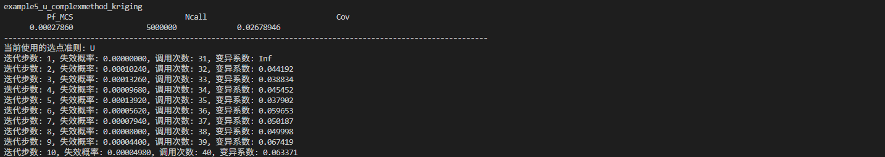

这个例子也是跑了600步完全不收敛，找到问题了

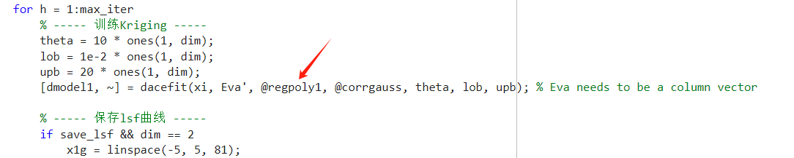

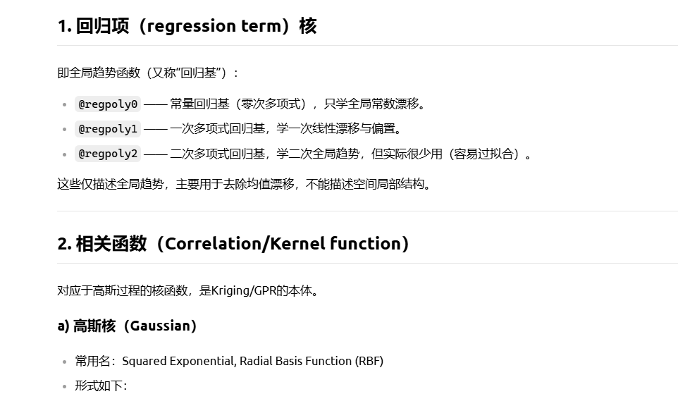

自己写的kriging调用错误，这里要使用regpoly1，错误的设置成了regpoly0

- 对复合形法有两种理解，

- [ ] 一种直接把u作为待优化的函数
- [ ] 一种是把已选点作为训练点来寻找下一个点

```matlab
function result= AK_U(problem, option)

variable_table = problem.variable_table;
performanceFunc = problem.performanceFunc;
dim= size(variable_table,1);
N0=3*dim;
N_tianchong=option.Nt;
N_sim=option.Ns;

Mu=zeros(1,dim);
Sigma=ones(1,dim);
Samnum=100;
Subsam=N_sim./Samnum;
for   rv_id = 1:dim
       X_mcs(:,rv_id) = ...
              GenerateRV( ...
                                   variable_table{rv_id,1}, ...
                                   variable_table{rv_id,2}, ...
                                   variable_table{rv_id,3}, ...
                                   N_sim);
end

for i=1:dim
    % Data(:,i)=unifrnd(Mu(i)-3.*Sigma(i),Mu(i)+3.*Sigma(i),N0,1);
    Data_tiankong(:,i)=unifrnd(Mu(i)-3.*Sigma(i),Mu(i)+3.*Sigma(i),N_tianchong,1);
end
% load("xi.mat")
Data=6.*UniformPoint(N0,dim,'Latin')-3;
xi= NatafTransformation(Data, variable_table, -1 );
x_un= NatafTransformation(Data_tiankong, variable_table, -1 );
for i=1:N0
     Eva(i)=performanceFunc(xi(i,:));
end
PF=[];COV=[];Ncall=[];
GKA1 = zeros(Subsam, Samnum); % 添加此行初始化
for h=1:1000
        theta=10*ones(1,dim); lob=1e-2*ones(1,dim); upb=20*ones(1,dim);
        [dmodel, ~]=dacefit(xi,Eva,@regpoly1,@corrgauss,theta,lob,upb);
        GK=@(t)predictor(t,dmodel);

        [yC,or]=predictor(x_un,dmodel);
        UC=abs((0-yC)./sqrt(or));
   if min(UC)>2
       break
   end
   [a,b]=find(UC==min(UC));
   CCC=x_un(a,:);
  x_un(a,:)=[];
  GCe=performanceFunc(CCC);   
  xi=[xi;CCC];
  Eva=[Eva,GCe];
  for j=1:Samnum
        GKA1(:,j)=GK(X_mcs(((j-1)*Subsam+1):(j*Subsam),:));
  end
   GKA=GKA1(:);
   [aa bb]=find(GKA<=0);
   PF(h)=length(aa)./length(GKA);
   COV(h)=sqrt((1-PF(h))./((N_sim-1).*PF(h)));
   % 打印当前迭代次数和结果
   fprintf('Iteration %d: Pf = %.6f, COV = %.6f\n', h, PF(end), COV(end));
end
Ncall=N0+h-1;
fprintf('%16s%32s%32s\n','Pf_AKU', 'Ncall ','COV')
fprintf('%16d%30f%32f\n', PF(end), Ncall, COV(end));
disp('----------------------------------------------------------------------------------------------------------------')
result.Pf=PF
result.COV=COV;
result.Ncall=Ncall
result.LSF=Eva(N0+1:end)
end
```

对代码做修改，计算候选样本点的[yC,or]，再通过[yC,or]计算各个样本点的目标这是一个多优化问题，求解这个问题使用gamultiobj，然后CCC是结果上的随机一个点，

```
function UC = foo_U(yC, or)
% 标准化均值距离函数（常用于主动学习）
% yC: 代理模型输出均值向量
% or: 代理模型输出方差向量
    UC = abs(-yC ./ sqrt(or));  % 对应 abs((0 - yC) ./ sqrt(or))
end

function S = foo_EFF(yC, or)
% EFF学习函数，衡量点靠近极限状态（0）区域的“可行性期望”
    epsEFF = 2 .* sqrt(or);
    stdv = sqrt(or);

    norm1 = normcdf(-yC ./ stdv);
    norm2 = normcdf((-epsEFF - yC) ./ stdv);
    norm3 = normcdf((epsEFF - yC) ./ stdv);
    
    npdf1 = normpdf(-yC ./ stdv);
    npdf2 = normpdf((-epsEFF - yC) ./ stdv);
    npdf3 = normpdf((epsEFF - yC) ./ stdv);
    
    EFF = yC .* (2 .* norm1 - norm2 - norm3) ...
        - stdv .* (2 .* npdf1 - npdf2 - npdf3) ...
        + epsEFF .* (norm3 - norm2);
    
    % 排序+指数加权，可选
    [~, sortedIndices] = sort(EFF, 'descend');
    rankIndex = zeros(size(EFF));
    for i = 1:length(EFF)
        rankIndex(i) = find(sortedIndices == i, 1);
    end
    S = exp((1 - rankIndex) / sqrt(length(EFF)));
end

function S = foo_HH(yC, or)
% HH学习函数，结构复杂，融合了概率区间和密度的量
    stdv = sqrt(or);
    tmp1 = log(sqrt(2 * pi) * stdv + 1 / 2);
    norm1 = normcdf((2 * stdv - yC) ./ stdv);
    norm2 = normcdf((-2 * stdv - yC) ./ stdv);

    pdf1 = normpdf((2 * stdv - yC) ./ stdv);
    pdf2 = normpdf((-2 * stdv - yC) ./ stdv);

    part1 = tmp1 .* (norm1 - norm2);
    part2 = (2 * stdv - yC) ./ 2 .* pdf1 + (2 * stdv + yC) ./ 2 .* pdf2;
    HH = abs(part1 - part2);

    % 排序+指数加权，可选
    [~, sortedIndices] = sort(HH, 'descend');
    rankIndex = zeros(size(HH));
    for i = 1:length(HH)
        rankIndex(i) = find(sortedIndices == i, 1);
    end
    S = exp((1 - rankIndex) / sqrt(length(HH)));
end

```

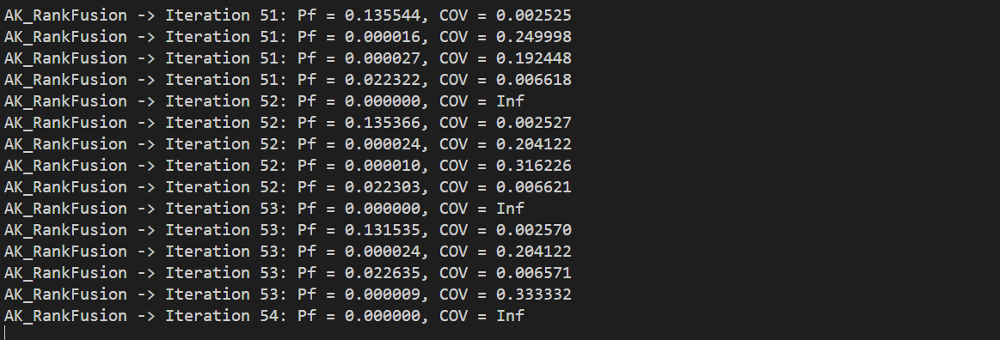

转化为多优化问题后来做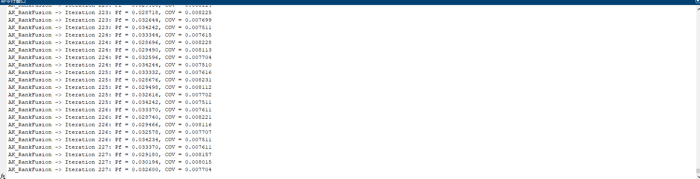

也是根本保证不了收敛

是不是种群不够，没找到最优帕累托点

```
//没写终止条件，但是效果不太好
function result= AK_RankFusion(problem, option)

variable_table = problem.variable_table;
performanceFunc = problem.performanceFunc;
dim= size(variable_table,1);
N0=3*dim;
N_tianchong=option.Nt;
N_sim=option.Ns;

Mu=zeros(1,dim);
Sigma=ones(1,dim);
Samnum=100;
Subsam=N_sim./Samnum;

% 生成蒙特卡罗样本
for rv_id = 1:dim
    X_mcs(:,rv_id) = GenerateRV( ...
        variable_table{rv_id,1}, ...
        variable_table{rv_id,2}, ...
        variable_table{rv_id,3}, ...
        N_sim);
end

% 生成候选点池
for i=1:dim
    Data_tiankong(:,i)=unifrnd(Mu(i)-3.*Sigma(i),Mu(i)+3.*Sigma(i),N_tianchong,1);
end

% 初始样本点
Data=6.*UniformPoint(N0,dim,'Latin')-3;
xi= NatafTransformation(Data, variable_table, -1 );
x_un= NatafTransformation(Data_tiankong, variable_table, -1 );

% 初始函数评估
Eva = zeros(1,N0);
for i=1:N0
    Eva(i)=performanceFunc(xi(i,:));
end

PF=[];COV=[];Ncall=[];
GKA1 = zeros(Subsam, Samnum); 

for h=1:1000
    theta=10*ones(1,dim); lob=1e-2*ones(1,dim); upb=20*ones(1,dim);
    [dmodel, ~]=dacefit(xi,Eva,@regpoly1,@corrgauss,theta,lob,upb);
    
    % 多目标优化设置
    options = optimoptions('gamultiobj', ...
        'PopulationSize', 50, ...
        'MaxGenerations', 100, ...
        'Display', 'off', ...
        'UseParallel', false);
    
    % 根据变量表设置真实的物理边界
    lb = zeros(1, dim);
    ub = zeros(1, dim);
    for i = 1:dim
        dist_type = variable_table{i,1};  % 分布类型
        param1 = variable_table{i,2};     % 第一个参数
        param2 = variable_table{i,3};     % 第二个参数
        
        switch lower(dist_type)
            case 'normal'  % 正态分布
                % param1=均值μ, param2=标准差σ
                mu = param1;
                sigma = param2;
                lb(i) = mu - 4*sigma;  % μ-4σ (99.99%覆盖率)
                ub(i) = mu + 4*sigma;  % μ+4σ
                
            case 'lognormal'  % 对数正态分布
                % param1=μ, param2=σ (对数空间的参数)
                mu_log = param1;
                sigma_log = param2;
                % 使用分位数方法
                lb(i) = exp(mu_log - 4*sigma_log);  % 近似下界
                ub(i) = exp(mu_log + 4*sigma_log);  % 近似上界
                
            case 'uniform'  % 均匀分布
                % param1=下界, param2=上界
                lb(i) = param1;
                ub(i) = param2;
                
            case 'exponential'  % 指数分布
                % param1=λ (率参数)
                lambda = param1;
                lb(i) = 0;  % 指数分布下界为0
                ub(i) = -log(0.0001)/lambda;  % 99.99%分位数
                
            case 'gamma'  % 伽马分布
                % param1=shape(k), param2=scale(θ)
                k = param1;
                theta = param2;
                lb(i) = 0;  % 伽马分布下界为0
                ub(i) = k*theta + 4*sqrt(k)*theta;  % 近似上界
                
            case 'beta'  % 贝塔分布
                % param1=α, param2=β
                lb(i) = 0;  % 贝塔分布范围[0,1]
                ub(i) = 1;
                
            otherwise  % 未知分布类型，使用默认值
                warning('未识别的分布类型: %s，使用默认范围[-4,4]', dist_type);
                lb(i) = -4;
                ub(i) = 4;
        end
    end
    % 安全检查：确保边界合理
    for i = 1:dim
        if lb(i) >= ub(i)
            warning('变量%d的边界设置有问题，使用默认值', i);
            lb(i) = -4;
            ub(i) = 4;
        end
        
        if ~isfinite(lb(i)) || ~isfinite(ub(i))
            warning('变量%d的边界包含无穷值，使用默认值', i);
            lb(i) = -4;
            ub(i) = 4;
        end
    end
    
    % 定义多目标函数
    objfun = @(x) multiObjectiveFunction(x, dmodel);
    
    % 运行多目标优化
    try
        [pareto_front, ~] = gamultiobj(objfun, dim, [], [], [], [], lb, ub, [], options);
        
        % 从帕累托前沿选择点
        if size(pareto_front, 1) > 1
            rand_idx = randi(size(pareto_front, 1));
            CCC = pareto_front(rand_idx, :);
        else
            CCC = pareto_front;
        end
        
        % 检查结果合理性
        if isempty(CCC) || any(isnan(CCC)) || any(isinf(CCC))
            error('多目标优化结果无效');
        end
        
        % 从候选点中移除最接近的点
        distances = sum((x_un - CCC).^2, 2);
        [~, closest_idx] = min(distances);
        x_un(closest_idx, :) = [];
        
    catch ME
        fprintf('多目标优化出错：%s，回退到原始EFF方法\n', ME.message);
        
        % 回退到EFF方法
        [yC,or]=predictor(x_un,dmodel);
        safe_or = max(real(or), 1e-12);  % 数值安全处理
        epsEFF = 2 .* sqrt(safe_or);
        stdv = sqrt(safe_or);
        
        EFF = yC .* (2 .* normcdf(-yC ./ stdv) ...
                    - normcdf((-epsEFF - yC) ./ stdv) ...
                    - normcdf((epsEFF - yC) ./ stdv)) ...
            - stdv .* (2 .* normpdf(-yC ./ stdv) ...
                    - normpdf((-epsEFF - yC) ./ stdv) ...
                    - normpdf((epsEFF - yC) ./ stdv)) ...
            + epsEFF .* (normcdf((epsEFF - yC) ./ stdv) ...
                    - normcdf((-epsEFF - yC) ./ stdv));
        
        if max(EFF) < 0.001
            break
        end
        [~, best_idx] = max(EFF);
        CCC = x_un(best_idx, :);
        x_un(best_idx, :) = [];
    end
    
    % 检查收敛条件
    if isempty(x_un)
        fprintf('候选点集合已空，停止迭代\n');
        break
    end
    
    % 评估新点并更新模型
    GCe = performanceFunc(CCC);   
    xi = [xi; CCC];
    Eva = [Eva, GCe];
    
    % 计算失效概率
    for j=1:Samnum
        GKA1(:,j)=predictor(X_mcs(((j-1)*Subsam+1):(j*Subsam),:),dmodel);
    end
    GKA=GKA1(:);
    [aa, ~]=find(GKA<=0);
    PF(h)=length(aa)./length(GKA);
    
    if PF(h) > 0
        COV(h)=sqrt((1-PF(h))./((N_sim-1).*PF(h)));
    else
        COV(h) = Inf;
    end
    
    fprintf('AK_RankFusion -> Iteration %d: Pf = %.6f, COV = %.6f\n', h, PF(h), COV(h));
end

Ncall=N0+h-1;
fprintf('%16s%32s%32s\n','Pf_AKU', 'Ncall ','COV')
fprintf('%16.6f%30d%32.6f\n', PF(end), Ncall, COV(end));
disp('----------------------------------------------------------------------------------------------------------------')

result.Pf=PF;
result.COV=COV;
result.Ncall=Ncall;
result.LSF=Eva(N0+1:end);
end

% 修正的多目标函数
function objectives = multiObjectiveFunction(X, dmodel)
    % X 可能是矩阵 (n_points × dim)
    if size(X,1) == 1
        % 单点情况
        [yC, or] = predictor(X, dmodel);
        safe_or = max(real(or), 1e-12);
        
        try
            obj1 = foo_U(yC, safe_or);
            obj2 = -foo_EFF(yC, safe_or);
            obj3 = -foo_HH(yC, safe_or);
            
            objectives = [obj1, obj2, obj3];
            
            % 安全检查
            if any(~isfinite(objectives)) || any(~isreal(objectives))
                objectives = [1e6, 1e6, 1e6];
            end
        catch
            objectives = [1e6, 1e6, 1e6];
        end
    else
        % 多点情况
        n_points = size(X,1);
        objectives = zeros(n_points, 3);
        
        for i = 1:n_points
            [yC, or] = predictor(X(i,:), dmodel);
            safe_or = max(real(or), 1e-12);
            
            try
                obj1 = foo_U(yC, safe_or);
                obj2 = -foo_EFF(yC, safe_or);
                obj3 = -foo_HH(yC, safe_or);
                
                temp_obj = [obj1, obj2, obj3];
                
                if any(~isfinite(temp_obj)) || any(~isreal(temp_obj))
                    temp_obj = [1e6, 1e6, 1e6];
                end
                
                objectives(i,:) = temp_obj;
            catch
                objectives(i,:) = [1e6, 1e6, 1e6];
            end
        end
    end
end

% 安全的UC函数
function UC = foo_U(yC, or)
    UC = abs(yC ./ sqrt(or));
end

% 修正的EFF函数
function S = foo_EFF(yC, or)
    epsEFF = 2 .* sqrt(or);
    stdv = sqrt(or);

    norm1 = normcdf(-yC ./ stdv);
    norm2 = normcdf((-epsEFF - yC) ./ stdv);
    norm3 = normcdf((epsEFF - yC) ./ stdv);
    
    npdf1 = normpdf(-yC ./ stdv);
    npdf2 = normpdf((-epsEFF - yC) ./ stdv);
    npdf3 = normpdf((epsEFF - yC) ./ stdv);
    
    EFF = yC .* (2 .* norm1 - norm2 - norm3) ...
        - stdv .* (2 .* npdf1 - npdf2 - npdf3) ...
        + epsEFF .* (norm3 - norm2);
    
    % 修正的排序逻辑
    if length(EFF) > 1
        [~, sortedIndices] = sort(EFF, 'descend');
        rankIndex = zeros(size(EFF));
        rankIndex(sortedIndices) = 1:length(EFF);  % 修正的排序
        S = exp((1 - rankIndex) / sqrt(length(EFF)));
    else
        S = 1;
    end
end

% 修正的HH函数
function S = foo_HH(yC, or)
    stdv = sqrt(or);

    tmp1 = log(sqrt(2 * pi) * stdv + 0.5);
    norm1 = normcdf((2 * stdv - yC) ./ stdv);
    norm2 = normcdf((-2 * stdv - yC) ./ stdv);

    pdf1 = normpdf((2 * stdv - yC) ./ stdv);
    pdf2 = normpdf((-2 * stdv - yC) ./ stdv);

    part1 = tmp1 .* (norm1 - norm2);
    part2 = (2 * stdv - yC) ./ 2 .* pdf1 + (2 * stdv + yC) ./ 2 .* pdf2;
    HH = abs(part1 - part2);

    % 修正的排序逻辑
    if length(HH) > 1
        [~, sortedIndices] = sort(HH, 'descend');
        rankIndex = zeros(size(HH));
        rankIndex(sortedIndices) = 1:length(HH);  % 修正的排序
        S = exp((1 - rankIndex) / sqrt(length(HH)));
    else
        S = 1;
    end
end

```

像exam 5这种任务 小概率

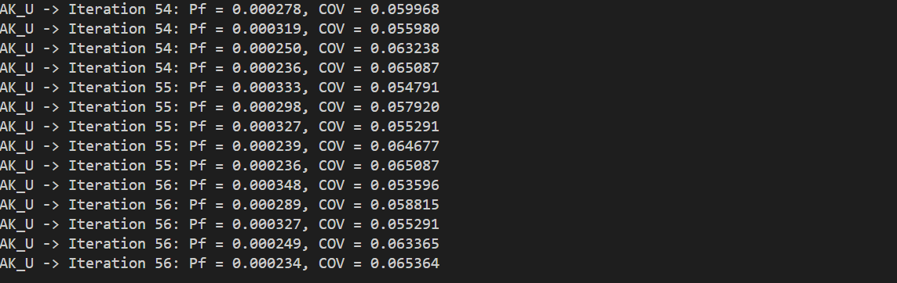

### 实验-多优化问题,使用matlab自带多优化求解工具，无候选点集

```
function result= AK_RankFusion(problem, option)

variable_table = problem.variable_table;
performanceFunc = problem.performanceFunc;
dim= size(variable_table,1);
N0=3*dim;
N_tianchong=option.Nt;
N_sim=option.Ns;

Mu=zeros(1,dim);
Sigma=ones(1,dim);
Samnum=100;
Subsam=N_sim./Samnum;

% 生成蒙特卡罗样本
for rv_id = 1:dim
    X_mcs(:,rv_id) = GenerateRV( ...
        variable_table{rv_id,1}, ...
        variable_table{rv_id,2}, ...
        variable_table{rv_id,3}, ...
        N_sim);
end

% 生成候选点池
for i=1:dim
    Data_tiankong(:,i)=unifrnd(Mu(i)-3.*Sigma(i),Mu(i)+3.*Sigma(i),N_tianchong,1);
end

% 初始样本点
Data=6.*UniformPoint(N0,dim,'Latin')-3;
xi= NatafTransformation(Data, variable_table, -1 );
x_un= NatafTransformation(Data_tiankong, variable_table, -1 );

% 初始函数评估
Eva = zeros(1,N0);
for i=1:N0
    Eva(i)=performanceFunc(xi(i,:));
end

PF=[];COV=[];Ncall=[];
GKA1 = zeros(Subsam, Samnum); 

max_iter = 400;    % 最大迭代步数
delta_tol = 1e-2;   % 相对变化率收敛阈值
window = 5;         % 检查最近5次的变化


for h=1:max_iter
    theta=10*ones(1,dim); lob=1e-2*ones(1,dim); upb=20*ones(1,dim);
    [dmodel, ~]=dacefit(xi,Eva,@regpoly1,@corrgauss,theta,lob,upb);
    
    % 多目标优化设置
    options = optimoptions('gamultiobj', ...
        'PopulationSize', 50, ...
        'MaxGenerations', 100, ...
        'Display', 'off', ...
        'UseParallel', false);
    
    % 根据变量表设置真实的物理边界
    lb = zeros(1, dim);
    ub = zeros(1, dim);
    for i = 1:dim
        dist_type = variable_table{i,1};  % 分布类型
        param1 = variable_table{i,2};     % 第一个参数
        param2 = variable_table{i,3};     % 第二个参数
        
        switch lower(dist_type)
            case 'normal'  % 正态分布
                % param1=均值μ, param2=标准差σ
                mu = param1;
                sigma = param2;
                lb(i) = mu - 4*sigma;  % μ-4σ (99.99%覆盖率)
                ub(i) = mu + 4*sigma;  % μ+4σ
                
            case 'lognormal'  % 对数正态分布
                % param1=μ, param2=σ (对数空间的参数)
                mu_log = param1;
                sigma_log = param2;
                % 使用分位数方法
                lb(i) = exp(mu_log - 4*sigma_log);  % 近似下界
                ub(i) = exp(mu_log + 4*sigma_log);  % 近似上界
                
            case 'uniform'  % 均匀分布
                % param1=下界, param2=上界
                lb(i) = param1;
                ub(i) = param2;
                
            case 'exponential'  % 指数分布
                % param1=λ (率参数)
                lambda = param1;
                lb(i) = 0;  % 指数分布下界为0
                ub(i) = -log(0.0001)/lambda;  % 99.99%分位数
                
            case 'gamma'  % 伽马分布
                % param1=shape(k), param2=scale(θ)
                k = param1;
                theta = param2;
                lb(i) = 0;  % 伽马分布下界为0
                ub(i) = k*theta + 4*sqrt(k)*theta;  % 近似上界
                
            case 'beta'  % 贝塔分布
                % param1=α, param2=β
                lb(i) = 0;  % 贝塔分布范围[0,1]
                ub(i) = 1;
                
            otherwise  % 未知分布类型，使用默认值
                warning('未识别的分布类型: %s，使用默认范围[-4,4]', dist_type);
                lb(i) = -4;
                ub(i) = 4;
        end
    end
    % 安全检查：确保边界合理
    for i = 1:dim
        if lb(i) >= ub(i)
            warning('变量%d的边界设置有问题，使用默认值', i);
            lb(i) = -4;
            ub(i) = 4;
        end
        
        if ~isfinite(lb(i)) || ~isfinite(ub(i))
            warning('变量%d的边界包含无穷值，使用默认值', i);
            lb(i) = -4;
            ub(i) = 4;
        end
    end
    
    % 定义多目标函数
    objfun = @(x) multiObjectiveFunction(x, dmodel);
    
    % 运行多目标优化
    try
        [pareto_front, ~] = gamultiobj(objfun, dim, [], [], [], [], lb, ub, [], options);
        
        % 从帕累托前沿选择点
        if size(pareto_front, 1) > 1
            rand_idx = randi(size(pareto_front, 1));
            CCC = pareto_front(rand_idx, :);
        else
            CCC = pareto_front;
        end
        
        % 检查结果合理性
        if isempty(CCC) || any(isnan(CCC)) || any(isinf(CCC))
            error('多目标优化结果无效');
        end
        
        % 从候选点中移除最接近的点
        distances = sum((x_un - CCC).^2, 2);
        [~, closest_idx] = min(distances);
        x_un(closest_idx, :) = [];
        
    catch ME
        fprintf('多目标优化出错：%s，回退到原始EFF方法\n', ME.message);
        
        % 回退到EFF方法
        [yC,or]=predictor(x_un,dmodel);
        safe_or = max(real(or), 1e-12);  % 数值安全处理
        epsEFF = 2 .* sqrt(safe_or);
        stdv = sqrt(safe_or);
        
        EFF = yC .* (2 .* normcdf(-yC ./ stdv) ...
                    - normcdf((-epsEFF - yC) ./ stdv) ...
                    - normcdf((epsEFF - yC) ./ stdv)) ...
            - stdv .* (2 .* normpdf(-yC ./ stdv) ...
                    - normpdf((-epsEFF - yC) ./ stdv) ...
                    - normpdf((epsEFF - yC) ./ stdv)) ...
            + epsEFF .* (normcdf((epsEFF - yC) ./ stdv) ...
                    - normcdf((-epsEFF - yC) ./ stdv));
        
        if max(EFF) < 0.001
            break
        end
        [~, best_idx] = max(EFF);
        CCC = x_un(best_idx, :);
        x_un(best_idx, :) = [];
    end
    
    % 检查收敛条件
    if isempty(x_un)
        fprintf('候选点集合已空，停止迭代\n');
        break
    end
    
    % 评估新点并更新模型
    GCe = performanceFunc(CCC);   
    xi = [xi; CCC];
    Eva = [Eva, GCe];
    
    % 计算失效概率
    for j=1:Samnum
        GKA1(:,j)=predictor(X_mcs(((j-1)*Subsam+1):(j*Subsam),:),dmodel);
    end
    GKA=GKA1(:);
    [aa, ~]=find(GKA<=0);
    PF(h)=length(aa)./length(GKA);
    
    if PF(h) > 0
        COV(h)=sqrt((1-PF(h))./((N_sim-1).*PF(h)));
    else
        COV(h) = Inf;
    end
    
    fprintf('AK_RankFusion -> Iteration %d: Pf = %.6f, COV = %.6f\n', h, PF(h), COV(h));
    
    if h > window
        pf_recent = PF(h-window:h);          % 最近window+1个Pf值
        rel_changes = abs(diff(pf_recent)./max(abs(pf_recent(1:end-1)), eps));  % 相对变化
        max_rel_change = max(rel_changes);
        if max_rel_change < delta_tol
            fprintf('Pf在最近%d次的最大相对变化率<%.2e，终止！\n', window, delta_tol);
            break
        end
    end
end

Ncall=N0+h-1;
fprintf('%16s%32s%32s\n','Pf_AKU', 'Ncall ','COV')
fprintf('%16.6f%30d%32.6f\n', PF(end), Ncall, COV(end));
disp('----------------------------------------------------------------------------------------------------------------')

result.Pf=PF;
result.COV=COV;
result.Ncall=Ncall;
result.LSF=Eva(N0+1:end);
end


% 修正的多目标函数
function objectives = multiObjectiveFunction(X, dmodel)
    % X 可能是矩阵 (n_points × dim)
    if size(X,1) == 1
        % 单点情况
        [yC, or] = predictor(X, dmodel);
        safe_or = max(real(or), 1e-12);
        
        try
            obj1 = foo_U(yC, safe_or);
            obj2 = -foo_EFF(yC, safe_or);
            obj3 = -foo_HH(yC, safe_or);
            
            objectives = [obj1, obj2, obj3];
            
            % 安全检查
            if any(~isfinite(objectives)) || any(~isreal(objectives))
                objectives = [1e6, 1e6, 1e6];
            end
        catch
            objectives = [1e6, 1e6, 1e6];
        end
    else
        % 多点情况
        n_points = size(X,1);
        objectives = zeros(n_points, 3);
        
        for i = 1:n_points
            [yC, or] = predictor(X(i,:), dmodel);
            safe_or = max(real(or), 1e-12);
            
            try
                obj1 = foo_U(yC, safe_or);
                obj2 = -foo_EFF(yC, safe_or);
                
                temp_obj = [obj1, obj2];
                
                if any(~isfinite(temp_obj)) || any(~isreal(temp_obj))
                    temp_obj = [1e6, 1e6];
                end
                
                objectives(i,:) = temp_obj;
            catch
                objectives(i,:) = [1e6, 1e6];
            end
        end
    end
end

% 安全的UC函数
function UC = foo_U(yC, or)
    UC = abs(yC ./ sqrt(or));
end

% 修正的EFF函数
function S = foo_EFF(yC, or)
    epsEFF = 2 .* sqrt(or);
    stdv = sqrt(or);

    norm1 = normcdf(-yC ./ stdv);
    norm2 = normcdf((-epsEFF - yC) ./ stdv);
    norm3 = normcdf((epsEFF - yC) ./ stdv);
    
    npdf1 = normpdf(-yC ./ stdv);
    npdf2 = normpdf((-epsEFF - yC) ./ stdv);
    npdf3 = normpdf((epsEFF - yC) ./ stdv);
    
    EFF = yC .* (2 .* norm1 - norm2 - norm3) ...
        - stdv .* (2 .* npdf1 - npdf2 - npdf3) ...
        + epsEFF .* (norm3 - norm2);
    
    % 修正的排序逻辑
    if length(EFF) > 1
        [~, sortedIndices] = sort(EFF, 'descend');
        rankIndex = zeros(size(EFF));
        rankIndex(sortedIndices) = 1:length(EFF);  % 修正的排序
        S = exp((1 - rankIndex) / sqrt(length(EFF)));
    else
        S = 1;
    end
end


```

#### exam1

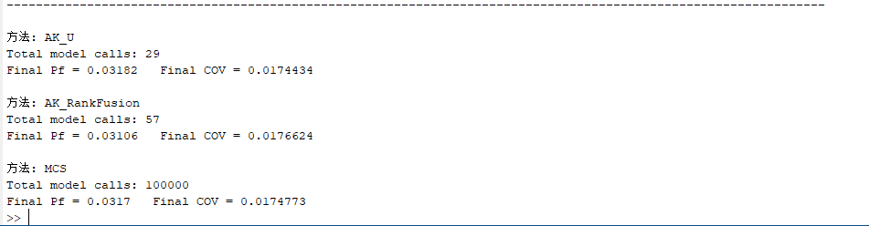

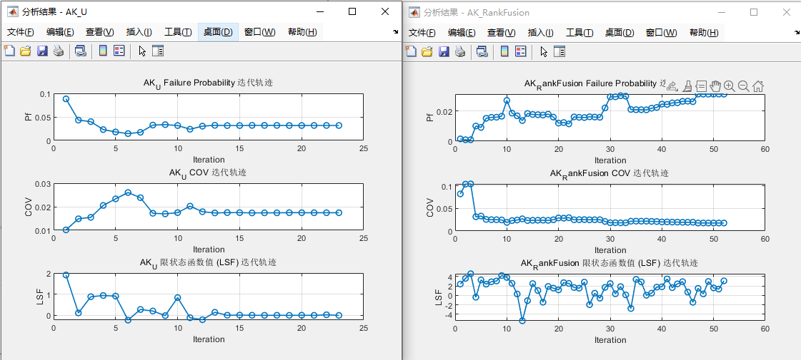

#### exam2

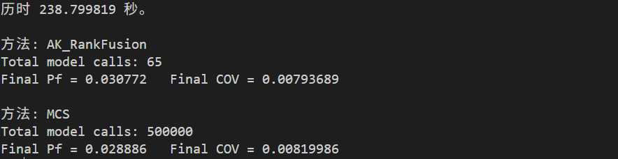

### **离散多目标决策问题**（Discrete Multi-objective Decision Making）。

> 理想点法

```
function result= AK_RankFusion(problem, option)

variable_table = problem.variable_table;
performanceFunc = problem.performanceFunc;
dim= size(variable_table,1);
N0=3*dim;
N_tianchong=option.Nt;
N_sim=option.Ns;

Mu=zeros(1,dim);
Sigma=ones(1,dim);
Samnum=100;
Subsam=N_sim./Samnum;

% 生成蒙特卡罗样本
for rv_id = 1:dim
    X_mcs(:,rv_id) = GenerateRV( ...
        variable_table{rv_id,1}, ...
        variable_table{rv_id,2}, ...
        variable_table{rv_id,3}, ...
        N_sim);
end

% 生成候选点池
for i=1:dim
    Data_tiankong(:,i)=unifrnd(Mu(i)-3.*Sigma(i),Mu(i)+3.*Sigma(i),N_tianchong,1);
end

% 初始样本点
Data=6.*UniformPoint(N0,dim,'Latin')-3;
xi= NatafTransformation(Data, variable_table, -1 );
x_un= NatafTransformation(Data_tiankong, variable_table, -1 );

% 初始函数评估
Eva = zeros(1,N0);
for i=1:N0
    Eva(i)=performanceFunc(xi(i,:));
end

PF=[];COV=[];Ncall=[];
GKA1 = zeros(Subsam, Samnum); 

max_iter = 400;    % 最大迭代步数
delta_tol = 1e-3;   % 相对变化率收敛阈值
window = 10;         % 检查最近5次的变化

for h=1:max_iter
    theta=10*ones(1,dim); lob=1e-2*ones(1,dim); upb=20*ones(1,dim);
    [dmodel, ~]=dacefit(xi,Eva,@regpoly1,@corrgauss,theta,lob,upb);
    
    % 使用最小距离法选择下一个点
    try
        % ===== 修改：先统一计算所有候选点的预测值 =====
        [yC_all, or_all] = predictor(x_un, dmodel);
        
        % 计算所有候选点的多目标值
        objectives = computeObjectives(yC_all, or_all);
        
        % ===== 新增：计算并打印排序相似度 =====
        if h==1
            fprintf('\n=== 目标函数排序相似度分析（O1 vs O2, O1 vs O3） ===\n');
            fprintf('迭代 | S12 | K12 | Top12 |  S13 | K13 | Top13\n');
            fprintf('------|------|------|-------|------|------|-------\n');
        end
        [s12,k12,top12] = computeRankSimilarity(objectives,1,2);
        [s13,k13,top13] = computeRankSimilarity(objectives,1,3);
        fprintf('%3d  |%5.2f |%5.2f |%6.2f |%5.2f |%5.2f |%6.2f\n', ...
            h, s12, k12, top12, s13, k13, top13);

        % ===== 排序相似度分析结束 =====
        
        % 计算理想点（每个目标的最优值）
        ideal_point = min(objectives, [], 1);
        
        % 归一化目标值（可选，但推荐）
        nadir_point = max(objectives, [], 1);
        
        % 避免除零
        range_obj = nadir_point - ideal_point;
        range_obj(range_obj == 0) = 1;
        
        % 归一化
        normalized_obj = (objectives - ideal_point) ./ range_obj;
        normalized_ideal = zeros(1, size(objectives, 2));
        
        % 计算到理想点的欧氏距离
        distances = sqrt(sum((normalized_obj - normalized_ideal).^2, 2));
        
        % 选择距离最小的点
        [~, best_idx] = min(distances);
        CCC = x_un(best_idx, :);
        
        % 检查结果合理性
        if isempty(CCC) || any(isnan(CCC)) || any(isinf(CCC))
            error('最小距离法结果无效');
        end
        
        % 从候选点中移除选中的点
        x_un(best_idx, :) = [];
        
    catch ME
        fprintf('最小距离法出错：%s，回退到原始EFF方法\n', ME.message);
        
        % 回退到EFF方法
        [yC,or]=predictor(x_un,dmodel);
        safe_or = max(real(or), 1e-12);  % 数值安全处理
        epsEFF = 2 .* sqrt(safe_or);
        stdv = sqrt(safe_or);
        
        EFF = yC .* (2 .* normcdf(-yC ./ stdv) ...
                    - normcdf((-epsEFF - yC) ./ stdv) ...
                    - normcdf((epsEFF - yC) ./ stdv)) ...
            - stdv .* (2 .* normpdf(-yC ./ stdv) ...
                    - normpdf((-epsEFF - yC) ./ stdv) ...
                    - normpdf((epsEFF - yC) ./ stdv)) ...
            + epsEFF .* (normcdf((epsEFF - yC) ./ stdv) ...
                    - normcdf((-epsEFF - yC) ./ stdv));
        
        if max(EFF) < 0.001
            break
        end
        [~, best_idx] = max(EFF);
        CCC = x_un(best_idx, :);
        x_un(best_idx, :) = [];
    end
    
    % 检查收敛条件
    if isempty(x_un)
        fprintf('候选点集合已空，停止迭代\n');
        break
    end
    
    % 评估新点并更新模型
    GCe = performanceFunc(CCC);   
    xi = [xi; CCC];
    Eva = [Eva, GCe];
    
    % 计算失效概率
    for j=1:Samnum
        GKA1(:,j)=predictor(X_mcs(((j-1)*Subsam+1):(j*Subsam),:),dmodel);
    end
    GKA=GKA1(:);
    [aa, ~]=find(GKA<=0);
    PF(h)=length(aa)./length(GKA);
    
    if PF(h) > 0
        COV(h)=sqrt((1-PF(h))./((N_sim-1).*PF(h)));
    else
        COV(h) = Inf;
    end
    
    fprintf('AK_RankFusion -> Iteration %d: Pf = %.6f, COV = %.6f\n', h, PF(h), COV(h));
    
    if h > window
        pf_recent = PF(h-window:h);          % 最近window+1个Pf值
        rel_changes = abs(diff(pf_recent)./max(abs(pf_recent(1:end-1)), eps));  % 相对变化
        max_rel_change = max(rel_changes);
        if max_rel_change < delta_tol
            fprintf('Pf在最近%d次的最大相对变化率<%.2e，终止！\n', window, delta_tol);
            break
        end
    end
end

Ncall=N0+h-1;
fprintf('%16s%32s%32s\n','Pf_AKU', 'Ncall ','COV')
fprintf('%16.6f%30d%32.6f\n', PF(end), Ncall, COV(end));
disp('----------------------------------------------------------------------------------------------------------------')

result.Pf=PF;
result.COV=COV;
result.Ncall=Ncall;
result.LSF=Eva(N0+1:end);
end

% ===== 修改：接收yC和or作为输入参数 =====
function objectives = computeObjectives(yC_all, or_all)
    n_points = length(yC_all);
    objectives = zeros(n_points, 3); % <-- 改为3列
    safe_or_all = max(real(or_all), 1e-12);
    for i = 1:n_points
        try
            obj1 = foo_U(yC_all(i), safe_or_all(i));
            obj2 = -foo_EFF(yC_all(i), safe_or_all(i));
            obj3 = -foo_HH(yC_all(i), safe_or_all(i));  
            objectives(i,:) = [obj1, obj2, obj3];
            if any(~isfinite(objectives(i,:))) || any(~isreal(objectives(i,:)))
                objectives(i,:) = [1e6, 1e6, 1e6];
                fprintf('警告：第 %d 个点的目标值无效，设置为 [1e6,1e6,1e6]\n', i);
            end
        catch
            objectives(i,:) = [1e6, 1e6, 1e6];
            fprintf('警告：第 %d 个点的目标值计算出错，设置为 [1e6,1e6,1e6]\n', i);
        end
    end
end

% ===== 新增函数：计算排序相似度 =====
function [spearman_corr, kendall_corr, topK_overlap] = computeRankSimilarity(objectives, idx1, idx2)
    if nargin < 3
        idx1 = 1;
        idx2 = 2;
    end
    
    % 获取排序后的索引
    [~, rank1] = sort(objectives(:,idx1), 'ascend');
    [~, rank2] = sort(objectives(:,idx2), 'ascend');
    
    % 转换为排名（用于相关系数计算）
    ranking1 = zeros(size(rank1));
    ranking2 = zeros(size(rank2));
    ranking1(rank1) = 1:length(rank1);
    ranking2(rank2) = 1:length(rank2);
    
    % 计算相关系数
    spearman_corr = corr(ranking1, ranking2, 'Type', 'Spearman');
    kendall_corr  = corr(ranking1, ranking2, 'Type', 'Kendall');
    
    % ===== 修复：Top-K重叠也应该基于相同的排名数据 =====
    k = min(10, length(rank1));
    
    % 方法1：基于排序索引的重叠（推荐）
    top_k_1 = rank1(1:k);  % 目标1的前k个最优点的索引
    top_k_2 = rank2(1:k);  % 目标2的前k个最优点的索引
    topK_overlap = length(intersect(top_k_1, top_k_2)) / k;
    
    % 处理NaN值
    if isnan(spearman_corr), spearman_corr = 0; end
    if isnan(kendall_corr),  kendall_corr  = 0; end
    if isnan(topK_overlap), topK_overlap = 0; end
end

% UC函数
function UC = foo_U(yC, or)
    UC = abs(yC ./ sqrt(or));
end

% EFF函数（避免排序复杂性）
function EFF_value = foo_EFF(yC, or)
% EFF学习函数，衡量点靠近极限状态（0）区域的“可行性期望”
    epsEFF = 2 .* sqrt(or);
    stdv = sqrt(or);
    norm1 = normcdf(-yC ./ stdv);
    norm2 = normcdf((-epsEFF - yC) ./ stdv);
    norm3 = normcdf((epsEFF - yC) ./ stdv);
    
    npdf1 = normpdf(-yC ./ stdv);
    npdf2 = normpdf((-epsEFF - yC) ./ stdv);
    npdf3 = normpdf((epsEFF - yC) ./ stdv);

    EFF_value = yC .* (2 .* norm1 - norm2 - norm3) ...
        - stdv .* (2 .* npdf1 - npdf2 - npdf3) ...
        + epsEFF .* (norm3 - norm2);
    
end

function HH_value = foo_HH(yC, or)
% HH学习函数，结构复杂，融合了概率区间和密度的量
    stdv = sqrt(or);
    tmp1 = log(sqrt(2 * pi) * stdv + 1 / 2);
    norm1 = normcdf((2 * stdv - yC) ./ stdv);
    norm2 = normcdf((-2 * stdv - yC) ./ stdv);
    pdf1 = normpdf((2 * stdv - yC) ./ stdv);
    pdf2 = normpdf((-2 * stdv - yC) ./ stdv);
    part1 = tmp1 .* (norm1 - norm2);
    part2 = (2 * stdv - yC) ./ 2 .* pdf1 + (2 * stdv + yC) ./ 2 .* pdf2;
    HH_value = abs(part1 - part2);
end


```


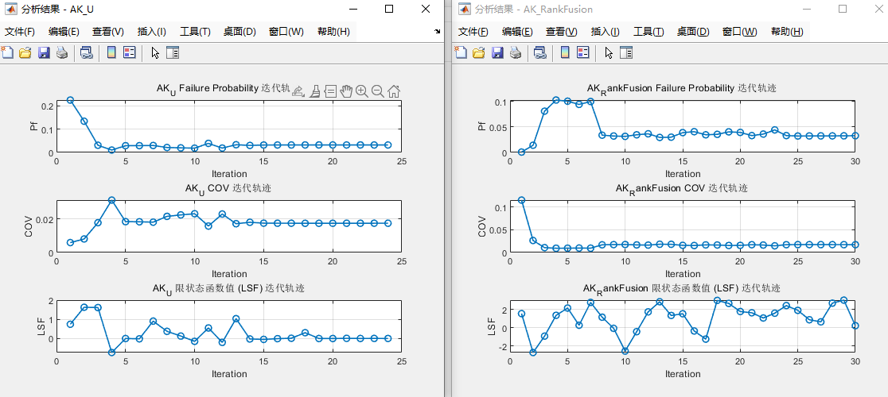

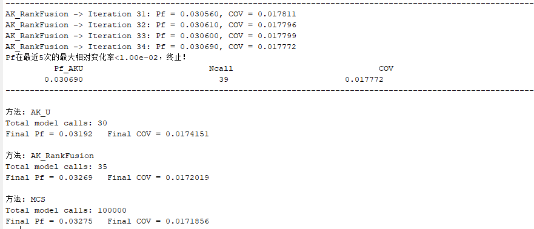

exam6

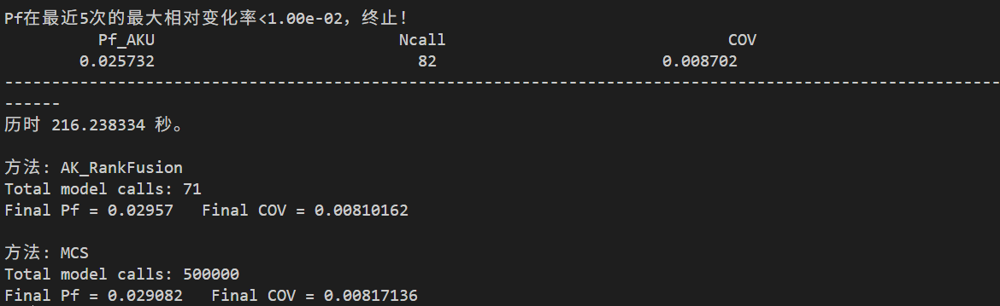

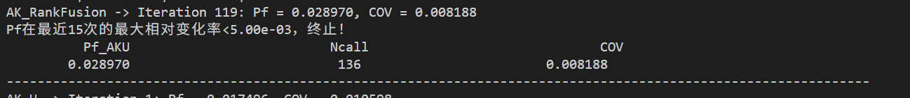

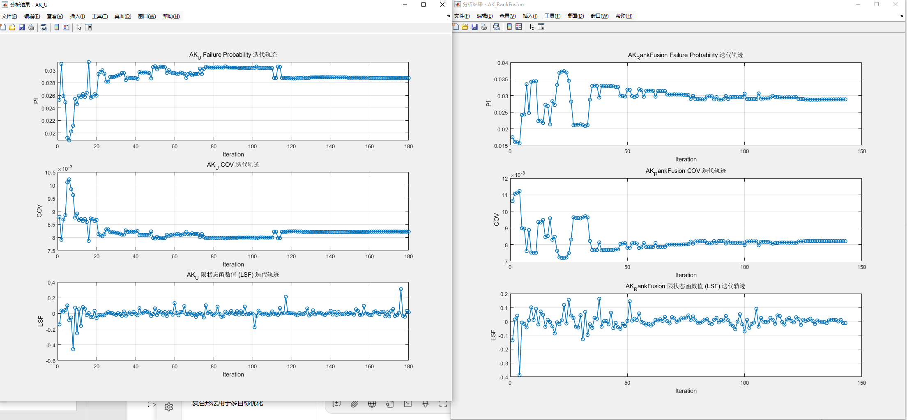

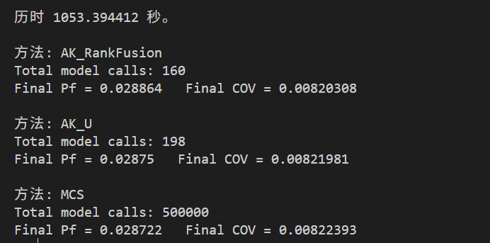

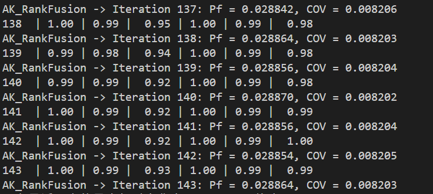

到最后几种方法基本上差别不大了

#### exam7

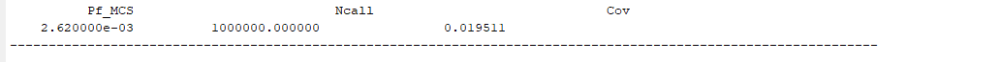

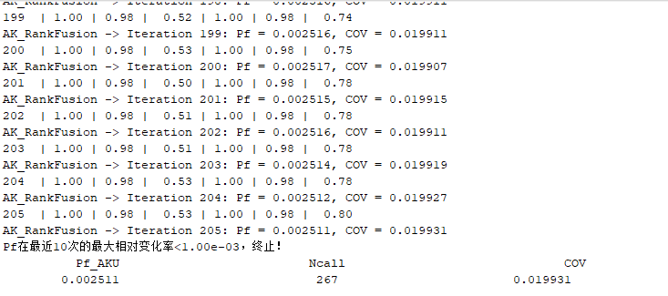

直接错过了2.62这一个点

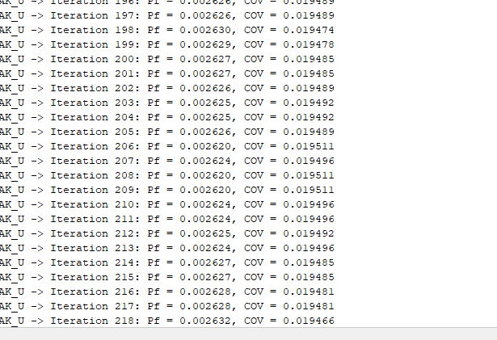

#### exam5

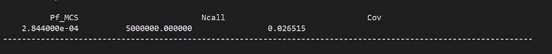

我们可以观察到


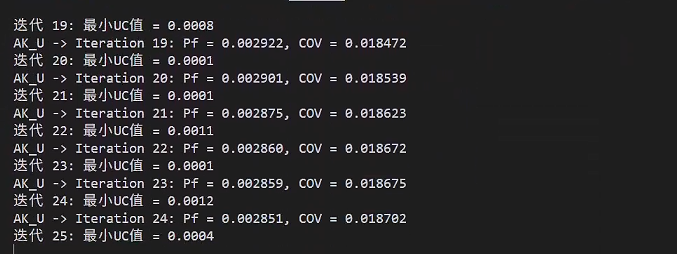

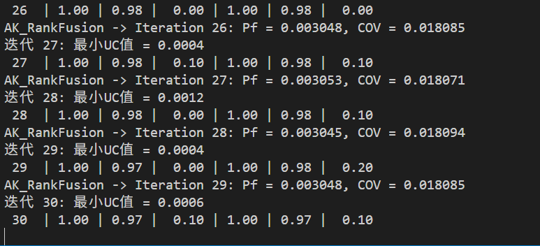


#### 如果我们换一个思路，调整终止条件为min(UC)>=2，此时只使用了两个目标函数

```
function result= AK_RankFusion(problem, option)

variable_table = problem.variable_table;
performanceFunc = problem.performanceFunc;
dim= size(variable_table,1);
N0=3*dim;
N_tianchong=option.Nt;
N_sim=option.Ns;

Mu=zeros(1,dim);
Sigma=ones(1,dim);
Samnum=100;
Subsam=N_sim./Samnum;

% 生成蒙特卡罗样本
for rv_id = 1:dim
    X_mcs(:,rv_id) = GenerateRV( ...
        variable_table{rv_id,1}, ...
        variable_table{rv_id,2}, ...
        variable_table{rv_id,3}, ...
        N_sim);
end

% 生成候选点池
for i=1:dim
    Data_tiankong(:,i)=unifrnd(Mu(i)-3.*Sigma(i),Mu(i)+3.*Sigma(i),N_tianchong,1);
end

% 初始样本点
Data=6.*UniformPoint(N0,dim,'Latin')-3;
xi= NatafTransformation(Data, variable_table, -1 );
x_un= NatafTransformation(Data_tiankong, variable_table, -1 );

% 初始函数评估
Eva = zeros(1,N0);
for i=1:N0
    Eva(i)=performanceFunc(xi(i,:));
end

PF=[];COV=[];Ncall=[];
GKA1 = zeros(Subsam, Samnum); 

max_iter = 400;    % 最大迭代步数
delta_tol = 1e-3;   % 相对变化率收敛阈值
window = 10;         % 检查最近5次的变化

for h=1:max_iter
    theta=10*ones(1,dim); lob=1e-2*ones(1,dim); upb=20*ones(1,dim);
    [dmodel, ~]=dacefit(xi,Eva,@regpoly1,@corrgauss,theta,lob,upb);
    
    % 使用最小距离法选择下一个点
    try
        % ===== 修改：先统一计算所有候选点的预测值 =====
        [yC_all, or_all] = predictor(x_un, dmodel);
        UC_all = foo_U(yC_all, or_all);
        EFF_all = foo_EFF(yC_all, or_all);

        % 收敛条件
        if min(UC_all) > 0.5 && max(EFF_all) < 0.05
            fprintf('所有候选点的UC值和EFF满足条件（最小UC=%.4f，最大EFF=%.4f），算法收敛！\n', min(UC_all), max(EFF_all));
            break;
        end
        fprintf('迭代 %d: 最小UC值 = %.4f，最大EFF = %.4f\n', h, min(UC_all), max(EFF_all));

        % 计算所有候选点的多目标值
        objectives = computeObjectives(yC_all, or_all);
        
        % ===== 修改：计算并打印排序相似度（只有两个目标函数） =====
        if h==1
            fprintf('\n=== 目标函数排序相似度分析（O1 vs O2） ===\n');
            fprintf('迭代 | S12 | K12 | Top12\n');
            fprintf('------|------|------|-------\n');
        end
        [s12,k12,top12] = computeRankSimilarity(objectives,1,2);
        fprintf('%3d  |%5.2f |%5.2f |%6.2f\n', h, s12, k12, top12);

        % ===== 排序相似度分析结束 =====
        
        % 计算理想点（每个目标的最优值）
        ideal_point = min(objectives, [], 1);
        
        % 归一化目标值（可选，但推荐）
        nadir_point = max(objectives, [], 1);
        
        % 避免除零
        range_obj = nadir_point - ideal_point;
        range_obj(range_obj == 0) = 1;
        
        % 归一化
        normalized_obj = (objectives - ideal_point) ./ range_obj;
        normalized_ideal = zeros(1, size(objectives, 2));
        
        % 计算到理想点的欧氏距离
        distances = sqrt(sum((normalized_obj - normalized_ideal).^2, 2));
        
        % 选择距离最小的点
        [~, best_idx] = min(distances);
        CCC = x_un(best_idx, :);
        
        % 检查结果合理性
        if isempty(CCC) || any(isnan(CCC)) || any(isinf(CCC))
            error('最小距离法结果无效');
        end
        
        % 从候选点中移除选中的点
        x_un(best_idx, :) = [];
        
    catch ME
        fprintf('最小距离法出错：%s，回退到原始EFF方法\n', ME.message);
        
        % 回退到EFF方法
        [yC,or]=predictor(x_un,dmodel);
        safe_or = max(real(or), 1e-12);  % 数值安全处理
        epsEFF = 2 .* sqrt(safe_or);
        stdv = sqrt(safe_or);
        
        EFF = yC .* (2 .* normcdf(-yC ./ stdv) ...
                    - normcdf((-epsEFF - yC) ./ stdv) ...
                    - normcdf((epsEFF - yC) ./ stdv)) ...
            - stdv .* (2 .* normpdf(-yC ./ stdv) ...
                    - normpdf((-epsEFF - yC) ./ stdv) ...
                    - normpdf((epsEFF - yC) ./ stdv)) ...
            + epsEFF .* (normcdf((epsEFF - yC) ./ stdv) ...
                    - normcdf((-epsEFF - yC) ./ stdv));
        
        if max(EFF) < 0.001
            break
        end
        [~, best_idx] = max(EFF);
        CCC = x_un(best_idx, :);
        x_un(best_idx, :) = [];
    end
    
    % 检查收敛条件
    if isempty(x_un)
        fprintf('候选点集合已空，停止迭代\n');
        break
    end
    
    % 评估新点并更新模型
    GCe = performanceFunc(CCC);   
    xi = [xi; CCC];
    Eva = [Eva, GCe];
    
    % 计算失效概率
    for j=1:Samnum
        GKA1(:,j)=predictor(X_mcs(((j-1)*Subsam+1):(j*Subsam),:),dmodel);
    end
    GKA=GKA1(:);
    [aa, ~]=find(GKA<=0);
    PF(h)=length(aa)./length(GKA);
    
    if PF(h) > 0
        COV(h)=sqrt((1-PF(h))./((N_sim-1).*PF(h)));
    else
        COV(h) = Inf;
    end
    
    fprintf('AK_RankFusion -> Iteration %d: Pf = %.6f, COV = %.6f\n', h, PF(h), COV(h));
    
end

Ncall=N0+h-1;
fprintf('%16s%32s%32s\n','Pf_AKU', 'Ncall ','COV')
fprintf('%16.6f%30d%32.6f\n', PF(end), Ncall, COV(end));
disp('----------------------------------------------------------------------------------------------------------------')

result.Pf=PF;
result.COV=COV;
result.Ncall=Ncall;
result.LSF=Eva(N0+1:end);
end

% ===== 修改：只使用两个目标函数 =====
function objectives = computeObjectives(yC_all, or_all)
    n_points = length(yC_all);
    objectives = zeros(n_points, 2); % <-- 改为2列
    safe_or_all = max(real(or_all), 1e-12);
    for i = 1:n_points
        try
            obj1 = foo_U(yC_all(i), safe_or_all(i));
            obj2 = -foo_EFF(yC_all(i), safe_or_all(i));
            objectives(i,:) = [obj1, obj2];
            if any(~isfinite(objectives(i,:))) || any(~isreal(objectives(i,:)))
                objectives(i,:) = [1e6, 1e6];
                fprintf('警告：第 %d 个点的目标值无效，设置为 [1e6,1e6]\n', i);
            end
        catch
            objectives(i,:) = [1e6, 1e6];
            fprintf('警告：第 %d 个点的目标值计算出错，设置为 [1e6,1e6]\n', i);
        end
    end
end

% ===== 修改：排序相似度分析函数，适应两个目标函数 =====
function [spearman_corr, kendall_corr, topK_overlap] = computeRankSimilarity(objectives, idx1, idx2)
    if nargin < 3
        idx1 = 1;
        idx2 = 2;
    end
    
    % 获取排序后的索引
    [~, rank1] = sort(objectives(:,idx1), 'ascend');
    [~, rank2] = sort(objectives(:,idx2), 'ascend');
    
    % 转换为排名（用于相关系数计算）
    ranking1 = zeros(size(rank1));
    ranking2 = zeros(size(rank2));
    ranking1(rank1) = 1:length(rank1);
    ranking2(rank2) = 1:length(rank2);
    
    % 计算相关系数
    spearman_corr = corr(ranking1, ranking2, 'Type', 'Spearman');
    kendall_corr  = corr(ranking1, ranking2, 'Type', 'Kendall');
    
    % Top-K重叠计算
    k = min(10, length(rank1));
    
    top_k_1 = rank1(1:k);  % 目标1的前k个最优点的索引
    top_k_2 = rank2(1:k);  % 目标2的前k个最优点的索引
    topK_overlap = length(intersect(top_k_1, top_k_2)) / k;
    
    % 处理NaN值
    if isnan(spearman_corr), spearman_corr = 0; end
    if isnan(kendall_corr),  kendall_corr  = 0; end
    if isnan(topK_overlap), topK_overlap = 0; end
end

% UC函数
function UC = foo_U(yC, or)
    UC = abs(yC ./ sqrt(or));
end

% EFF函数（避免排序复杂性）
function EFF_value = foo_EFF(yC, or)
% EFF学习函数，衡量点靠近极限状态（0）区域的"可行性期望"
    epsEFF = 2 .* sqrt(or);
    stdv = sqrt(or);
    norm1 = normcdf(-yC ./ stdv);
    norm2 = normcdf((-epsEFF - yC) ./ stdv);
    norm3 = normcdf((epsEFF - yC) ./ stdv);
    
    npdf1 = normpdf(-yC ./ stdv);
    npdf2 = normpdf((-epsEFF - yC) ./ stdv);
    npdf3 = normpdf((epsEFF - yC) ./ stdv);

    EFF_value = yC .* (2 .* norm1 - norm2 - norm3) ...
        - stdv .* (2 .* npdf1 - npdf2 - npdf3) ...
        + epsEFF .* (norm3 - norm2);
    
end

function H = foo_H(mu, sigma)
if any(sigma <= 0)
    error('标准差(sigma)必须为正数。');
end
if ~isequal(size(mu), size(sigma))
    error('输入向量mu和sigma的维度必须相同。');
end
 
% 为提高可读性和效率，预先计算两个关键的归一化参数z1和z2
z1 = (2 * sigma - mu) ./ sigma;
z2 = (-2 * sigma - mu) ./ sigma;
 
term1 = log(sqrt(2 * pi) .* sigma);
term2 = 0.5 * (normcdf(z1) - normcdf(z2));
term3 = - (2 * sigma - mu) / 2 .* normpdf(z1);
term4 = (2 * sigma + mu) / 2 .* normpdf(z2); 
 
% 将所有项相加，并取绝对值
H = abs(term1 + term2 + term3 + term4);
end
```

```matlab
function result= AK_RankFusion(problem, option)

variable_table = problem.variable_table;
performanceFunc = problem.performanceFunc;
dim= size(variable_table,1);
N0=3*dim;
N_tianchong=option.Nt;
N_sim=option.Ns;

Mu=zeros(1,dim);
Sigma=ones(1,dim);
Samnum=100;
Subsam=N_sim./Samnum;

% 生成蒙特卡罗样本
for rv_id = 1:dim
    X_mcs(:,rv_id) = GenerateRV( ...
        variable_table{rv_id,1}, ...
        variable_table{rv_id,2}, ...
        variable_table{rv_id,3}, ...
        N_sim);
end

% 生成候选点池
for i=1:dim
    Data_tiankong(:,i)=unifrnd(Mu(i)-3.*Sigma(i),Mu(i)+3.*Sigma(i),N_tianchong,1);
end

% 初始样本点
Data=6.*UniformPoint(N0,dim,'Latin')-3;
xi= NatafTransformation(Data, variable_table, -1 );
x_un= NatafTransformation(Data_tiankong, variable_table, -1 );

% 初始函数评估
Eva = zeros(1,N0);
for i=1:N0
    Eva(i)=performanceFunc(xi(i,:));
end

PF=[];COV=[];Ncall=[];
GKA1 = zeros(Subsam, Samnum); 

max_iter = 400;    % 最大迭代步数
delta_tol = 1e-3;   % 相对变化率收敛阈值
window = 10;         % 检查最近5次的变化

for h=1:max_iter
    theta=10*ones(1,dim); lob=1e-2*ones(1,dim); upb=20*ones(1,dim);
    [dmodel, ~]=dacefit(xi,Eva,@regpoly1,@corrgauss,theta,lob,upb);
    
    % 使用最小距离法选择下一个点
    try
        % ===== 修改：先统一计算所有候选点的预测值 =====
        [yC_all, or_all] = predictor(x_un, dmodel);
        UC_all = foo_U(yC_all, or_all);
        EFF_all = foo_EFF(yC_all, or_all);

        % 如果所有候选点的UC值都>=2，则收敛
        if min(UC_all) > 0.5 & max(EFF_all) < 0.01
            fprintf('所有候选点的UC值都>=2（最小UC=%.4f），算法收敛！\n', min(UC_all));
            break;
        end
        fprintf('迭代 %d: 最小UC值 = %.4f\n', h, min(UC_all));

        % 计算所有候选点的多目标值
        objectives = computeObjectives(yC_all, or_all);
        
        % ===== 修改：计算并打印排序相似度（只有两个目标函数） =====
        if h==1
            fprintf('\n=== 目标函数排序相似度分析（O1 vs O2） ===\n');
            fprintf('迭代 | S12 | K12 | Top12\n');
            fprintf('------|------|------|-------\n');
        end
        [s12,k12,top12] = computeRankSimilarity(objectives,1,2);
        fprintf('%3d  |%5.2f |%5.2f |%6.2f\n', h, s12, k12, top12);

        % ===== 排序相似度分析结束 =====
        
        % 计算理想点（每个目标的最优值）
        ideal_point = min(objectives, [], 1);
        
        % 归一化目标值（可选，但推荐）
        nadir_point = max(objectives, [], 1);
        
        % 避免除零
        range_obj = nadir_point - ideal_point;
        range_obj(range_obj == 0) = 1;
        
        % 归一化
        normalized_obj = (objectives - ideal_point) ./ range_obj;
        normalized_ideal = zeros(1, size(objectives, 2));
        
        % 计算到理想点的欧氏距离
        distances = sqrt(sum((normalized_obj - normalized_ideal).^2, 2));
        
        % 选择距离最小的点
        [~, best_idx] = min(distances);
        CCC = x_un(best_idx, :);
        
        % 检查结果合理性
        if isempty(CCC) || any(isnan(CCC)) || any(isinf(CCC))
            error('最小距离法结果无效');
        end
        
        % 从候选点中移除选中的点
        x_un(best_idx, :) = [];
        
    catch ME
        fprintf('最小距离法出错：%s，回退到原始EFF方法\n', ME.message);
        
        % 回退到EFF方法
        [yC,or]=predictor(x_un,dmodel);
        safe_or = max(real(or), 1e-12);  % 数值安全处理
        epsEFF = 2 .* sqrt(safe_or);
        stdv = sqrt(safe_or);
        
        EFF = yC .* (2 .* normcdf(-yC ./ stdv) ...
                    - normcdf((-epsEFF - yC) ./ stdv) ...
                    - normcdf((epsEFF - yC) ./ stdv)) ...
            - stdv .* (2 .* normpdf(-yC ./ stdv) ...
                    - normpdf((-epsEFF - yC) ./ stdv) ...
                    - normpdf((epsEFF - yC) ./ stdv)) ...
            + epsEFF .* (normcdf((epsEFF - yC) ./ stdv) ...
                    - normcdf((-epsEFF - yC) ./ stdv));
        
        if max(EFF) < 0.001
            break
        end
        [~, best_idx] = max(EFF);
        CCC = x_un(best_idx, :);
        x_un(best_idx, :) = [];
    end
    
    % 检查收敛条件
    if isempty(x_un)
        fprintf('候选点集合已空，停止迭代\n');
        break
    end
    
    % 评估新点并更新模型
    GCe = performanceFunc(CCC);   
    xi = [xi; CCC];
    Eva = [Eva, GCe];
    
    % 计算失效概率
    for j=1:Samnum
        GKA1(:,j)=predictor(X_mcs(((j-1)*Subsam+1):(j*Subsam),:),dmodel);
    end
    GKA=GKA1(:);
    [aa, ~]=find(GKA<=0);
    PF(h)=length(aa)./length(GKA);
    
    if PF(h) > 0
        COV(h)=sqrt((1-PF(h))./((N_sim-1).*PF(h)));
    else
        COV(h) = Inf;
    end
    
    fprintf('AK_RankFusion -> Iteration %d: Pf = %.6f, COV = %.6f\n', h, PF(h), COV(h));
    
end

Ncall=N0+h-1;
fprintf('%16s%32s%32s\n','Pf_AKU', 'Ncall ','COV')
fprintf('%16.6f%30d%32.6f\n', PF(end), Ncall, COV(end));
disp('----------------------------------------------------------------------------------------------------------------')

result.Pf=PF;
result.COV=COV;
result.Ncall=Ncall;
result.LSF=Eva(N0+1:end);
end

% ===== 修改：只使用两个目标函数 =====
function objectives = computeObjectives(yC_all, or_all)
    n_points = length(yC_all);
    objectives = zeros(n_points, 2); % <-- 改为2列
    safe_or_all = max(real(or_all), 1e-12);
    for i = 1:n_points
        try
            obj1 = foo_U(yC_all(i), safe_or_all(i));
            obj2 = -foo_EFF(yC_all(i), safe_or_all(i));
            objectives(i,:) = [obj1, obj2];
            if any(~isfinite(objectives(i,:))) || any(~isreal(objectives(i,:)))
                objectives(i,:) = [1e6, 1e6];
                fprintf('警告：第 %d 个点的目标值无效，设置为 [1e6,1e6]\n', i);
            end
        catch
            objectives(i,:) = [1e6, 1e6];
            fprintf('警告：第 %d 个点的目标值计算出错，设置为 [1e6,1e6]\n', i);
        end
    end
end

% ===== 修改：排序相似度分析函数，适应两个目标函数 =====
function [spearman_corr, kendall_corr, topK_overlap] = computeRankSimilarity(objectives, idx1, idx2)
    if nargin < 3
        idx1 = 1;
        idx2 = 2;
    end
    
    % 获取排序后的索引
    [~, rank1] = sort(objectives(:,idx1), 'ascend');
    [~, rank2] = sort(objectives(:,idx2), 'ascend');
    
    % 转换为排名（用于相关系数计算）
    ranking1 = zeros(size(rank1));
    ranking2 = zeros(size(rank2));
    ranking1(rank1) = 1:length(rank1);
    ranking2(rank2) = 1:length(rank2);
    
    % 计算相关系数
    spearman_corr = corr(ranking1, ranking2, 'Type', 'Spearman');
    kendall_corr  = corr(ranking1, ranking2, 'Type', 'Kendall');
    
    % Top-K重叠计算
    k = min(10, length(rank1));
    
    top_k_1 = rank1(1:k);  % 目标1的前k个最优点的索引
    top_k_2 = rank2(1:k);  % 目标2的前k个最优点的索引
    topK_overlap = length(intersect(top_k_1, top_k_2)) / k;
    
    % 处理NaN值
    if isnan(spearman_corr), spearman_corr = 0; end
    if isnan(kendall_corr),  kendall_corr  = 0; end
    if isnan(topK_overlap), topK_overlap = 0; end
end

% UC函数
function UC = foo_U(yC, or)
    UC = abs(yC ./ sqrt(or));
end

% EFF函数（避免排序复杂性）
function EFF_value = foo_EFF(yC, or)
% EFF学习函数，衡量点靠近极限状态（0）区域的"可行性期望"
    epsEFF = 2 .* sqrt(or);
    stdv = sqrt(or);
    norm1 = normcdf(-yC ./ stdv);
    norm2 = normcdf((-epsEFF - yC) ./ stdv);
    norm3 = normcdf((epsEFF - yC) ./ stdv);
    
    npdf1 = normpdf(-yC ./ stdv);
    npdf2 = normpdf((-epsEFF - yC) ./ stdv);
    npdf3 = normpdf((epsEFF - yC) ./ stdv);

    EFF_value = yC .* (2 .* norm1 - norm2 - norm3) ...
        - stdv .* (2 .* npdf1 - npdf2 - npdf3) ...
        + epsEFF .* (norm3 - norm2);
    
end

function H = foo_H(mu, sigma)
if any(sigma <= 0)
    error('标准差(sigma)必须为正数。');
end
if ~isequal(size(mu), size(sigma))
    error('输入向量mu和sigma的维度必须相同。');
end
 
% 为提高可读性和效率，预先计算两个关键的归一化参数z1和z2
z1 = (2 * sigma - mu) ./ sigma;
z2 = (-2 * sigma - mu) ./ sigma;
 
term1 = log(sqrt(2 * pi) .* sigma);
term2 = 0.5 * (normcdf(z1) - normcdf(z2));
term3 = - (2 * sigma - mu) / 2 .* normpdf(z1);
term4 = (2 * sigma + mu) / 2 .* normpdf(z2); 
 
% 将所有项相加，并取绝对值
H = abs(term1 + term2 + term3 + term4);
end
```

#### exam3

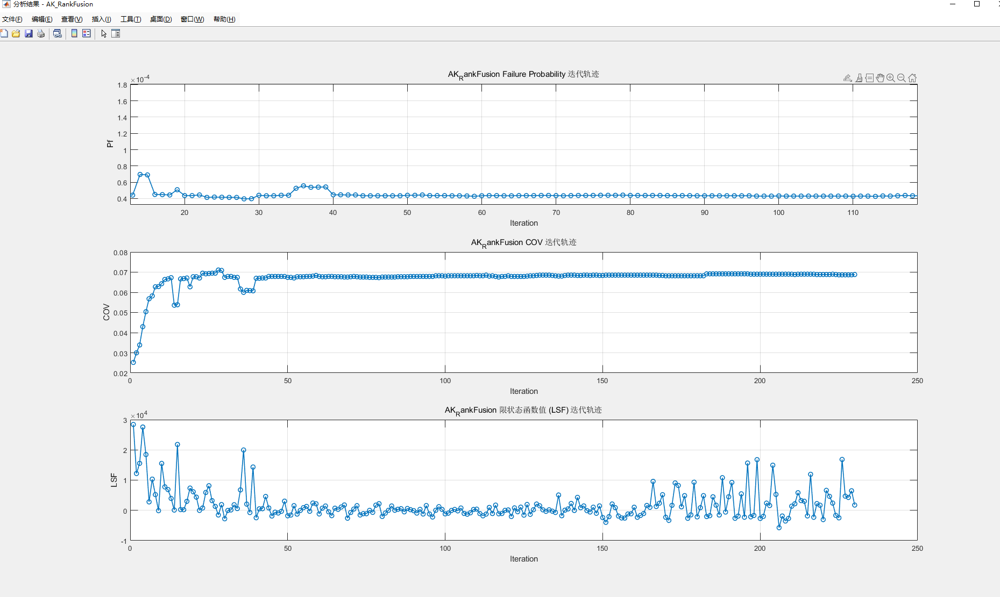

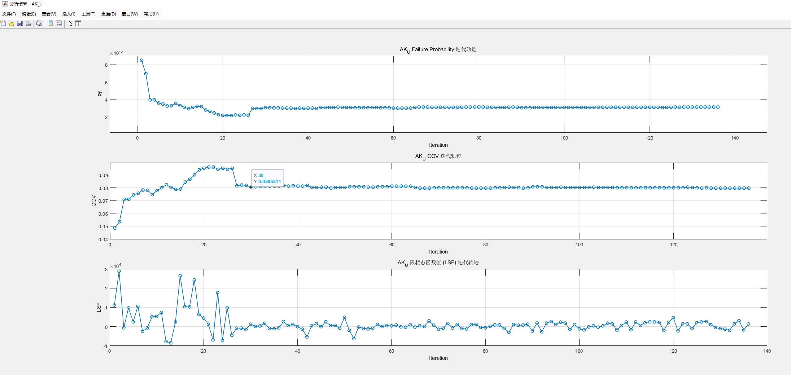

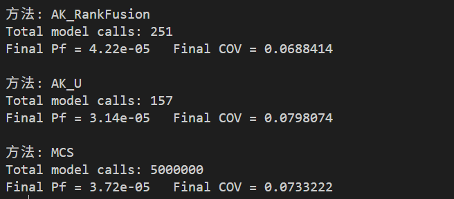

迭代120对比

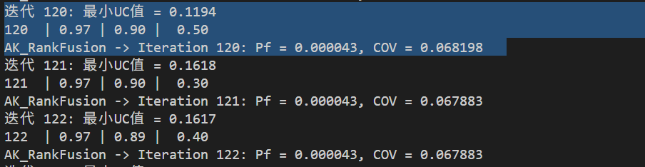

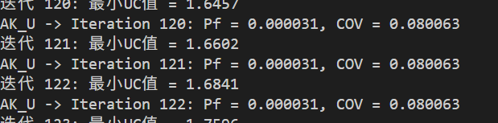

#### exam6

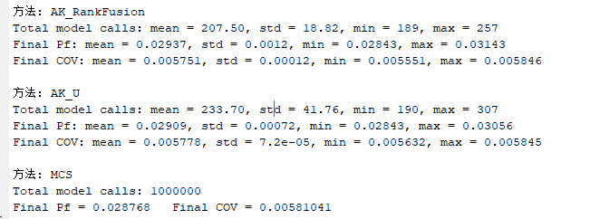

### 优中选优(词典序法/分层法)

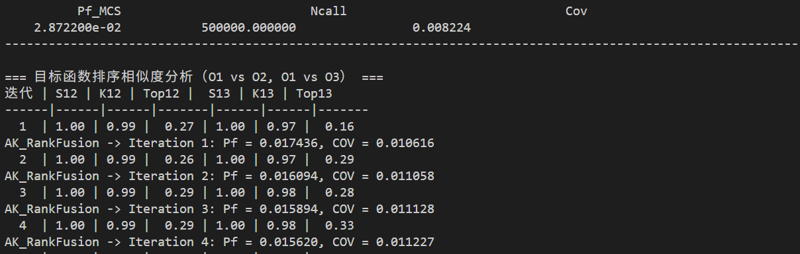

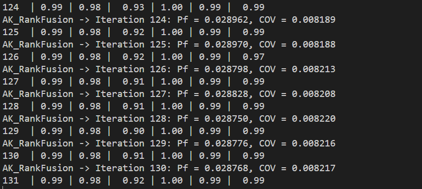


观察到他们的相似性是从小变大的，可以使用分层法，他们肯定有共同点的，也就是在后期训练的时候是差不多的

#### Exam4 就无结果

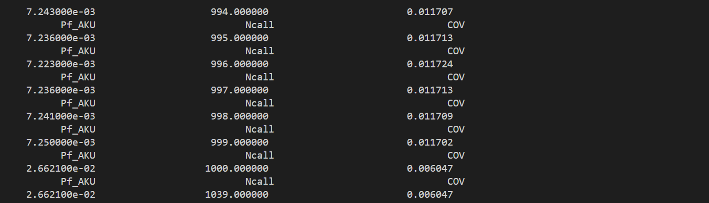

#### exam5

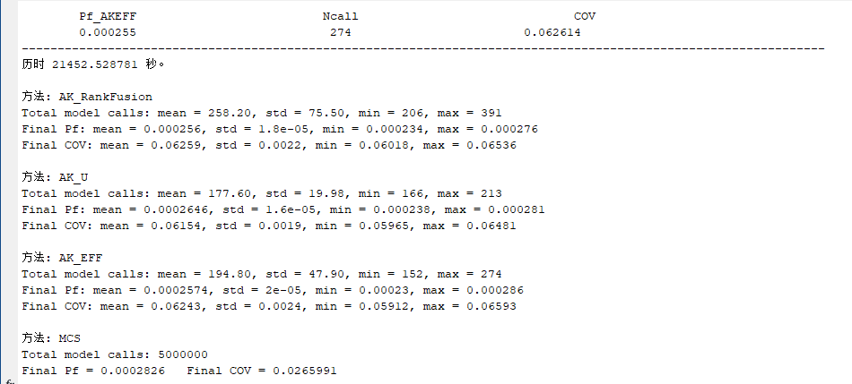

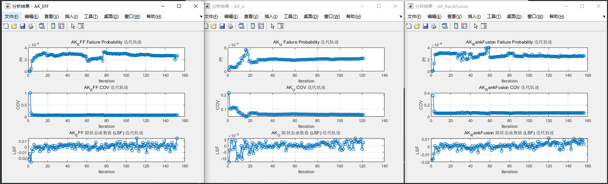


### 模型

```
        % 1. 创建并训练 VariationalSVR 模型
        %    替换原有的 dacefit
        vsvr_model = VariationalSVR('n_iter', 150, 'tol', 1e-5, 'verbose', false, 'prune_threshold', 1e5); % 'verbose'设为false以保持输出整洁
        vsvr_model.fit(xi, Eva(:)); % Eva(:)确保是列向量
        
        % 2. 定义预测函数句柄
        %    注意：vsvr_model.predict 返回 [mean, std]
        GK = @(t) vsvr_model.predict(t);
        % 3. 在候选点上进行预测，获取均值和标准差
        %    替换原有的 predictor
        [yC, y_std] = GK(x_un);
        % 4. 计算 U-Function (Learning Function)
        %    y_std 是标准差，不需要再开方
        UC = abs((0 - yC) ./ y_std);
```

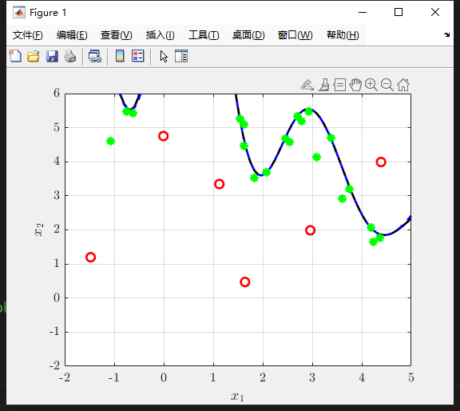

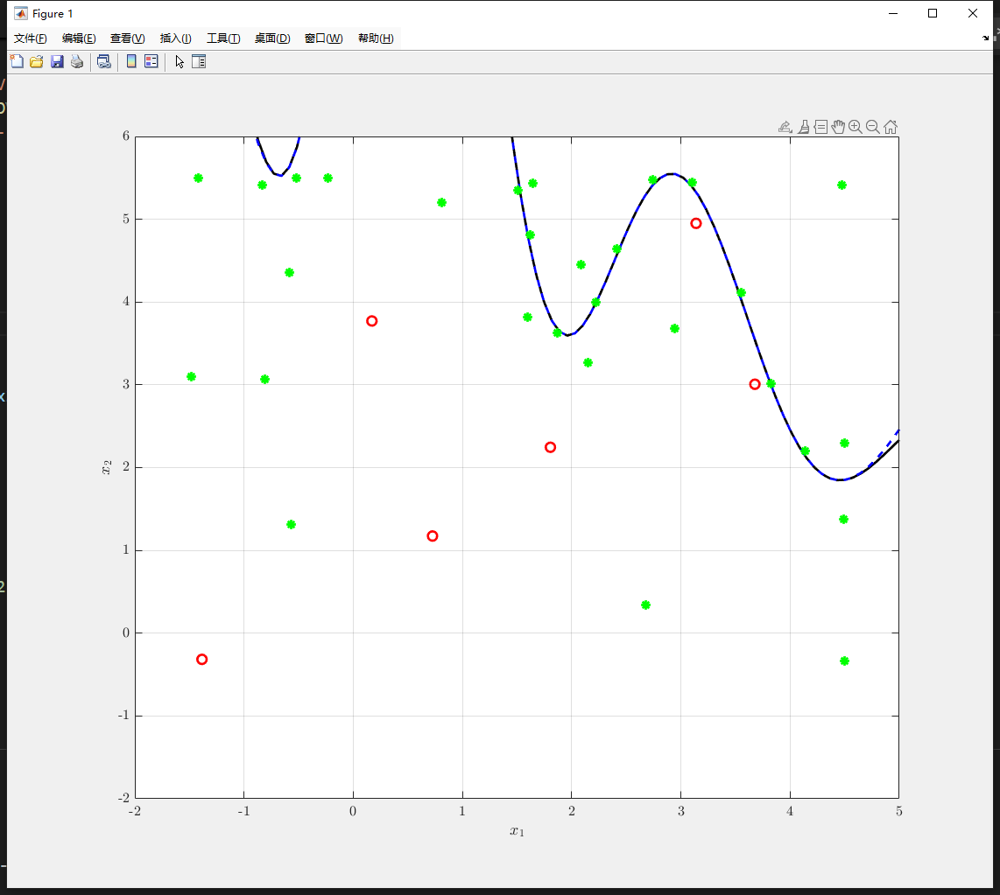

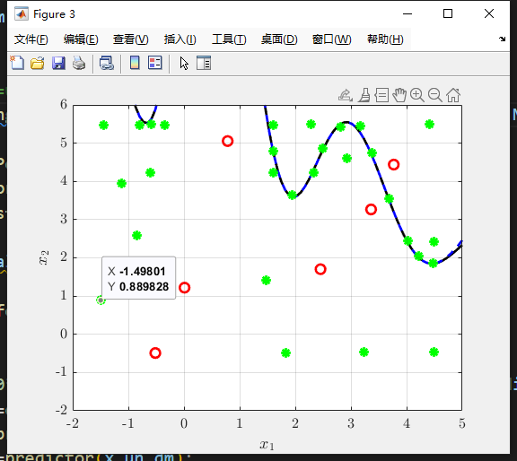

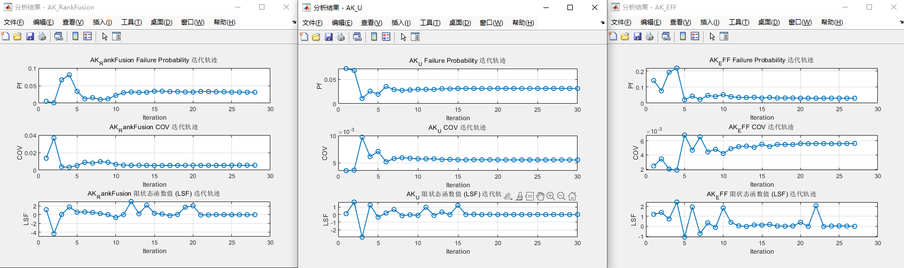

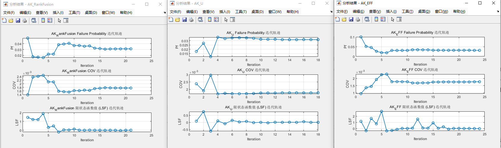

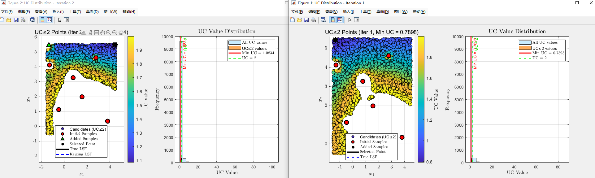

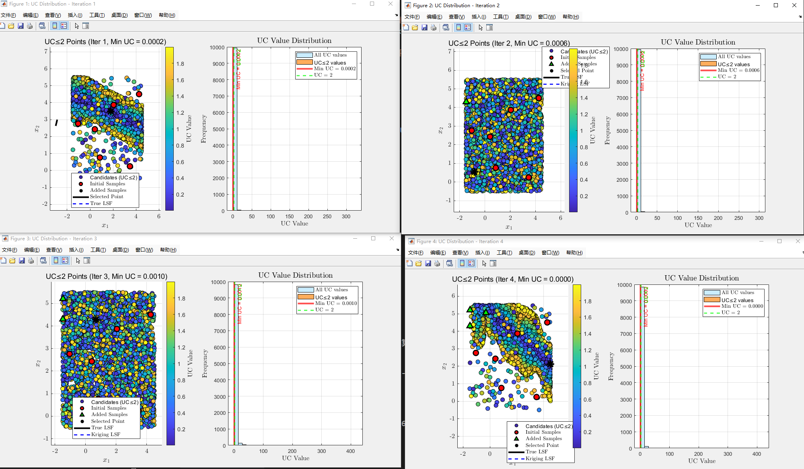

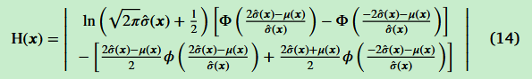

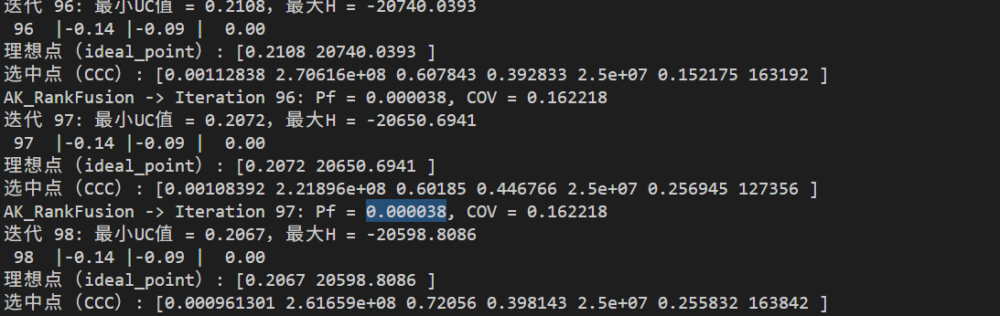

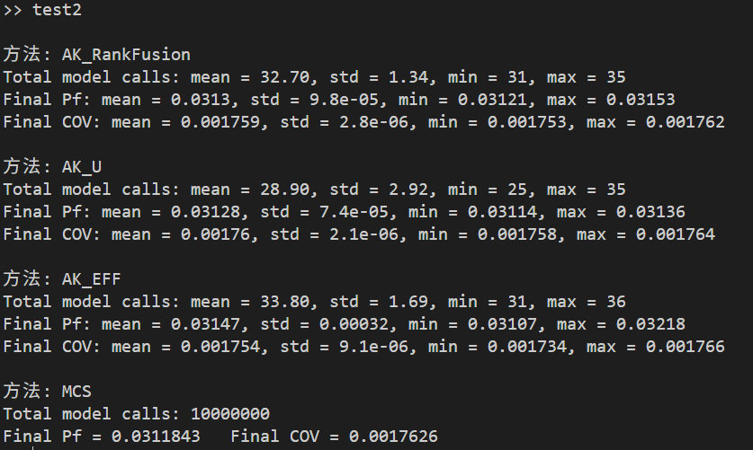
