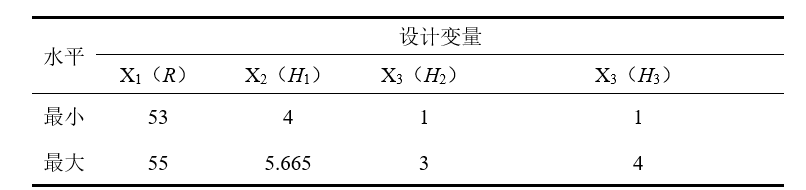

## 评价标准

### 密封环结构安全评价准则：强度准则

### 密封环密封性能评价准则：最小接触压力准则

### 密封环密封性能评价准则：接触均匀度准则

## 要解决的不确定性问题

- 模糊不确定性

- 随机不确定性

- 区间不确定性

## 规律

- 失圆度
- 变形
- 应力
- 扩径到接触

## 优化方法

## 可靠性计算方法DOE

- [x] 可溶桥塞金属环的表面质量、弹性模量、质量、密度、泊松比、应力参数、强度参数等材料特性参数具有不确定性

温度对于材料力学特性也有影响

- [x] 尺寸在规定误差范围内，因此，与几何尺寸相关的设计参数需采用区间变量来表征，几何性有不确定性

这里采用正态分布

- [ ] 载荷的大小、方向和作用点均具有不确定性

根据已有的数据建立一个doe

在对金属材料进行仿真（如有限元分析 FEA），关注最大等效应力和屈服强度时，主要需要考虑以下材料性能参数：

**1. 弹性参数：**

- **弹性模量（E，杨氏模量）**：衡量材料在弹性阶段的刚度。
- **泊松比（ν）**：描述材料横向变形与纵向变形的比例。

**2. 强度参数：**

- **屈服强度（σy）**：材料开始发生塑性变形的应力值。
- **抗拉强度（σmax）**（如需要，极限强度）：材料在断裂前能承受的最大应力。

**3. 密度（ρ）：**

- 如果仿真涉及力学计算（如惯性、重力），则需赋予材料密度。

**5. 特殊性能参数：**

- **断裂韧性**、**疲劳强度**、**剪切模量**等（具体取决于具体分析内容）。

---

### 材料性质基本参数：

| 参数         | 说明                  | 相关性           |
| ------------ | --------------------- | ---------------- |
| 弹性模量(E)  | 午性阶段应力-应变关系 | 等效应力计算必需 |
| 泊松比(ν)    | 横纵变形比例          | 应力状态影响     |
| 屈服强度(σy) | 塑性区分析的临界点    | 判别强度极限     |

对于**最大等效应力**，软件如ANSYS、Abaqus等，会根据应力和应变状态（通过输入的上述参数）进行计算。**屈服强度**则用来判定材料是否已经发生塑性变形。

---

**如果是只做弹性分析**，上述参数基本足够；
**如果考虑塑性行为（屈服后的变形）**，还应额外考虑材料的应力-应变曲线及硬化参数。

- **钢材**常用参数：
  - 弹性模量：约 210 GPa
  - 泊松比：约 0.3
  - 屈服强度：Q235 约 235 MPa, Q345 约 345 MPa

### 变量不确定性量化设置

1. 材料参数建模
钢材的材料参数通常服从正态分布（因加工/测试误差符合中心极限定理），关键参数的均值（$\mu$）和变异系数（$COV=\sigma/\mu$，衡量波动程度）如下：
| **参数**                 | **均值\(\mu\)**                 | **变异系数\(COV\)** | **标准差\(\sigma=\mu\times COV\)**            | **分布类型**        |
| ------------------------ | ------------------------------- | ------------------- | --------------------------------------------- | ------------------- |
| 弹性模量\(E\)            | 205 GPa（普通碳钢）             | 1%-2%（波动小）     | 2.05-4.1 GPa                                  | 正态分布            |
| 泊松比\(\nu\)            | 0.29（钢材典型值）              | 1%-2%（稳定）       | 0.0029-0.0058                                 | 正态分布            |
| 屈服强度\(\sigma_y\)     | 235 MPa（Q235）/345 MPa（Q345） | 5%-10%（波动大）    | 11.75-23.5 MPa（Q235）/17.25-34.5 MPa（Q345） | 正态分布/韦布尔分布 |
| 密度\(\rho\)             | 7850 kg/m³（钢材）              | 0.1%-0.5%（极稳定） | 7.85-39.25 kg/m³                              | 正态分布            |
| 屈服强度分布取韦布尔分布 |                                 |                     |                                               |                     |
2. 几何参数建模
| **参数**                              | **设计值**       | **加工公差**（示例） | **分布类型** | **分布参数**                                                 |
| ------------------------------------- | ---------------- | -------------------- | ------------ | ------------------------------------------------------------ |
| 半径\(R\)                             | \(R_0=100\) mm   | ±0.1 mm（IT8级）     | 正态分布     | 均值\(\mu_R=R_0\)，标准差\(\sigma_R=0.1/3\approx0.033\) mm   |
| 密封环宽度\(H_1\)                     | \(H_{10}=10\) mm | ±0.05 mm（IT9级）    | 正态分布     | 均值\(\mu_{H1}=H_{10}\)，标准差\(\sigma_{H1}=0.05/3\approx0.017\) mm |
| 凹槽宽度\(H_2\)                       | \(H_{20}=8\) mm  | ±0.05 mm（IT9级）    | 正态分布     | 均值\(\mu_{H2}=H_{20}\)，标准差\(\sigma_{H2}=0.05/3\approx0.017\) mm |
| 凹槽深度\(H_3\)                       | \(H_{30}=2\) mm  | ±0.02 mm（IT7级）    | 正态分布     | 均值\(\mu_{H3}=H_{30}\)，标准差\(\sigma_{H3}=0.02/3\approx0.0067\) mm |
| 四个几何参数均值分别取54 4.8325 2 2.5 |                  |                      |              |                                                              |

| 参数           | 分布类型   | 均值（μ）       | 变异系数（COV） | 标准差（σ=μ×COV） | 关键说明                                                     |
| -------------- | ---------- | --------------- | --------------- | ----------------- | ------------------------------------------------------------ |
| 弹性模量（E）  | 正态分布   | 205 GPa         | 2%              | 4.1 GPa           | 钢材弹性模量波动小，符合正态分布（中心极限定理）。           |
| 泊松比（ν）    | 正态分布   | 0.29            | 2%              | 0.0058            | 钢材泊松比稳定，变异系数小。                                 |
| 屈服强度（σᵧ） | 韦布尔分布 | 345 MPa（目标） | 5%              | ≈17.72 MPa        | 韦布尔分布更符合钢材屈服强度的**右侧长尾**（偶有高屈服强度值），参数通过**数值反推**得到： 形状参数\(k=27\)，尺度参数\(λ=352.1\) MPa（确保均值≈345 MPa，COV≈5%）。 |
| 密度（ρ）      | 正态分布   | 7850 kg/m³      | 0.1%            | 7.85 kg/m³        | 静态仿真中**密度不影响应力**（除非有重力载荷），可忽略其不确定性。 |

| 参数             | 分布类型 | 设计均值（μ） | 加工公差          | 标准差（σ=公差/3） | 关键说明                                                     |
| ---------------- | -------- | ------------- | ----------------- | ------------------ | ------------------------------------------------------------ |
| 密封环半径（R）  | 正态分布 | 54 mm         | ±1 mm（IT8级）    | ≈0.33 mm           | 正态分布的99.73%数据覆盖±3σ，故公差±Δ对应σ=Δ/3（符合加工误差规律）。 |
| 密封环宽度（H₁） | 正态分布 | 4.8325 mm     | ±0.05 mm（IT9级） | ≈0.017 mm          | 轴向宽度，影响密封环的**径向刚度**。                         |
| 凹槽宽度（H₂）   | 正态分布 | 2 mm          | ±0.05 mm          | ≈0.017 mm          | 凹槽的轴向长度，影响应力集中区域的**载荷分布**。             |
| 凹槽深度（H₃）   | 正态分布 | 2.5 mm        | ±0.02 mm（IT7级） | ≈0.0067 mm         | 凹槽的径向深度，**应力集中的关键因素**（深度越大，应力集中越明显）。 |

- [x] 材料属性设置

80%的成功率，严重变形(10%)

85%

- [ ] 仿真模型

位移控制

workbench

act 

最小接触压力大于等于50

对比方法 U IE E 

kriging

蒙特卡洛

## 单个系统 综合可靠度

两个可靠度
$$
/theda = real - /theta_{max} 

/Press = /Press_{min} - real
$$

问题建模 + 可靠性方法，对比不同方法计算结果

流程图

可靠度要达到0.99，也就是失效概率在0.01 

固定其他变量 绘制表格

敏感度分析

收敛图

候选样本点

## 优化

应力可靠度作为约束，保证其失效概率，压力作为优化目标，让压力更大

rbgo 多算法对比

解耦(对一个区间内变量直接做代理模型) + 嵌套

## 综述