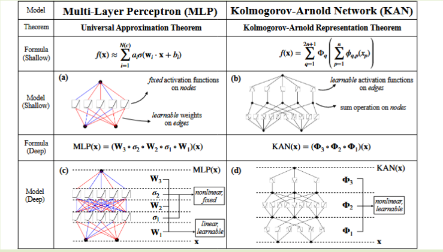
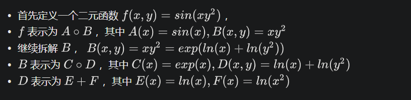
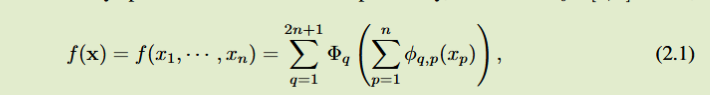
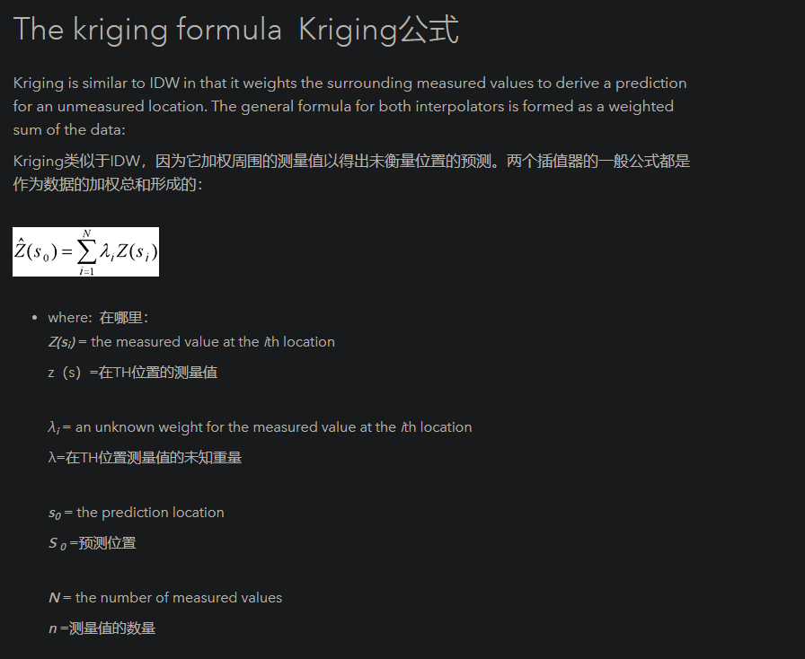

+++
date = '2025-02-24T16:40:12+08:00'
draft = false
title = 'KAN'

+++

## 梯度提升决策树a

> cite: [图解机器学习 | GBDT模型详解](https://www.showmeai.tech/article-detail/193)

### Boosting and Bagging

### GBDT

使用残差来迭代下一步的计算

1. 初始化回归树

$$
f_1{x} = \arg\min_{c}\sum_{n=1}^{n}L(y_{i},x)
$$

2. 迭代，从第二棵树开始不断计算每一棵树的训练目标， 也就是前面结果的残差
3. 对于当前第m棵子树而言，我们需要遍历它的可行的切分点以及阈值，找到最优的预测值c对应的参数，使得尽可能逼近残差，我们来写出这段公式

$$
r_{mi} = -\left[ \frac{\partial L(y_i, f(x_i))}{\partial f(x_i)} \right]_{f(x) = f_{m-1}(x)}
\\
c_{mj} = \arg\min_{c} \sum_{x_i \in R_{mj}} L(y_i, f_{m-1}(x_i) + c)
$$

# KAN

> http://arxiv.org/abs/2404.19756

## 摘要

受Kolmogorov-Arnold表示定理的启发，我们提出了KolmogorovArnold网络（KANs），作为多层感知机（MLPs）的有前景替代方案。MLPs在节点（“神经元”）上有固定的激活函数，而KANs在边（“权重”）上有可学习的激活函数。KANs完全没有线性权重——每个权重参数都被一个参数化为样条的单变量函数所取代。我们展示了这一看似简单的改变使KANs在准确性和可解释性方面优于MLPs，尤其是在小规模的AI与科学任务中。在准确性方面，较小的KANs在函数拟合任务中可以达到与较大MLPs相当或更好的准确性。理论和实验证明，KANs的神经扩展规律比MLPs更快。在可解释性方面，KANs可以直观地可视化，并能轻松与人类用户互动。通过数学和物理领域的两个例子，KANs被证明是有用的“合作者”，帮助科学家（重新）发现数学和物理定律。总之，KANs是MLPs的有前景替代方案，为进一步改进今天依赖MLPs的深度学习模型提供了机会。

## KAN vs MLP

## KA表示定理

对于多元函数而言，可以近似化多个一元函数的和，而这个最后的加法操作才是真正的多元函数

这是KAN的核心思想，以矩阵形式写的把x，作为$\phi_{\text{in}}$之前的输入，$\phi_{\text{in}}$在作为$\phi{\text{out}}$的输入

KA只是证明了存在性，但是具体如何构造需要网络训练

以以下公式为例
$$
y = sin(x_1^3 + x_2^2)
$$

$$
y = \sum_{i=1}^{5} \phi_i(\psi_{i1}(x_1) + \psi_{i2}(x_2))
$$

对于内函数使用样条（对低维有准确性），对于然后进行MLP

,

提出问题，很可能对于公式2.1而言，一维函数是非平滑的，但是可以通过更深的表示让其更平滑，通过Grid更加细致的你和，比如在梯度大的区域，grid更密

# KAN2.0

回到KA reoresentation theory(KART)任意连续函数都可以分解为单变量连续函数和加法的有限组合。

KAN主要实现加法，KAN2实现乘法

## Adaptive First-Crossing Approach for Life-Cycle Reliability Analysis

生命周期可靠性分析可以有效地估计和呈现结构在其生命周期中动态不确定性下的安全状态变化。第一次穿越方法是基于第一次穿越时间点 （FCTP） 的概率特征评估时变可靠性的有效方法。然而，FCTP 模型存在许多关键挑战，例如计算准确性。本文针对结构在整个生命周期内的时变可靠性提出了一种自适应首次交叉方法，可以为循环寿命可靠性分析和设计提供工具。首先通过执行支持向量回归来估计 FCTP 关于输入变量的响应面。此外，通过整合统一设计和代理模型的中心矩，开发了用于训练支持向量回归的自适应学习算法。然后，构建了结合首次穿越概率分布函数 （PDF） 的原始矩和熵的收敛条件，以构建最优的首次穿越代理模型。最后，使用自适应核密度估计对首次交叉 PDF 进行求解，以获得整个生命周期内的时变可靠性趋势。通过实例演示了在应用程序中指定所提出的方法。

## A stochastic process discretization method combing active learning Kriging model for efficient time-variant reliability analysis

时变可靠性分析 (TRA) 在评估产品全生命周期可靠性方面引起了广泛关注。
随机过程离散化被认为是将时变问题转化为更易于处理的时不变问题的最简单的方法之一。然而，将其应用于时变问题需要克服两个主要问题：(1)小离散时间间隔的效率低，(2)大离散时间间隔的精度低。为了解决这两个挑战，我们提出了一种基于随机过程离散化的克里金辅助时变可靠性分析方法 (简称 K-TRPD)。首先，通过随机过程离散化将复杂的时变可靠性问题转化为传统的时不变问题。其次，通过克里金模型在整个相关时间段内近似最可能点 (MPP) 轨迹，其输入通过主动学习方法从离散时间点中识别出来；并在确定的时间点上采用一阶可靠性方法（FORM）获得输出。
最后，利用构建的克里金模型对每个离散时间点进行时不变可靠性分析，并利用时不变可靠性分析结果对多元正态分布函数进行分析，得到时变可靠性。本文通过三个数值分析算例和一个工程设计算例，证明了所提方法的有效性。

### KRIGING

## 
