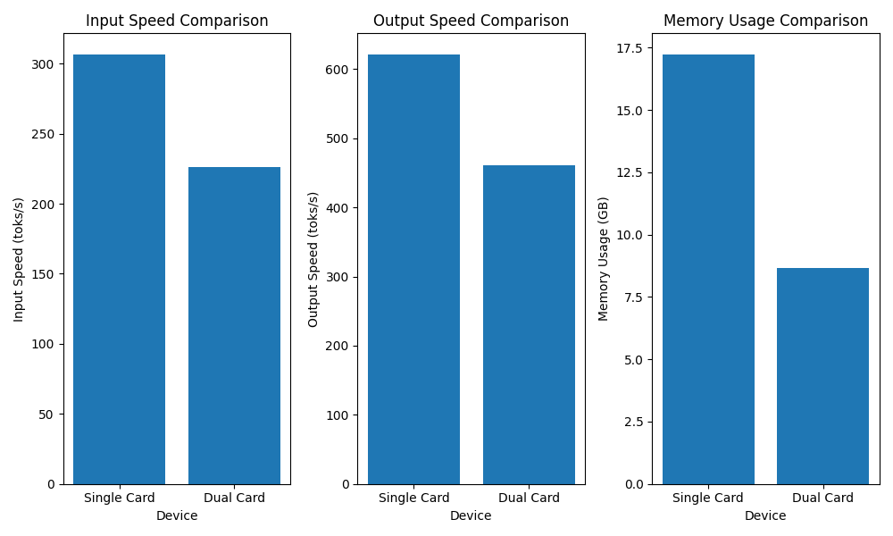
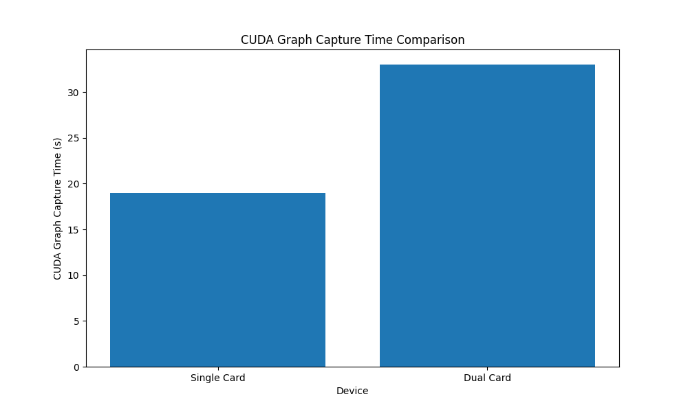

[toc]

# Llama-3.1-70b的部署和批量推理（离线推理）

offline inferencem, or batch inference

### top_p vs top_k

> `top_p`是指在生成文本时，选择概率最高的 `p`个token作为候选集。例如，如果 `top_p`为0.9，则意味着在生成文本时，选择概率最高的90%的token作为候选集。
>
> `top_p`的作用是：
>
> * 限制生成的文本的多样性：通过选择概率最高的token，`top_p`可以限制生成的文本的多样性，使得生成的文本更加集中和可预测。
> * 提高生成的文本的质量：通过选择概率最高的token，`top_p`可以提高生成的文本的质量，使得生成的文本更加流畅和自然。
>
> `top_k`是指在生成文本时，选择前 `k`个概率最高的token作为候选集。例如，如果 `top_k`为100，则意味着在生成文本时，选择前100个概率最高的token作为候选集。
>
> `top_k`的作用是：
>
> * 提高生成的文本的多样性：通过选择前 `k`个概率最高的token，`top_k`可以提高生成的文本的多样性，使得生成的文本更加丰富和多样。
> * 降低生成的文本的质量：通过选择前 `k`个概率最高的token，`top_k`可以降低生成的文本的质量，使得生成的文本更加随机和不确定。
>
> `top_p`和 `top_k`是两个相关但不同的参数。`top_p`限制了生成的文本的多样性，而 `top_k`提高了生成的文本的多样性。通常情况下，`top_p`和 `top_k`会被同时使用，以便在生成的文本的质量和多样性之间找到一个平衡。
>
> 例如，如果你想生成一个高质量的文本，你可以设置 `top_p`为0.9和 `top_k`为100。这意味着在生成avour时，选择概率最高的90%的token作为候选集，并从候选集中选择前100个概率最高的token作为生成的文本。

## Huggingface model

```powershell
huggingface-cli login
huggingface-cli download -h
huggingface-cli download meta-llama/Llama-3.1-70B-Instruct
```

## Vllm

### CUDA和Pytorch

> [显卡驱动CUDA 和 pytorch CUDA 之间的区别_cuda版本和torch.cuda一样吗-CSDN博客](https://blog.csdn.net/null_one/article/details/129412159)

区别了nvcc nvidia-smi torch.\_\_version\_\_

### conda和pip

> [conda install和pip install区别 - lmqljt - 博客园](https://www.cnblogs.com/Li-JT/p/14024034.html)

pip 包含build conda一般是可执行

1. 安装环境 此处安装的是老版vllm 支持cuda11.8

```powershell
# conda 虚拟环境
conda create myenv

# 先安装pytorch
conda install pytorch torchvision torchaudio pytorch-cuda=11.8 -c pytorch -c nvidia

# Install vLLM with CUDA 11.8.
export VLLM_VERSION=0.6.1.post1
export PYTHON_VERSION=310
pip install https://github.com/vllm-project/vllm/releases/download/v${VLLM_VERSION}/vllm-${VLLM_VERSION}+cu118-cp${PYTHON_VERSION}-cp${PYTHON_VERSION}-manylinux1_x86_64.whl --extra-index-url https://download.pytorch.org/whl/cu11
```

2. 代码
   注意这里的要指定 `CUDA_VISIBLE_DEVICES`， 而且在代码内支持着一种方式

> [【杂记】vLLM如何指定GPU单卡离线推理_vllm指定gpu-CSDN博客](https://blog.csdn.net/m0_65814643/article/details/143882882)

```python
from vllm import LLM, SamplingParams
import os
os.environ["CUDA_DEVICE_ORDER"] = "PCI_BUS_ID"
os.environ["CUDA_VISIBLE_DEVICES"] = "2"

# Sample prompts.
prompts = [
    "Hello, my name is",
    "The president of the United States is",
    "The capital of France is",
    "The future of AI is",
]
# Create a sampling params object.
sampling_params = SamplingParams(temperature=0.8, top_p=0.95)

# Create an LLM.
llm = LLM(model="facebook/opt-125m")
# Generate texts from the prompts. The output is a list of RequestOutput objects
# that contain the prompt, generated text, and other information.
outputs = llm.generate(prompts, sampling_params)
# Print the outputs.
for output in outputs:
    prompt = output.prompt
    generated_text = output.outputs[0].text
    print(f"Prompt: {prompt!r}, Generated text: {generated_text!r}")
```

### 问题一 `vllm-flash-attn`

软硬件

```
NVIDIA RTX A6000
nvcc: NVIDIA (R) Cuda compiler driver
Copyright (c) 2005-2021 NVIDIA Corporation
Built on Wed_Jun__2_19:15:15_PDT_2021
Cuda compilation tools, release 11.4, V11.4.48
Build cuda_11.4.r11.4/compiler.30033411_0
2.4.0+cu118
11.8
```

Cannot use FlashAttention-2 backend because the vllm_flash_attn package is not found. `pip install vllm-flash-attn` for better performance.

> 这里安装的的不是cuda11.8的，识别不了，我找不到11.8的 `vllm-flash-attn`，遂放弃。

ValueError: XFormers does not support attention logits soft capping.

重开一个2.4 cuda12.1的虚拟环境,12.1可以装vllm, 但是我本地nvidia-smi是12.0的不清楚会不会出错

> 没问题，但是又变成2.5.1了，是啥情况
> 2.5.1+cu124

```shell
conda install pytorch==2.4.1 torchvision==0.19.1 torchaudio==2.4.1 pytorch-cuda=12.1 -c pytorch -c nvidia
```

```python
# 单卡版本
from vllm import LLM, SamplingParams
import os
os.environ["CUDA_DEVICE_ORDER"] = "PCI_BUS_ID"
os.environ["CUDA_VISIBLE_DEVICES"] = "2"

prompts = [
    "Hello, my name is",
    "The president of the United States is",
    "The capital of France is",
    "The future of AI is",
]
# Create a sampling params object.
sampling_params = SamplingParams(temperature=0.8, top_p=0.95)

# Create an LLM.
llm = LLM(model="/path/gemma-2-9b-it")
# Generate texts from the prompts. The output is a list of RequestOutput objects
# that contain the prompt, generated text, and other information.
outputs = llm.generate(prompts, sampling_params)
# Print the outputs.
for output in outputs:
    prompt = output.prompt
    generated_text = output.outputs[0].text
    print(f"Prompt: {prompt!r}, Generated text: {generated_text!r}")


# 多卡版本
from vllm import LLM, SamplingParams
import os
os.environ["CUDA_DEVICE_ORDER"] = "PCI_BUS_ID"
os.environ["CUDA_VISIBLE_DEVICES"] = "0,2"
tensor_parallel_size=2
prompts = [
    "Hello, my name is",
    "The president of the United States is",
    "The capital of France is",
    "The future of AI is",
]
# Create a sampling params object.
sampling_params = SamplingParams(temperature=0.8, top_p=0.95)

# Create an LLM.
llm = LLM(model="/path/gemma-2-9b-it", tensor_parallel_size=tensor_parallel_size)
# Generate texts from the prompts. The output is a list of RequestOutput objects
# that contain the prompt, generated text, and other information.
outputs = llm.generate(prompts, sampling_params)
# Print the outputs.
for output in outputs:
    prompt = output.prompt
    generated_text = output.outputs[0].text
    print(f"Prompt: {prompt!r}, Generated text: {generated_text!r}")
```

### 问题二 GPU资源占用问题

资源占用问题

> [LLM大模型：推理优化-vLLM显存使用优化 - 第七子007 - 博客园](https://www.cnblogs.com/theseventhson/p/18315598)

```
speed input: 306.32 toks/s, output: 620.85 toks/s]

双卡
加载模型权重时占用了 8.6535 GB 的内存。
内存使用情况：
初始内存使用量：9.10 GiB (第一个进程) 和 23.18 GiB (第二个进程)
峰值 Torch 内存使用量：8.97 GiB (第一个进程) 和 11.02 GiB (第二个进程)
内存使用量（在内存分析后）：9.17 GiB (第一个进程) 和 23.25 GiB (第二个进程)
非 Torch 内存使用量：0.50 GiB (第一个进程) 和 14.58 GiB (第二个进程)
GPU 内存使用量：47.54 GiB
GPU 资源占用：
GPU 内存使用率：0.90
GPU 并发度：26.19x
CUDA 图形资源占用：
CUDA 图形注册数量：2975
CUDA 图形捕获所需时间：38 秒
CUDA 图形捕获所需内存：1.46 GiB

speed input: 226.13 toks/s, output: 461.36 toks/s
单卡
内存占用：
加载模型权重时占用了 17.2179 GB 的内存。
内存使用情况：
初始内存使用量：17.54 GiB
峰值 Torch 内存使用量：19.57 GiB
内存使用量（在内存分析后）：17.55 GiB
非 Torch 内存使用量：0.33 GiB
GPU 内存使用量：47.54 GiB
GPU 资源占用：
GPU 内存使用率：0.90
GPU 并发度：17.43x
CUDA 图形资源占用：
CUDA 图形捕获所需时间：19 秒
CUDA 图形捕获所需内存：1.34 GiB
与之前的输出相比，这个程序的资源占用情况有一些变化：

加载模型权重时占用的内存增加了（从 8.6535 GB 到 17.2179 GB）。
峰值 Torch 内存使用量增加了（从 11.02 GiB 到 19.57 GiB）。
CUDA 图形捕获所需时间减少了（从 38 秒到 19 秒）。
CUDA 图形捕获所需内存减少了（从 1.46 GiB 到 1.34 GiB）。

增加问题数目，双卡
加载模型权重时占用了 8.6535 GB 的内存。
内存使用情况：
初始内存使用量：9.10 GiB (第一个进程) 和 23.18 GiB (第二个进程)
峰值 Torch 内存使用量：8.97 GiB (第一个进程) 和 11.02 GiB (第二个进程)
内存使用量（在内存分析后）：9.17 GiB (第一个进程) 和 23.25 GiB (第二个进程)
非 Torch 内存使用量：0.50 GiB (第一个进程) 和 14.58 GiB (第二个进程)
GPU 内存使用量：47.54 GiB
GPU 资源占用：
GPU 内存使用率：0.90
GPU 并发度：26.19x
CUDA 图形资源占用：
CUDA 图形注册数量：2975
CUDA 图形捕获所需时间：33 秒
CUDA 图形捕获所需内存：1.46 GiB
与之前的输出相比，这个程序的资源占用情况有一些变化：

加载模型权重时占用的内存没有变化（仍然是 8.6535 GB）。
峰值 Torch 内存使用量没有变化（仍然是 8.97 GiB 和 11.02 GiB）。
CUDA 图形捕获所需时间增加了（从 19 秒到 33 秒）。
CUDA 图形捕获所需内存没有变化（仍然是 1.46 GiB）。

增加问题数目，双卡
内存占用：
加载模型权重时占用了 17.2179 GB 的内存。
内存使用情况：
初始内存使用量：17.54 GiB
峰值 Torch 内存使用量：19.57 GiB
内存使用量（在内存分析后）：17.55 GiB
非 Torch 内存使用量：0.33 GiB
GPU 内存使用量：47.54 GiB
GPU 资源占用：
GPU 内存使用率：0.90
GPU 并发度：17.43x
GPU 块数：4463
CPU 块数：780
CUDA 图形资源占用：
CUDA 图形捕获所需时间：21 秒
CUDA 图形捕获所需内存：1.34 GiB
与之前的输出相比，这个程序的资源占用情况有一些变化：

加载模型权重时占用的内存增加了（从 8.6535 GB 到 17.2179 GB）。
峰值 Torch 内存使用量增加了（从 11.02 GiB 到 19.57 GiB）。
CUDA 图形捕获所需时间减少了（从 33 秒到 21 秒）。
CUDA 图形捕获所需内存减少了（从 1.46 GiB 到 1.34 GiB）。
```






## Llama factory

webui board
