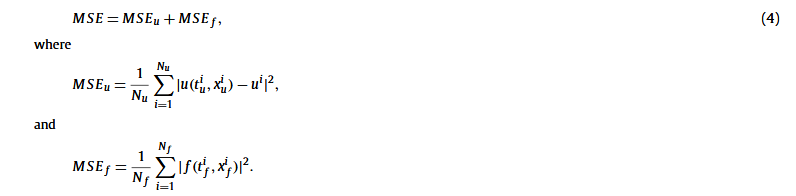
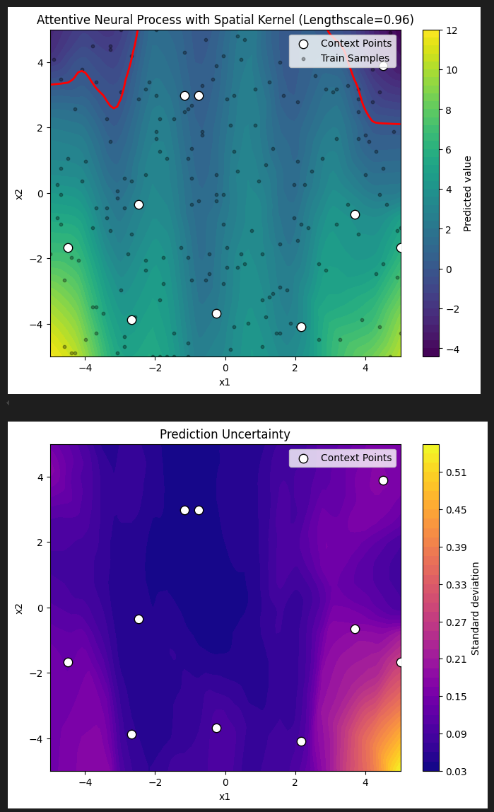

# PINN:Physics-informed neural networks: A deep learning framework for solving forward and inverse problems involving nonlinear partial differential equations

## 基本信息

论文地址：https://linkinghub.elsevier.com/retrieve/pii/S0021999118307125

github:[maziarraissi/PINNs: Physics Informed Deep Learning: Data-driven Solutions and Discovery of Nonlinear Partial Differential Equations](https://github.com/maziarraissi/PINNs)

## 摘要和背景

我们介绍了物理信息神经网络 – 经过训练以解决监督学习任务的神经网络，同时遵守由一般非线性偏微分方程描述的任何给定物理定律。在这项工作中，我们展示了我们在解决两大类问题的背景下的发展：数据驱动的解决方案和数据驱动的偏微分方程发现。根据可用数据的性质和排列方式，我们设计了两种不同类型的算法，即***连续时间和离散时间模型***。第一种类型的模型形成了一个新的数据高效时空函数逼近器系列，而后一种类型允许使用具有无限阶段数的任意精确的隐式 Runge-Kutta 时间步进方案。通过流体、量子力学、反应扩散系统和非线性浅水波传播中的一系列经典问题证明了所提出的框架的有效性。

随着可用数据和计算资源的爆炸性增长，最近在机器学习和数据分析方面的进展已经在各个科学领域取得了变革性的成果，包括图像识别[1]、认知科学[2]和基因组学[3]。然而，在分析复杂的物理、生物或工程系统的过程中，数据获取的成本往往是禁止性的，我们不可避免地面临着在部分信息下进行决策的挑战。在这种小数据环境下，大多数最先进的机器学习技术（例如深度/卷积/递归神经网络）缺乏鲁棒性，并且无法提供收敛性的保证。在第一眼看来，训练一个深度学习算法来准确识别一个非线性映射从几个 - 可能非常高维 - 输入和输出数据对似乎是幼稚的。幸运的是，对于许多与物理和生物系统建模有关的案例，***存在大量的先验知识，这些知识目前尚未在现代机器学习实践中被利用***。无论是原则上的物理定律来描述系统的时间依赖动态，还是一些实证验证的规则或其他领域的专业知识，这些先验信息都可以作为一种正则化因子来约束可接受解的空间大小（例如，在不可压缩流体动力学问题中，通过丢弃任何违反质量守恒原则的非现实流解）。作为回报，将这些结构化信息编码到学习算法中会扩大数据的信息内容，使算法能够快速找到正确的解，并且即使只有很少的训练示例也能很好地泛化。利用结构化先验信息来构造数据高效和物理信息化的学习机器的前景已经在最近的研究中得到了展示[4-6]。在那里，作者们使用高斯过程回归[7]来设计专门针对给定线性算子的函数表示，并能够准确推断解决方案并为数学物理中的几个原型问题提供不确定性估计。Raissi等人[8,9]在推断和系统识别的背景下提出了对非线性问题的扩展。尽管高斯过程在编码先验信息方面具有灵活性和数学优雅性，但处理非线性问题引入了两个重要的限制。首先，在[8,9]中，作者们必须局部线性化任何非线性项，以时间为单位，从而限制了所提方法的适用性，并损害了他们在强非线性环境中的预测准确性。其次，高斯过程回归的贝叶斯性质要求一定的先验假设，这些假设可能会限制模型的表示能力并导致鲁棒性/脆弱性问题，特别是对于非线性问题[10]。

## 研究内容

在这项工作中，我们采用了一种不同的方法，利用深度神经网络及其作为通用函数逼近器的知名能力。在这种情况下，我们可以直接处理非线性问题，而无需进行任何先验假设、线性化或局部时间步进。我**们利用自动微分的最新发展——这是科学计算中最有用但可能未充分利用的技术之一——对神经网络的输入坐标和模型参数进行微分，以获得物理信息神经网络**。

在这项工作中，我们考虑参数化和非线性偏微分方程，其一般形式为

$$
u_t + \mathcal{N}[u ; \lambda] = 0, \, x \in \Omega, \, t \in [0, T]
$$

其中, $u(t, x)$是一个潜在解，$\mathcal{N}[\cdot, \lambda]$是由$\lambda$确定的非线性算子

首先，定义


然后要使用神经网络逼近$u(t,x)$，假设一个和u有一样参数的物理神经网络$f(t,x)$，然后通过最小MSE来学习u和f的共享参数



通过对输入坐标（即空间和时间）求导来为神经网络提供物理信息，其中物理现象由偏微分方程描述。

### 自动微分技术

反向传播就是自动微分，是通过自上而下的复用偏微分达到的

> 参考：[自动微分 - 李理的博客](https://fancyerii.github.io/books/autodiff/)
>
> [神经网络中的自动微分与反向传播 | Roy](https://cf020031308.github.io/wiki/automatic-differentiation-and-back-propagation/)

## 算法

## 实验

# GPT-PINN: Generative Pre-Trained Physics-Informed Neural  Networks toward non-intrusive Meta-learning of parametric PDEs

## 基本信息

论文：http://arxiv.org/abs/2303.14878

github:[skoohy/GPT-PINN：生成式预训练物理信息神经网络实现 --- skoohy/GPT-PINN: Generative Pre-Trained Physics-Informed Neural Networks Implementation](https://github.com/skoohy/GPT-PINN?tab=readme-ov-file)

## 摘要

*物理信息神经网络 (PINN) 已证明自己是一个强大的工具，可以利用深度神经网络的表达能力和现代异构硬件的计算能力来获取非线性偏微分方程 (PDE) 的数值解。然而，它的训练仍然很耗时，特别是在多查询和实时模拟设置中，并且其参数化往往过于过度。在本文中，我们提出了生成式预训练 PINN（GPT-PINN）来缓解参数偏微分方程设置中的这两个挑战。 GPT-PINN 代表了参数系统的全新元学习范式。作为网络的网络，其外网络/元网络是超精简的，只有一个隐藏层的神经元数量显着减少。此外，每个隐藏神经元的激活函数都是在明智选择的系统配置下预先训练的（完整）PINN。元网络自适应地“学习”系统的参数依赖性，并一次“生长”这个隐藏层一个神经元。最后，通过包含在这组自适应选择的参数值下训练的极少数网络，元网络能够准确有效地为整个参数域的参数系统生成替代解。*

# A solver for subsonic flow around airfoils based on physicsinformed neural networks and mesh transformation

## 基本信息

论文：http://arxiv.org/abs/2401.08705

github:[Cao-WenBo/NNfoil：基于物理信息神经网络和网格变换的翼型周围亚音速流动求解器 --- Cao-WenBo/NNfoil: A solver for subsonic flow around airfoils based on physics-informed neural networks and mesh transformation](https://github.com/Cao-WenBo/NNfoil)

## 摘要

物理信息神经网络 (PINN) 最近已成为解决偏微分方程 (PDE) 控制的正向和逆向问题的新流行方法。然而，在翼型周围的流动中，流体在前缘附近大大加速，导致局部急剧的过渡，这是 PINN 难以捕获的。因此，PINN 仍然很少用于求解翼型周围的流动。在本研究中，我们将物理信息神经网络与网格变换相结合，使用神经网络来学习均匀计算空间而不是物理空间中的流。网格变换避免网络捕获具有内部边界（墙边界）的局部较尖锐的过渡和学习流。我们成功地解决了无粘流问题，并为任意翼型提供了开源亚音速流求解器。我们的结果表明，该求解器表现出高阶属性，在非常稀疏的网格上比二阶有限体积方法 (FVM) 实现了近一个数量级的误差减少。受限于神经网络的学习能力和优化难度，该求解器的精度不会随着网格细化而显着提高。尽管如此，它在精细网格上实现了与二阶 FVM 相当的精度和效率。最后，我们强调了该求解器在求解参数问题时的显着优势，因为它可以有效地获得连续参数空间中关于攻角的解。


## TODO

1. 弄清楚SVR是如何实现不确定性的(高斯过程)

首先什么是SVR,如何寻找最佳SVR超参数

计算相似度，高斯核，结合了高斯核的SVR

高斯过程回归：

**预测均值 $u_*$**：基于核函数的加权插值，反映数据趋势。

**预测方差 $\sigma_*^2$**：量化不确定性，在数据稀疏区域增大。

2. PDE，初值，边值，真值实现
3. 做出一个demo，未必要实现PDE, 可以暂时先实现一个二分类问题

- 为什么需要nataf和lhs
  1. 用少量LHS样本（Data）构建初始代理模型。
  2. 通过蒙特卡洛样本（X_mcs）评估代理模型的全局失效概率。
  3. 从候选点（Data_tiankong）中选择关键点进行真实评估，更新代理模型。
  4. 迭代直至收敛，最终用蒙特卡洛样本计算高精度失效概率。

```matlab
% 生成蒙特卡洛样本
for rv_id = 1:dim
   X_mcs(:,rv_id) = GenerateRV(variable_table{rv_id,1}, variable_table{rv_id,2}, variable_table{rv_id,3}, N_sim);
end

% 生成候选点
for i=1:dim
    Data_tiankong(:,i) = unifrnd(-3,3,N_tianchong,1);
end

% 生成初始拉丁超立方样本
Data = 6.*UniformPoint(N0,dim,'Latin')-3;

% Nataf变换
xi = NatafTransformation(Data, variable_table, -1);
x_un = NatafTransformation(Data_tiankong, variable_table, -1);
```


## 问题设置

```python
class Problem:
        def __init__(self):
            self.performance_func = None
            self.variable_table = None

    def performance_func(x):
        return np.sin(2.5*x[0]) - (x[0]**2 + 4)*(x[1] - 1)/20 + 2
    
    problem = Problem()
    problem.performance_func = performance_func
    problem.variable_table = [
        ('normal', 1.5, 1),
        ('normal', 2.5, 1)
    ]
```


1. 多头神经过程存在严重欠拟合

## Kriging

```
import numpy as np
import matplotlib.pyplot as plt
from sklearn.gaussian_process import GaussianProcessRegressor
from sklearn.gaussian_process.kernels import RBF, ConstantKernel as C, Matern, WhiteKernel

# 假设您已有x_train, y_train, x_test, y_test数据

# 设置随机种子以确保结果可复现
np.random.seed(42)

# 绘制训练数据和真实函数
plt.figure(figsize=(12, 7))
plt.scatter(x_train, y_train, c='r', s=60, label='Training Data')
plt.plot(x_test, y_test, 'k-', linewidth=2, label='True Function')
plt.title('Training Data and True Function', fontsize=16)
plt.xlabel('x', fontsize=14)
plt.ylabel('y', fontsize=14)
plt.legend(fontsize=12)
plt.grid(True, alpha=0.3)
plt.tight_layout()
plt.show()

# 定义不同的核函数以比较性能
kernels = {
    'RBF': C(1.0) * RBF(length_scale=1.0) + WhiteKernel(noise_level=0.1),
    'Matern': C(1.0) * Matern(length_scale=1.0, nu=1.5) + WhiteKernel(noise_level=0.1)
}

# 训练不同核函数的Kriging模型并进行预测
results = {}

for name, kernel in kernels.items():
    # 创建并训练Kriging模型
    model = GaussianProcessRegressor(
        kernel=kernel, 
        n_restarts_optimizer=10,
        normalize_y=True,
        alpha=1e-10  # 数值稳定性的小常数
    )
    
    model.fit(x_train.reshape(-1, 1), y_train)
    
    # 进行预测
    y_pred, y_std = model.predict(x_test.reshape(-1, 1), return_std=True)
    
    # 计算MSE
    mse = np.mean((y_pred - y_test) ** 2)
    
    # 存储结果
    results[name] = {
        'model': model,
        'pred_mean': y_pred,
        'pred_std': y_std,
        'mse': mse
    }
    
    print(f"{name} Kernel - MSE: {mse:.6f}")
    print(f"Optimized kernel parameters: {model.kernel_}")

# 可视化预测结果
plt.figure(figsize=(14, 8))

# 绘制真实函数
plt.plot(x_test, y_test, 'k-', linewidth=3, label='True Function')

# 绘制训练数据
plt.scatter(x_train, y_train, c='k', s=60, label='Training Points')

# 为每个模型绘制预测结果
colors = ['b', 'r']
for i, (name, res) in enumerate(results.items()):
    plt.plot(x_test, res['pred_mean'], f'{colors[i]}-', linewidth=2.5, label=f'{name} Prediction')
    plt.fill_between(
        x_test.flatten(),
        res['pred_mean'] - 2 * res['pred_std'],
        res['pred_mean'] + 2 * res['pred_std'],
        alpha=0.2,
        color=colors[i],
        label=f'{name} Uncertainty'
    )

plt.title('Kriging Model Predictions with Different Kernels', fontsize=18)
plt.xlabel('x', fontsize=15)
plt.ylabel('y', fontsize=15)
plt.legend(fontsize=14)
plt.grid(True, alpha=0.3)
plt.tight_layout()
plt.savefig('kriging_predictions.png', dpi=300)
plt.show()

# 创建误差分析图
plt.figure(figsize=(14, 6))

# 计算每个模型的误差
for i, (name, res) in enumerate(results.items()):
    error = np.abs(res['pred_mean'] - y_test)
    plt.plot(x_test, error, f'{colors[i]}-', linewidth=2, label=f'{name} Error')

# 添加训练点位置的垂直线标记
for x_point in x_train:
    plt.axvline(x=x_point, color='gray', linestyle='--', alpha=0.3)

plt.title('Absolute Error Comparison', fontsize=18)
plt.xlabel('x', fontsize=15)
plt.ylabel('Absolute Error', fontsize=15)
plt.legend(fontsize=14)
plt.grid(True, alpha=0.3)
plt.tight_layout()
plt.savefig('kriging_error_comparison.png', dpi=300)
plt.show()

# 可视化方差/不确定性
plt.figure(figsize=(14, 6))

for i, (name, res) in enumerate(results.items()):
    plt.plot(x_test, res['pred_std'], f'{colors[i]}-', linewidth=2, label=f'{name} Uncertainty')

# 添加训练点位置的垂直线标记
for x_point in x_train:
    plt.axvline(x=x_point, color='gray', linestyle='--', alpha=0.3)

plt.title('Prediction Uncertainty', fontsize=18)
plt.xlabel('x', fontsize=15)
plt.ylabel('Standard Deviation', fontsize=15)
plt.legend(fontsize=14)
plt.grid(True, alpha=0.3)
plt.tight_layout()
plt.savefig('kriging_uncertainty.png', dpi=300)
plt.show()

# 输出详细的性能指标
print("\nDetailed Performance Metrics:")
print("-" * 50)
print(f"{'Kernel':<10} | {'MSE':<10} | {'MAE':<10} | {'Max Error':<10}")
print("-" * 50)

for name, res in results.items():
    mae = np.mean(np.abs(res['pred_mean'] - y_test))
    max_err = np.max(np.abs(res['pred_mean'] - y_test))
    print(f"{name:<10} | {res['mse']:<10.6f} | {mae:<10.6f} | {max_err:<10.6f}")

```

## 标准Np只能拟合单峰函数（但是这里不是这个问题）

ELBO 通常假设一个比较简单的**变分分布族**（如高斯分布或各向同性高斯），这能方便优化计算，但**高斯分布本身只能描述单峰分布**。如果真实的后验分布是多峰的（例如有两个截然不同的“解释”都能合理生成观测结果），单个高斯根本难以把所有峰都覆盖。

这时，为了最大化ELBO，变分分布会倾向于“平均”这些模式或者只覆盖其中一个模式，导致其它模式完全被忽略。这就是所谓的“**模式崩塌（mode collapse）**”或者“**模态覆盖失败**”。


## 神经过程借鉴Kriging 空间相关性





# 计算人工智能论文规划

- 什么是

