## 梯度提升决策树

> cite: [图解机器学习 | GBDT模型详解](https://www.showmeai.tech/article-detail/193)

### Boosting and Bagging


### GBDT

使用残差来迭代下一步的计算

1. 初始化回归树

$$
f_1{x} = \arg\min_{c}\sum_{n=1}^{n}L(y_{i},x)
$$

2. 迭代，从第二棵树开始不断计算每一棵树的训练目标， 也就是前面结果的残差
3. 对于当前第m棵子树而言，我们需要遍历它的可行的切分点以及阈值，找到最优的预测值c对应的参数，使得尽可能逼近残差，我们来写出这段公式

$$
r_{mi} = -\left[ \frac{\partial L(y_i, f(x_i))}{\partial f(x_i)} \right]_{f(x) = f_{m-1}(x)}
\\
c_{mj} = \arg\min_{c} \sum_{x_i \in R_{mj}} L(y_i, f_{m-1}(x_i) + c)
$$

这种Boost思想是否能应用到代理模型呢

### XGBOOST

要实现模型复杂度和损失的最小，

$$\omega(f) = \gamma T + \frac{1}{2}\lambda \sum_{j=1}^{T} w_j^2 $$

### LightGBM

和xgboost类似，小样本容易过拟合

现在二者没什么本质性差别，lgbm快一点点

# KAN

> http://arxiv.org/abs/2404.19756

## 摘要

受Kolmogorov-Arnold表示定理的启发，我们提出了KolmogorovArnold网络（KANs），作为多层感知机（MLPs）的有前景替代方案。MLPs在节点（“神经元”）上有固定的激活函数，而KANs在边（“权重”）上有可学习的激活函数。KANs完全没有线性权重——每个权重参数都被一个参数化为样条的单变量函数所取代。我们展示了这一看似简单的改变使KANs在准确性和可解释性方面优于MLPs，尤其是在小规模的AI与科学任务中。在准确性方面，较小的KANs在函数拟合任务中可以达到与较大MLPs相当或更好的准确性。理论和实验证明，KANs的神经扩展规律比MLPs更快。在可解释性方面，KANs可以直观地可视化，并能轻松与人类用户互动。通过数学和物理领域的两个例子，KANs被证明是有用的“合作者”，帮助科学家（重新）发现数学和物理定律。总之，KANs是MLPs的有前景替代方案，为进一步改进今天依赖MLPs的深度学习模型提供了机会。


## KAN vs MLP

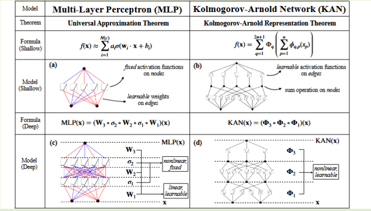

## KA表示定理

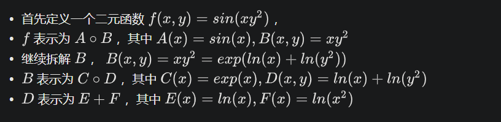

对于多元函数而言，可以近似化多个一元函数的和，而这个最后的加法操作才是真正的多元函数


这是KAN的核心思想，以矩阵形式写的把x，作为$\phi_{\text{in}}$之前的输入，$\phi_{\text{in}}$在作为$\phi{\text{out}}$的输入

KA只是证明了存在性，但是具体如何构造需要网络训练

以以下公式为例
$$
y = sin(x_1^3 + x_2^2)
$$

$$
y = \sum_{i=1}^{5} \phi_i(\psi_{i1}(x_1) + \psi_{i2}(x_2))
$$

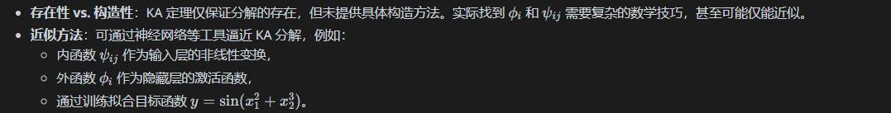

对于内函数使用样条（对低维有准确性），对于然后进行MLP

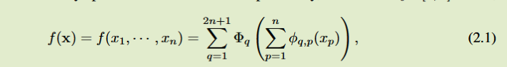,

提出问题，很可能对于公式2.1而言，一维函数是非平滑的，但是可以通过更深的表示让其更平滑，通过Grid更加细致的你和，比如在梯度大的区域，grid更密

# KAN2.0

回到KA reoresentation theory(KART)任意连续函数都可以分解为单变量连续函数和加法的有限组合。

KAN主要实现加法，KAN2实现乘法

# relate works

## Adaptive First-Crossing Approach for Life-Cycle Reliability Analysis

支持向量回归 近似第一次穿越 时变极限状态函数 （LSF）

生命周期可靠性分析可以有效地估计和呈现结构在其生命周期中动态不确定性下的安全状态变化。第一次穿越方法是基于第一次穿越时间点 （FCTP） 的概率特征评估时变可靠性的有效方法。然而，FCTP 模型存在许多关键挑战，例如计算准确性。本文针对结构在整个生命周期内的时变可靠性提出了一种自适应首次交叉方法，可以为循环寿命可靠性分析和设计提供工具。首先通过执行支持向量回归来估计 FCTP 关于输入变量的响应面。此外，通过整合统一设计和代理模型的中心矩，开发了用于训练支持向量回归的自适应学习算法。然后，构建了结合首次穿越概率分布函数 （PDF） 的原始矩和熵的收敛条件，以构建最优的首次穿越代理模型。最后，使用自适应核密度估计对首次交叉 PDF 进行求解，以获得整个生命周期内的时变可靠性趋势。通过实例演示了在应用程序中指定所提出的方法。

## A stochastic process discretization method combing active learning Kriging model for efficient time-variant reliability analysis

时变可靠性分析 (TRA) 在评估产品全生命周期可靠性方面引起了广泛关注。
随机过程离散化被认为是将时变问题转化为更易于处理的时不变问题的最简单的方法之一。然而，将其应用于时变问题需要克服两个主要问题：(1)小离散时间间隔的效率低，(2)大离散时间间隔的精度低。为了解决这两个挑战，我们提出了一种基于随机过程离散化的克里金辅助时变可靠性分析方法 (简称 K-TRPD)。首先，通过随机过程离散化将复杂的时变可靠性问题转化为传统的时不变问题。其次，通过克里金模型在整个相关时间段内近似最可能点 (MPP) 轨迹，其输入通过主动学习方法从离散时间点中识别出来；并在确定的时间点上采用一阶可靠性方法（FORM）获得输出。
最后，利用构建的克里金模型对每个离散时间点进行时不变可靠性分析，并利用时不变可靠性分析结果对多元正态分布函数进行分析，得到时变可靠性。本文通过三个数值分析算例和一个工程设计算例，证明了所提方法的有效性。

## KRIGING

> [克里金法 (KRG) — SMT 2.9.1 文档 --- Kriging (KRG) — SMT 2.9.1 documentation](https://smt.readthedocs.io/en/stable/_src_docs/surrogate_models/gpr/krg.html)


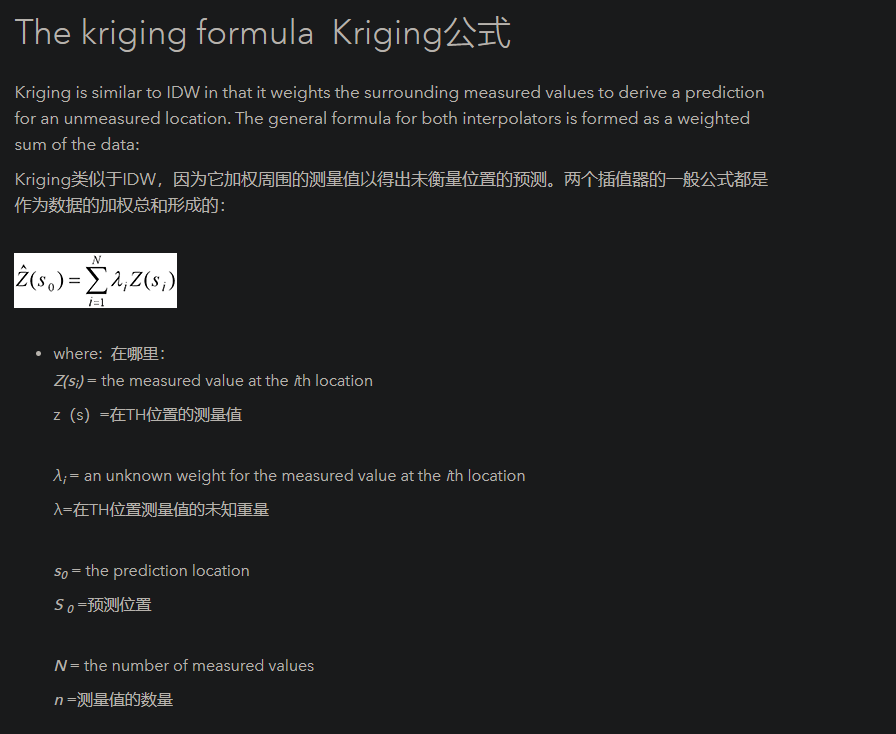

## NATAFTransformation

> [Nataf — UQpy v4.1.0 文档 --- Nataf — UQpy v4.1.0 documentation](https://uqpyproject.readthedocs.io/en/latest/transformations/nataf.html)

已知边缘累计分布函数（CDF）$$F_{X_{i}}(x_i)$$和相关矩阵$C_x=[\xi_(ij)]$可以把各个变量变换成标准正态分布$Z_i$,但是这种变换是存在失真的
$$
Z_i = \phi_{-1}(F_i(X_i))
$$

## 面向结构可靠性分析的并行自适应加点策略

本文提出一种基于通  用学习函数的并行自适应加点策略 CF - K,该方  法考虑了样本点的局部不确定性并保证所选的样  本点分布在极限状态函数附近,进一步地结合 k  - means 算法,在每次迭代过程中从多区域分别  选择最佳样本点以提高代理模型精度

## PINNs总结

> [内嵌物理知识神经网络（PINN）是个坑吗？ - 知乎](https://zhuanlan.zhihu.com/p/468748367)

总结：主要还是PDE，PINNs基于无网格方法，比如KANSA法，但是纯数据驱动会导致一个问题，就是大量的观测值会使得其泛化性变差，其推断不可行，PINNs做到了联系物理约束，在小数据就可以做到泛化性较强。

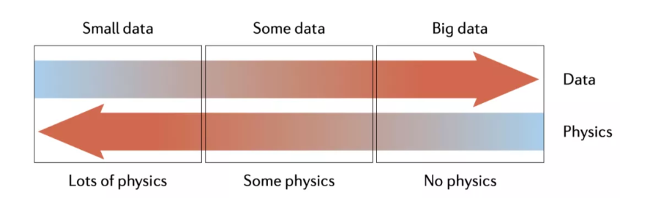

## 基于改进学习策略的 Kriging 模型结构可靠度算法

论文工作：

本文基于 Kriging 模 型 可 靠 性 计 算 框 架, 考 虑  Kriging 模型主动学习过程中对全局和局部搜索能  力的综合要求,针对传统 EGO 主动学习方法选点位  置不对 等 问 题, 提 出 一 种 IEGO ( improved efficient  global optimization) 主动学习方法,该方法既能在极  限状态面附近局部搜索最佳样本点,又能根据模型  预测方差的大小全局寻找最佳样本点,进而不断修  正 Kriging 模型的精度,最后结合蒙特卡罗方法完成  结构可靠性指标计算。

总结： 

总结了对Kriging的优化方案，提到了对模型中的参数$\theta$的优化，可以通过粒子群算法优化，或者**主动学习选点策略**，这里有很多种方法，主要还是对EGO方法的衍生。

## 新型结构可靠性分析自适应加点策略

论文工作：
因此,本文提出了一种面向多种代理模型的自适应加点策略,并用于结构可靠性分析中。该策略通过考虑样本点间的平均距离和最小距离，并引人极限状态函数附近的权重，保证样本点的自适应添加兼顾了样本稀疏处和极限状态函数附近。同时,引人变量的联合概率密度函数,确保所添加的样本点落在高概率区域,即保证了代理模型对失效概率的估计稳定收敛。因为本文所提自适应加点策略无需考虑样本点之间的协方差以及样本点预测值的标准差等信息，所以该策略不仅可用于 kriging模型,同时也适用于其他代理模型,具有较高的适用性。

总结：

自适应加点的一种，提到了四种加点策略：

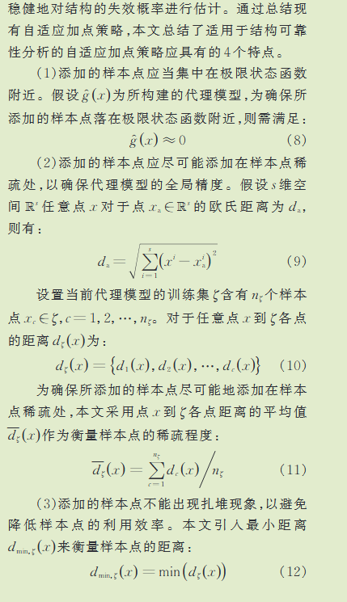

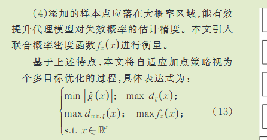

## AK-MCS: An active learning reliability method combining Kriging and Monte Carlo Simulation

结构可靠性的一个重要挑战是将对数值模型的调用次数保持在最低限度。工程问题涉及越来越复杂的计算机代码，并且评估故障概率可能需要非常耗时的计算。元模型用于减少这些计算时间。为了评估可靠性，最流行的方法仍然是响应面的众多变体。多项式混沌 [1] 和支持向量机 [2] 也是可能的，并且在过去几十年中已经引起了研究人员的考虑。然而，最近，源自地统计学的克里金法在可靠性分析中出现了。克里金法在优化中得到广泛应用，刚刚开始出现在不确定性传播 [3] 和可靠性 [4,5] 研究中。它呈现了有趣的特征，例如精确插值和预测的局部不确定性指数，可用于主动学习方法。本文的目的是提出一种基于蒙特卡洛模拟和克里金元模型的迭代方法，以更有效的方式评估结构的可靠性。该方法称为 AK-MCS，即结合克里金法和蒙特卡洛模拟的主动学习可靠性方法。事实证明，它非常有效，因为使用 AK-MCS 获得的失败概率非常准确，而且只需对 performance 函数进行少量调用即可。文献中的几个例子来说明该方法并证明其有效性，特别是对于处理高非线性、非微分性、非凸和非连接失效和高维域的问题。

## Monte carlo dropout

> [蒙特卡洛 Dropout：实用指南 | 作者：Ciaran Bench | Medium --- Monte Carlo Dropout: a practical guide | by Ciaran Bench | Medium](https://medium.com/@ciaranbench/monte-carlo-dropout-a-practical-guide-4b4dc18014b5)

这是一种实现输出不确定性的方法

### KL散度，交叉熵

衡量两种分布的相似程度

# Surrogate model

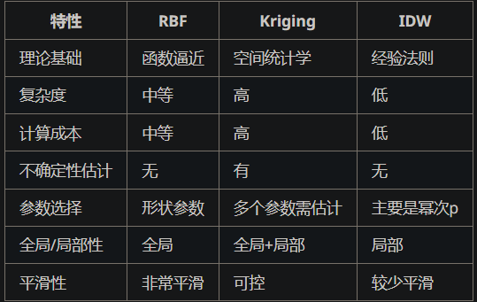

其中KRIGING，是作为最佳线性无偏估计（BLUP）,自带一个概率的置信度，那传统NN是没法做到的，所以映入了BNNs，或者一些其他的不确定性手段，首先什么是不确定性？

### 不确定性

偶然不确定性和认知不确定性（Aleatoric Uncertainty & Epistemic Uncertainty）

前者讲的是偏差bias，后者是泛化（？），对于未经过训练数据的置信度应该较低

### 参数化和非参数化

是否假定存在明确的参数，比如Kriging，协方差函数中的尺度参数$\theta$,方差参数$\sigma^{2}$


## 无限元高斯分布

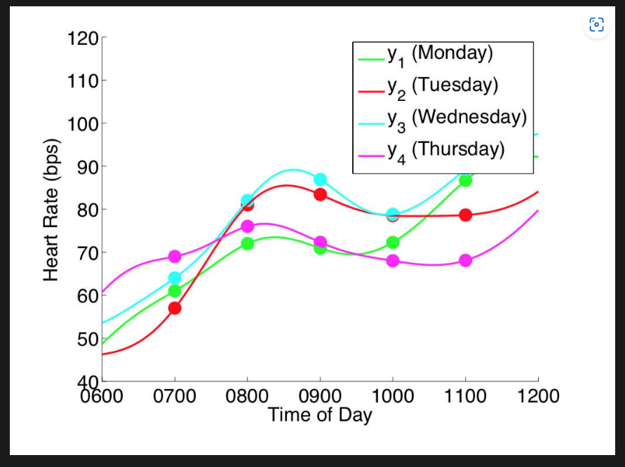

## SMT实现的高斯作为基函数（径向基函数RBF）

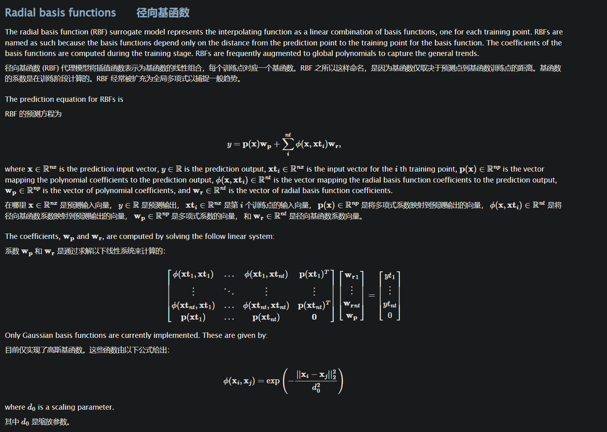

## IDW（反向距离加权）

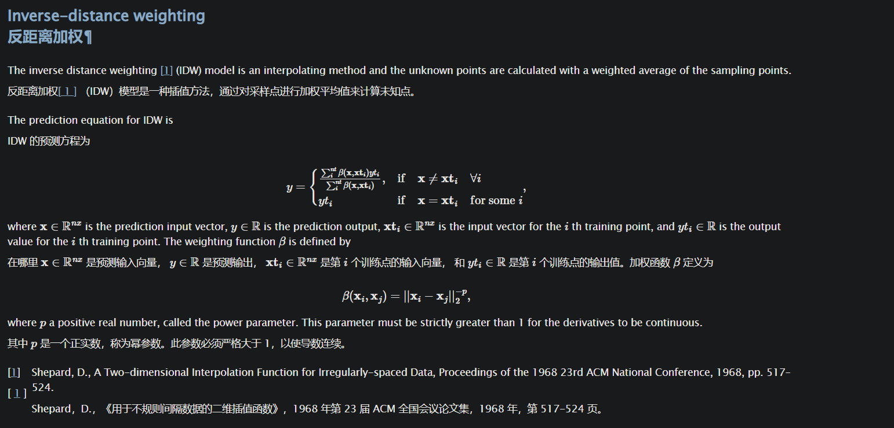

## BNNs(贝叶斯神经网络)

## 直接建模输出分布

训练的输出直接修改为均值和方差，

> 对于分类问题可以搜索迪利克雷分布和DS证据理论

## 神经网络高斯过程

1. NTK

2. NNGP

## 稀疏Kriging(高斯过程)

1. 低秩近似
2. 变分推断

# 选点策略和加点策略

## 

1. $f{(x)}$是已知还是未知？

f（x,t）有已知和未知两种选项，其中$x \sim \mathcal{N}(\mu,\sigma^2)$，

2. 支持向量回归是如何解决不确定性问题的。

穿越点方法本身不是必须支持置信度，只要能返回一个值就可以

3. 选点策略可以为如何评判点的好坏，可以通过能否有效降低拟合点的置信区间。

## 设计思路

### 第一次设计思路

1. 确定$f（x_1,x_2,t）$
2. 生成待采样数据存入
3. 对待采样数据进行DBSCAN聚类

### 第二次设计思路

1. 同样确定$f（x_1,x_2,t）$
2. 生成待采样数据存入[x1,x2]，这一步需要大量采样
3. 取上一步采样得到的[x1,x2]，将其加入g(x1, x2, t) 得到关于t的函数，使函数等于0，这时候求解出的t就是样本点，打包数据[x1,x2,t]，这一也需要大量采样数据
4. 然后问题回到了对此函数的采样，如何采最少的样得到最具有可信度的t

### 第三次设计思路

> 这个循环实现了一个基于支持向量回归（SVR）的主动学习过程，用于估计系统的失效概率。以下是循环的详细说明：
>
> ### 主要步骤
>
> 1. **初始化超参数**：
>    - 设置SVR模型的超参数初始值、下界和上界。
>    - `Hyperparameters`: 初始超参数。
>    - `lb` 和 `ub`: 超参数的上下界。
>
> 2. **训练SVR模型**：
>    - 使用当前样本点 `xi` 和其评估值 `Eva` 来训练SVR模型 `model1`。
>
> 3. **在候选点上进行预测**：
>    - 使用训练好的SVR模型在候选点 `x_un` 上进行预测，得到预测值 `yC` 和不确定性 `or`。
>
> 4. **计算交叉加权得分**：
>    - 计算 `UC`（不确定性度量）。
>    - 使用多个标准（预测值、归一化不确定性、与现有样本的平均距离和最小距离）来计算交叉加权得分 `CW`。
>    - 将各标准的得分求和，得到每个候选点的总得分 `CWp`。
>
> 5. **选择下一个样本点**：
>    - 根据 `CWp` 选择得分最高的候选点 `CCC`。
>    - 如果所有得分均不为正，则选择不确定性最高的点。
>    - 从候选集中移除选定点，并在该点上评估性能函数。
>
> 6. **更新样本集**：
>    - 将新评估的点 `CCC` 及其结果 `g(h)` 添加到样本集中。
>
> 7. **估计失效概率**：
>    - 对 `X_mcs` 进行预测，计算预测的均值 `gmean` 和不确定性 `delta`。
>    - 估计失效概率 `PF(h)`，并计算其上下界 `PFu(h)` 和 `PFl(h)`。
>    - 计算失效概率的差异 `dPF(h)` 和变异系数 `COV(h)`。
>
> 8. **检查收敛条件**：
>    - 检查失效概率的相对变化和不确定性是否满足收敛条件。
>    - 如果满足条件，则终止循环。
>
> ### 目的
>
> 这个循环通过主动选择最有价值的样本点来迭代改进替代模型，从而高效估计系统的失效概率。通过考虑预测值、不确定性和样本间距离等因素，算法在探索新区域和利用现有模型之间取得平衡。


> 

```

```

