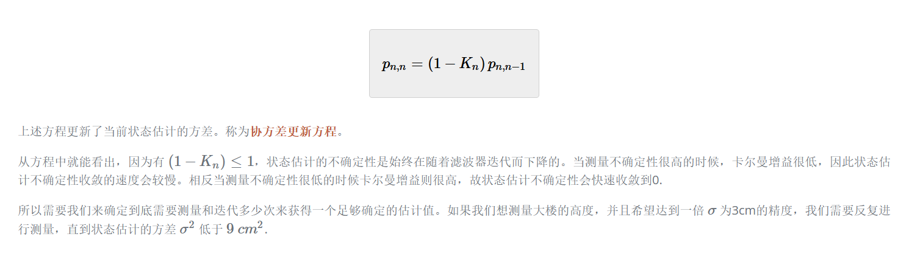

## 状态空间方程

## 状态变量

非线性系统转换为线性系统

静态系统和动态系统的区别，对于选择状态变量

## 转移函数

转移函数矩阵
$$
(sI - A)^{-1}D
$$

$$
\dot{\vec{x}} =  A\vec{x} + B\vec{u}\\ 
sX(s) = A X(s) + BU(s)\\
\vec{y} = C\vec{x} + D\vec{u}\\
\frac{Y(s)}{X(s)}
$$

## 卡尔曼滤波算法

线性状态估计

## 

