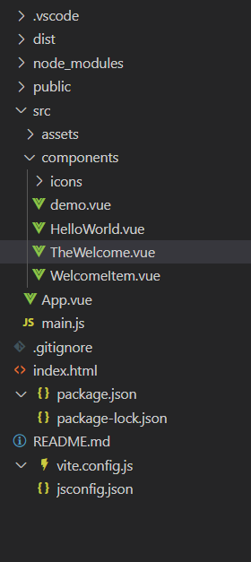

Vue -> uni-app (HbuilderX)  -> 微信小程序

- [ ] 这里使用uni-app可能还是不是很好，现在使用yarn来打包小程序

## HTML标签

```html
<!DOCTYPE html>
<html>
  <head>
    <title>网页标题</title>
  </head>
  <body>
    <header>头部</header>
    <nav>导航</nav>
    <main>
      <section>
        <h1>主要内容</h1>
          <h2>次要标题</h2>
        <p>一段文本</p>
        
      </section>
    </main>
    <footer>底部版权</footer>
  </body>
</html>


```


## Vue基本



像这样一个文件结构就是index.html是html模板,main.js负责创建vue引用，并挂载到index中，App.vue就是Vue应用的根组件，负责对各个组件(components)排版。

一般来说 `.vue` 文件包含三个部分：`<template>`、`<script>` 和 `<style>`。

```vue
<script setup>
import { ref , onMounted, watch} from 'vue'
const count = ref(0)

onMounted(() => {
  console.log('组件已经挂载到页面')
  const savedCount = localStorage.getItem('count')
  if (savedCount !== null) {
    count.value = parseInt(savedCount)
  }
})

watch(count, (newVal) => {
  localStorage.setItem('count', newVal)
  console.log('Count has changed:', newVal)
})

function resetCount() {
  count.value = 0
  localStorage.removeItem('count')
}
</script>

<template>
  <div>
    <button style="color: green;" @click="count++">Count is: {{ count }}</button>
  </div>
  <div>
    <button style="color: red;" @click="resetCount">Reset Count</button>
  </div>
</template>

<style scoped>
.btn-group {
  display: flex;
  flex-direction: column;
  gap: 10px; /* 按钮之间的间距 */
}
button {
  font-weight: bold;
}
</style>
```

## CDN ESM importmap

```html
<!-- 直接在 HTML 文件中使用 Vue CDN 实现计数器功能 -->
<!DOCTYPE html>
<html lang="en">
<head>
  <meta charset="UTF-8">
  <title>Vue CDN Demo</title>
</head>
<body>
  <div id="app">
    <button style="color: green;" @click="count++">Count is: {{ count }}</button>
    <button style="color: red;" @click="resetCount">Reset Count</button>
  </div>

  <!-- 引入 Vue 3 CDN -->
  <script src="https://unpkg.com/vue@3/dist/vue.global.prod.js"></script>
  <script>
    const { createApp, ref, onMounted, watch } = Vue

    createApp({
      setup() {
        const count = ref(0)
ref 返回一个响应式变量，每当变量变化，页面会同步变化
        onMounted(() => {
          const savedCount = localStorage.getItem('count')
          if (savedCount !== null) {
            count.value = parseInt(savedCount)
          }
        })

        watch(count, (newVal) => {
          localStorage.setItem('count', newVal)
        })

        function resetCount() {
          count.value = 0
          localStorage.removeItem('count')
        }

        return { count, resetCount }
      }
    }).mount('#app')
  </script>
</body>
</html>
```

