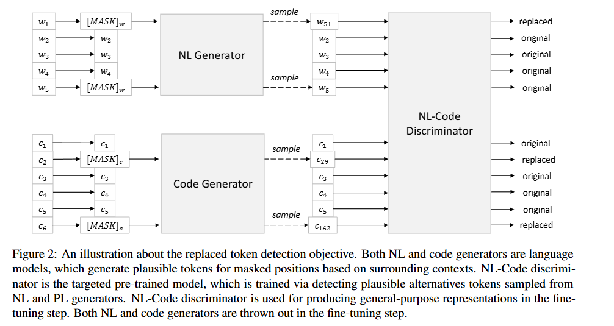
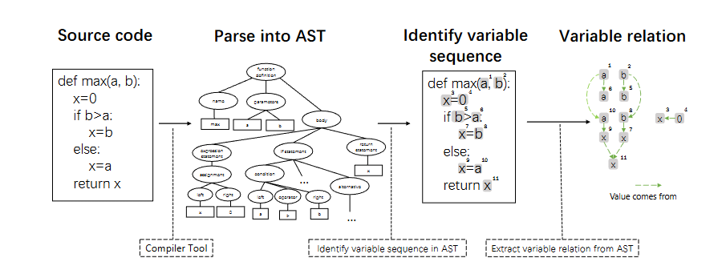
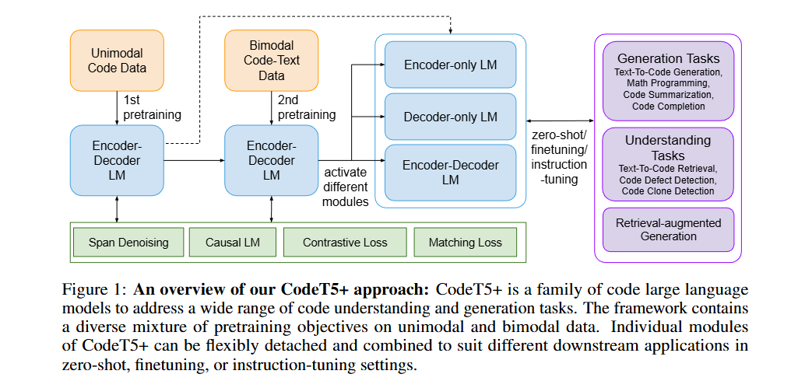
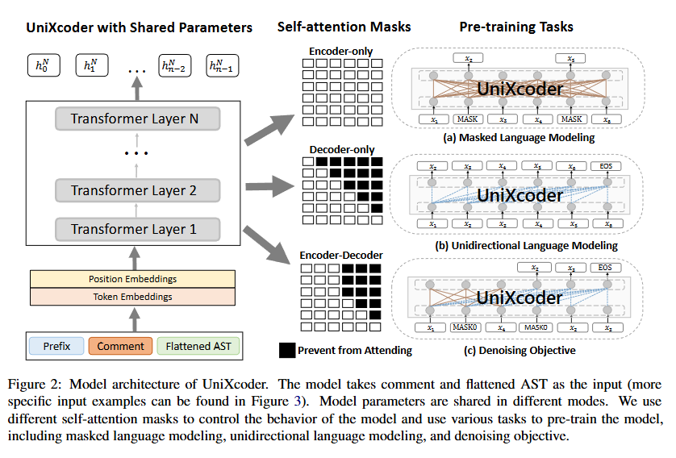

# embedding code

## **CodeBERT** 



## **GraphCodeBERT** 



## **CodeT5** 



## StarCoder 2

[bigcode (BigCode)](https://huggingface.co/bigcode)

## UniXcoder



## Specific Tools/Frameworks

- **Sourcegraph** - code search engine with semantic understanding
- **GitHub Copilot's approach** - uses surrounding code as context
- **Cursor/Continue.dev** - use codebase-aware retrieval
- **Chroma/Weaviate** - vector DBs with hybrid search capabilities

Your skepticism is well-founded. Let me break down the concerns with this approach:

## Fundamental Problems

**1. The "LEGO block" fallacy**
- Code isn't modular building blocks you can snap together
- Functions have implicit assumptions about state, context, error handling
- Gluing together examples often creates subtly broken code
- Interface mismatches, data format differences, error propagation issues

**2. Example code is contextual**
- Examples are written for specific use cases, not general reuse
- They make assumptions about the surrounding environment
- Edge cases handled (or not handled) may not fit your needs
- Performance characteristics may be inappropriate for your context

**3. The planning-retrieval gap**
- LLM plans at high abstraction: "authenticate user, validate input, query database"
- Retrieved examples are concrete: specific auth library, specific validation, specific ORM
- The semantic gap between abstract plan and concrete example is huge
- Bridging this gap still requires synthesis, not just retrieval

**4. Composition complexity**
- How do you handle conflicting dependencies from different examples?
- How do you reconcile different error handling patterns?
- How do you manage state across composed functions?
- Integration code is often more complex than the functions themselves

## What Actually Happens

When you retrieve example code:
- **Best case**: LLM still needs to adapt/modify it significantly → you're back to code generation
- **Worst case**: LLM copies it verbatim → creates brittle, inappropriate code
- **Reality**: The LLM needs to understand the code deeply anyway to integrate it properly

## The Real Value of Code Retrieval

Code retrieval **is** valuable, but not as copy-paste building blocks:

**1. API usage patterns**
- "How do I call this specific library function?"
- "What parameters does this API expect?"
- "What does the return value look like?"

**2. Idioms and conventions**
- "How does this codebase handle errors?"
- "What's the preferred logging pattern?"
- "How are configs typically loaded?"

**3. Context and understanding**
- Helping the LLM understand your codebase's architecture
- Learning domain-specific abstractions
- Understanding existing similar implementations

## A Better Approach?

**Retrieval for understanding, not assembly:**
1. **Give LLM architectural context** - retrieve related code to understand patterns
2. **Provide API documentation** - not just examples, but contracts and types
3. **Let LLM synthesize** - use retrieval to inform generation, not replace it
4. **Validate, don't construct** - retrieve tests/specs to check generated code

**Hybrid model:**
```
User request (natural language)
    ↓
LLM plans structure (with architectural context from retrieval)
    ↓
LLM generates code (informed by API docs and patterns)
    ↓
Retrieve similar implementations for validation/refinement
    ↓
LLM refines based on retrieved examples
```

## When Direct Retrieval Works

There ARE scenarios where retrieval-based assembly works:
- **Highly standardized tasks** - boilerplate, scaffolding, config files
- **Well-isolated utilities** - pure functions with clear contracts
- **Template expansion** - filling in known patterns with variables
- **Configuration-driven** - when composition is declarative, not imperative

## The Question You Should Ask

Instead of "Can I assemble code from retrieved examples?", ask:
- "How can retrieval help the LLM write better code from scratch?"
- "What context does the LLM need to generate appropriate code?"
- "How can I validate that generated code fits our patterns?"

The LLM's strength is synthesis and reasoning. Use retrieval to enhance that, not replace it.

**Does this resonate with your concerns? What specific problem are you trying to solve with this approach?**