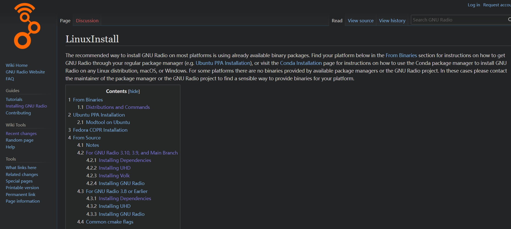

记一个wsl安装gnuradio经历，学校有一个课是使用gnuradio玩usrp，然后建议在linux上安装，本次安装主要设计wsl上安装gnuradio。

> [GNU Radio](https://wiki.gnuradio.org/index.php/Main_Page)

首先没得说

选择从源码构建，这里只要你是ubuntu20.04都是可以选3.10的，亲测可以装。

如果IMPOERT ERROR了，大概率是LD_PATH没设置好，从源码里面构建步骤里面有具体的设置方法。

装好了以后，会有一个GUI界面，会出现一个问题，如果你想设置听广播，但是wsl是没有声卡的，也就没法播放到windows, 我搜索了解决方案就一个，pulsyaudio。这软件很老了

> [Setting Up WSL with Graphics and Audio - Mianzhi Wang](https://research.wmz.ninja/articles/2017/11/setting-up-wsl-with-graphics-and-audio.html)

而且每次启动都很麻烦，你需要找到busid,然后共享，分享给wsl（因为wsl默认是不支持usb的，你需要把usrp分享给wsl他才能读取）, 然后打开pulsyaudio。

所以权衡之下，只做此记录，转向双系统，随便划100g硬盘给ubuntu就行，而且感觉原生linux编译快了很多有没有，ubuntu还没有windows这里的合盖休眠问题，合盖后每次启动都很快。
