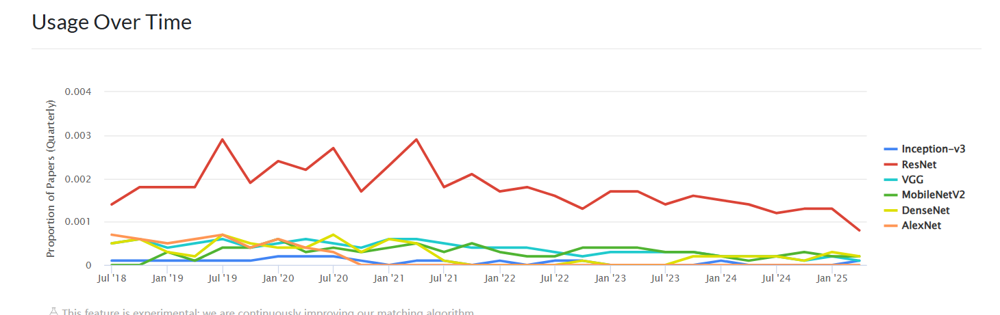
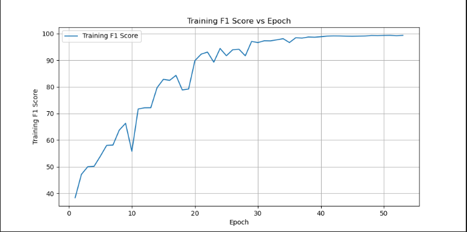
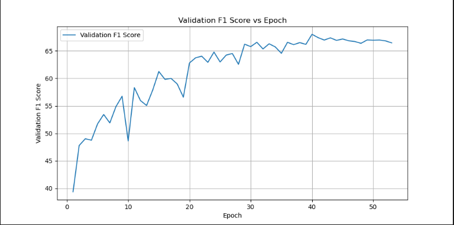
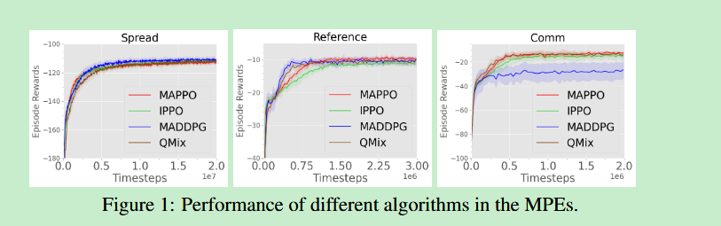
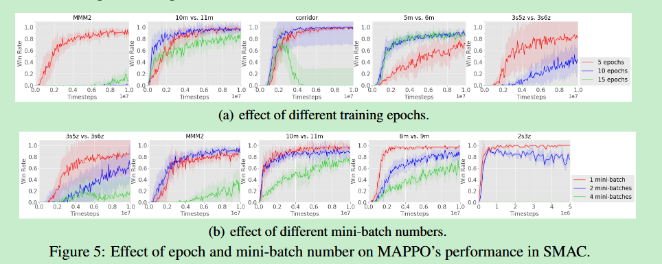
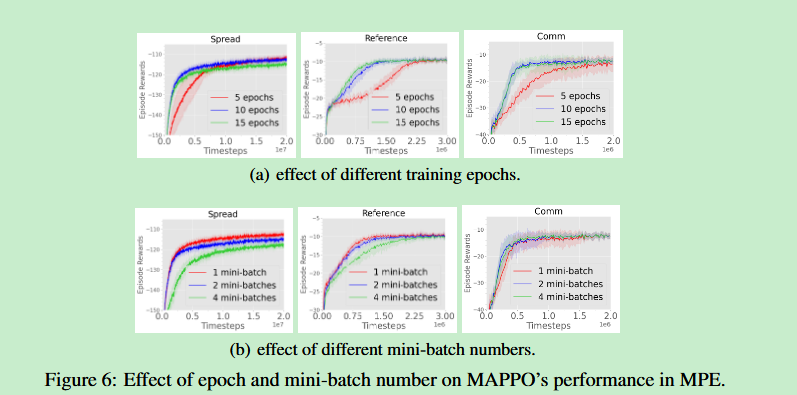

[toc]

# TODO



- StyleGAN
- 蛋白质图片分类
- 强化学习MAPPO，betaPPO,随机策略

## GAN

首先对于一个基本的GAN网络，少不了G和D

```python
class Generator(nn.Module):
        def __init__(self, latent_dim, num_channels, features_g=64):
            super(Generator, self).__init__()
            self.latent_dim = latent_dim
            self.num_channels = num_channels
            self.features_g = features_g

# 有几个参数，首先是是latent_dim， 也就是z_dim，G要做的就是不断对这个z_dim上上取样，以生成一个图片
# features_g反应了G的容量
            self.main = nn.Sequential(
                # 输入是 Z 向量 (latent_dim)，输出是 (features_g * 16) x 4 x 4 的特征图
                nn.ConvTranspose2d(latent_dim, features_g * 16, 4, 1, 0, bias=False),
                nn.BatchNorm2d(features_g * 16),
                nn.ReLU(True),

                # (features_g * 16) x 4 x 4 -> (features_g * 8) x 8 x 8
                nn.ConvTranspose2d(features_g * 16, features_g * 8, 4, 2, 1, bias=False),
                nn.BatchNorm2d(features_g * 8),
                nn.ReLU(True),

               ...

                # (features_g / 8) x 512 x 512 -> (num_channels) x 1024 x 1024
                nn.ConvTranspose2d(features_g // 8, num_channels, 4, 2, 1, bias=False),
                nn.Tanh() # 或者 nn.Sigmoid()，取决于你的图像数据范围
            )

        def forward(self, input):
            # 将输入的 noise 向量 reshape 成 (batch_size, latent_dim, 1, 1)
            input = input.unsqueeze(-1).unsqueeze(-1)
            return self.main(input)

class Discriminator(nn.Module):
        def __init__(self, num_channels, features_d=64):
            super(Discriminator, self).__init__()
            self.num_channels = num_channels
            self.features_d = features_d

            self.main = nn.Sequential(
                # 输入是 (num_channels) x 1024 x 1024
                nn.Conv2d(num_channels, features_d // 8, 4, 2, 1, bias=False),
                nn.LeakyReLU(0.2, inplace=True),

               ...

                # (features_d * 16) x 4 x 4 -> 1 x 1 x 1
                nn.Conv2d(features_d * 16, 1, 4, 1, 0, bias=False),
                nn.Sigmoid()
            )

        def forward(self, input):
            return self.main(input)
```


### Stylegan2-ada-pytorch

遇到一个问题，训练了很久也没法降低fid

### FastGAN

> [odegeasslbc/FastGAN-pytorch: Official implementation of the paper "Towards Faster and Stabilized GAN Training for High-fidelity Few-shot Image Synthesis" in ICLR 2021](https://github.com/odegeasslbc/FastGAN-pytorch?tab=readme-ov-file)

对于fow-shot, high resolution 有效果

- 测试


## 蛋白质图片分类

## resnet34





## inceptionv4

## HyBrid架构（CNN Backbone + Vit Encoder）

```
```


## SWIN

```python
import os
import random
import numpy as np
import pathlib
import pandas as pd
from PIL import Image
import cv2
from torch.utils.data import Dataset, DataLoader
from sklearn.preprocessing import MultiLabelBinarizer
from sklearn.model_selection import train_test_split
import torch
from torch import nn, optim
from torchvision import transforms as T
import timm
from sklearn.metrics import f1_score
import csv
from datetime import datetime
from tqdm import tqdm
from torch.cuda.amp import autocast, GradScaler


def evaluate(model, data_loader, device, threshold=0.5):
    model.eval()
    all_predictions = []
    all_targets = []

    with torch.no_grad():
        for images, targets in data_loader:
            images = images.to(device)
            targets = targets.to(device)

            outputs = model(images)
            outputs = torch.sigmoid(outputs)
            outputs = outputs.cpu().numpy()
            targets = targets.cpu().numpy()

            # 将预测结果二值化
            outputs = (outputs > threshold).astype(int)

            all_predictions.append(outputs)
            all_targets.append(targets)

    all_predictions = np.vstack(all_predictions)
    all_targets = np.vstack(all_targets)

    # 计算 F1 分数（加权）
    f1 = f1_score(all_targets, all_predictions, average='weighted', zero_division=0)
    return f1 * 100

# Plot metrics function
def plot_metrics(log_file, output_folder):
    import matplotlib.pyplot as plt

    # Read the CSV file
    df = pd.read_csv(log_file)

    # Plot training loss
    plt.figure(figsize=(10, 5))
    plt.plot(df['Epoch'], df['Training Loss'], label='Training Loss')
    plt.title('Training Loss vs Epoch')
    plt.xlabel('Epoch')
    plt.ylabel('Training Loss')
    plt.legend()
    plt.grid()
    loss_plot_path = os.path.join(output_folder, "training_loss.png")
    plt.savefig(loss_plot_path, dpi=300, bbox_inches='tight')
    plt.close()
    print(f"Training loss plot saved to: {loss_plot_path}")

    # Plot training F1 score
    plt.figure(figsize=(10, 5))
    plt.plot(df['Epoch'], df['Training F1 Score'], label='Training F1 Score')
    plt.title('Training F1 Score vs Epoch')
    plt.xlabel('Epoch')
    plt.ylabel('Training F1 Score')
    plt.legend()
    plt.grid()
    train_f1_plot_path = os.path.join(output_folder, "training_f1_score.png")
    plt.savefig(train_f1_plot_path, dpi=300, bbox_inches='tight')
    plt.close()
    print(f"Training F1 score plot saved to: {train_f1_plot_path}")

    # Plot validation F1 score
    plt.figure(figsize=(10, 5))
    plt.plot(df['Epoch'], df['Validation F1 Score'], label='Validation F1 Score')
    plt.title('Validation F1 Score vs Epoch')
    plt.xlabel('Epoch')
    plt.ylabel('Validation F1 Score')
    plt.legend()
    plt.grid()
    val_f1_plot_path = os.path.join(output_folder, "validation_f1_score.png")
    plt.savefig(val_f1_plot_path, dpi=300, bbox_inches='tight')
    plt.close()
    print(f"Validation F1 score plot saved to: {val_f1_plot_path}")

    # Plot both F1 scores together
    plt.figure(figsize=(10, 5))
    plt.plot(df['Epoch'], df['Training F1 Score'], label='Training F1 Score')
    plt.plot(df['Epoch'], df['Validation F1 Score'], label='Validation F1 Score')
    plt.title('F1 Scores vs Epoch')
    plt.xlabel('Epoch')
    plt.ylabel('F1 Score')
    plt.legend()
    plt.grid()
    combined_f1_plot_path = os.path.join(output_folder, "combined_f1_scores.png")
    plt.savefig(combined_f1_plot_path, dpi=300, bbox_inches='tight')
    plt.close()
    print(f"Combined F1 scores plot saved to: {combined_f1_plot_path}")
```


```python
import os
import random
import numpy as np
import pathlib
import pandas as pd
from PIL import Image
import cv2
from torch.utils.data import Dataset, DataLoader
from sklearn.preprocessing import MultiLabelBinarizer
from sklearn.model_selection import train_test_split
import torch
from torch import nn, optim
from torchvision import transforms as T
import timm
from sklearn.metrics import f1_score
import csv
from datetime import datetime
from tqdm import tqdm
from torch.cuda.amp import autocast, GradScaler
from utils import plot_metrics, evaluate

# Configuration
class DefaultConfigs(object):
    train_data = "human-protein-atlas-image-classification/train"
    test_data = "human-protein-atlas-image-classification/test"
    num_classes = 28
    img_width  = 256  
    img_height = 256  
    channels = 3
    lr = 3e-5         # 学习率调整
    batch_size = 32    # 增大batch_size
    epochs = 50       # 延长训练轮次
    warmup_epochs = 5 # 新增warmup
    output_folder = "swinv2_small_window8_256"

config = DefaultConfigs()

# 创建输出文件夹
if not os.path.exists(config.output_folder):
    os.makedirs(config.output_folder)
    print(f"Created output folder: {config.output_folder}")

# Set random seed
random.seed(2050)
np.random.seed(2050)
torch.manual_seed(2050)
torch.cuda.manual_seed_all(2050)
torch.backends.cudnn.benchmark = True

# MultiLabelFocalLoss implementation
class MultiLabelFocalLoss(nn.Module):
    def __init__(self, alpha=1, gamma=2, reduction='mean'):
        super(MultiLabelFocalLoss, self).__init__()
        self.alpha = alpha
        self.gamma = gamma
        self.reduction = reduction

    def forward(self, inputs, targets):
        # 使用 BCE with logits
        BCE_loss = nn.functional.binary_cross_entropy_with_logits(inputs, targets, reduction='none')
        pt = torch.exp(-BCE_loss)  # pt = sigmoid(logit) for positive target
        focal_loss = self.alpha * (1 - pt) ** self.gamma * BCE_loss

        if self.reduction == 'mean':
            return focal_loss.mean()
        elif self.reduction == 'sum':
            return focal_loss.sum()
        else:
            return focal_loss


class HumanDataset(Dataset):
    def __init__(self, images_df, base_path, augment=True, mode="train"):
        if not isinstance(base_path, pathlib.Path):
            base_path = pathlib.Path(base_path)
        self.images_df = images_df.copy()
        self.augment = augment
        self.images_df['Id'] = self.images_df['Id'].apply(lambda x: base_path / x)
        self.mode = mode
        self.augmentation = T.Compose([
            T.RandomApply([
                T.RandomChoice([
                    T.RandomRotation(degrees=90),
                    T.RandomRotation(degrees=180),
                    T.RandomRotation(degrees=270),
                    T.RandomAffine(degrees=0, shear=(-16, 16)),
                ]),
                T.RandomHorizontalFlip(p=0.5),
                T.RandomVerticalFlip(p=0.5)
            ], p=0.5)
        ]) if augment else None

    def __len__(self):
        return len(self.images_df)

    def __getitem__(self, index):
        X = self.read_images(index)
        X = Image.fromarray(X)

        if self.mode != "test":
            # 将标签字符串转换为整数列表
            labels = self.images_df.iloc[index]['Target'].split(' ')
            labels = [int(label) for label in labels]
            # 将标签转换为多热编码向量
            target = torch.zeros(config.num_classes)
            target[labels] = 1
        else:
            target = str(self.images_df.iloc[index]['Id'].absolute())

        transform_list = []
        if self.augment and self.augmentation:
            transform_list.append(self.augmentation)
        # 添加Resize操作
        transform_list.append(T.Resize((config.img_height, config.img_width)))
        transform_list.extend([
            T.ToTensor(),
            T.Normalize(mean=[0.485, 0.456, 0.406, 0.5] if config.channels == 4 else [0.485, 0.456, 0.406],
                        std=[0.229, 0.224, 0.225, 0.5] if config.channels == 4 else [0.229, 0.224, 0.225])
        ])

        transform = T.Compose(transform_list)
        X = transform(X)

        return X.float(), target.float()

    def read_images(self, index):
        row = self.images_df.iloc[index]
        filename = str(row['Id'].absolute())
        channels = 4 if config.channels == 4 else 3
        images = np.zeros((512, 512, channels), dtype=np.uint8)

        r = np.array(Image.open(f"{filename}_red.png"))
        g = np.array(Image.open(f"{filename}_green.png"))
        b = np.array(Image.open(f"{filename}_blue.png"))
        y = np.array(Image.open(f"{filename}_yellow.png"))

        images[:, :, 0] = r
        images[:, :, 1] = g
        images[:, :, 2] = b
        if config.channels == 4:
            images[:, :, 3] = y

        return images

# Model 修改部分
class CustomModel(nn.Module):
    def __init__(self, num_classes, channels):
        super().__init__()
        # 加载SwinV2模型
        self.model = timm.create_model(
            'swinv2_small_window8_256',
            pretrained=True,
            in_chans=channels,
            num_classes=num_classes,
            drop_rate=0.05,        # 增加dropout
            attn_drop_rate=0.1,   # 注意力层dropout
            img_size=config.img_height  # 确保与输入尺寸一致
        )
        
        # 适配多通道输入，同时保留预训练权重
        if channels != 3:
            # 获取原始的权重和偏置
            original_conv = self.model.patch_embed.proj
            old_weights = original_conv.weight  # [out_channels, 3, kernel_size, kernel_size]
            old_bias = original_conv.bias

            # 创建新的权重张量
            new_weights = torch.zeros((old_weights.size(0), channels, old_weights.size(2), old_weights.size(3)))
            # 将旧的权重复制到新的权重中
            new_weights[:, :3, :, :] = old_weights  # 前3个通道

            new_weights[:, 3:, :, :] = old_weights.mean(dim=1, keepdim=True)
            
            # 更新模型的输入层
            self.model.patch_embed.proj = nn.Conv2d(
                channels,
                original_conv.out_channels,
                kernel_size=original_conv.kernel_size,
                stride=original_conv.stride,
                padding=original_conv.padding,
                bias=(original_conv.bias is not None)
            )
            self.model.patch_embed.proj.weight = nn.Parameter(new_weights)
            if original_conv.bias is not None:
                self.model.patch_embed.proj.bias = nn.Parameter(old_bias)
            
    def forward(self, x):
        return self.model(x)

# Main function
def main():
    # Create a timestamp for the log file
    timestamp = datetime.now().strftime("%Y%m%d_%H%M%S")
    log_file = os.path.join(config.output_folder, f'training_log_{timestamp}.csv')

    # Create CSV file and write header
    with open(log_file, 'w', newline='') as f:
        writer = csv.writer(f)
        writer.writerow(['Epoch', 'Training Loss', 'Training F1 Score', 'Validation F1 Score'])

    all_files = pd.read_csv("human-protein-atlas-image-classification/train.csv")
    train_data_list, val_data_list = train_test_split(all_files, test_size=0.2, random_state=2050)

    train_gen = HumanDataset(train_data_list, config.train_data, augment=True, mode="train")
    train_loader = DataLoader(train_gen, batch_size=config.batch_size, shuffle=True, pin_memory=True, num_workers=4)

    val_gen = HumanDataset(val_data_list, config.train_data, augment=False, mode="train")
    val_loader = DataLoader(val_gen, batch_size=config.batch_size, shuffle=False, pin_memory=True, num_workers=4)

    device = torch.device("cuda" if torch.cuda.is_available() else "cpu")
    model = CustomModel(num_classes=config.num_classes, channels=config.channels).to(device)
    
    # 使用多标签 Focal Loss
    criterion = MultiLabelFocalLoss(alpha=1, gamma=2)

    optimizer = optim.AdamW(
        model.parameters(),
        lr=config.lr,
        weight_decay=0.05,  # 增大权重衰减
        betas=(0.9, 0.999)
    )

    # 学习率调度器替换为带 warmup 的 cosine
    scheduler = optim.lr_scheduler.OneCycleLR(
        optimizer,
        max_lr=config.lr,
        epochs=config.epochs,
        steps_per_epoch=len(train_loader),
        pct_start=config.warmup_epochs/config.epochs,
        anneal_strategy='cos'
    )
    scaler = torch.GradScaler(device=device)  # 使用自动混合精度训练

    best_val_f1 = 0
    for epoch in tqdm(range(config.epochs)):
        model.train()
        epoch_loss = 0.0
        batch_count = 0


        for i, (images, targets) in enumerate(train_loader):
            images = images.to(device)
            targets = targets.to(device)

            optimizer.zero_grad()
            with torch.autocast(device_type='cuda'):
                outputs = model(images)
                loss = criterion(outputs, targets)
            scaler.scale(loss).backward()
            scaler.step(optimizer)
            scaler.update()
            scheduler.step()
            epoch_loss += loss.item()
            batch_count += 1
            
            if (i + 1) % 20 == 0:
                print(f'Epoch {epoch+1}/{config.epochs}, Batch {i+1}/{len(train_loader)}, Loss: {loss.item():.4f}')

        # Calculate average loss for the epoch
        avg_epoch_loss = epoch_loss / batch_count
        print(f'Epoch {epoch+1}/{config.epochs}, Average Loss: {avg_epoch_loss:.4f}')

        # Evaluate on validation set
        val_f1 = evaluate(model, val_loader, device)
        print(f'Epoch {epoch+1}/{config.epochs}, Validation F1 Score: {val_f1:.2f}%')

        # Evaluate on training set
        train_f1 = evaluate(model, train_loader, device)
        print(f'Epoch {epoch+1}/{config.epochs}, Training F1 Score: {train_f1:.2f}%')

        # Save metrics to CSV
        with open(log_file, 'a', newline='') as f:
            writer = csv.writer(f)
            writer.writerow([epoch+1, avg_epoch_loss, train_f1, val_f1])

        # Save the best model
        if val_f1 > best_val_f1:
            best_val_f1 = val_f1
            model_save_path = os.path.join(config.output_folder, f'best_model_{timestamp}.pth')
            torch.save(model.state_dict(), model_save_path)
            print(f'New best model saved with F1 score: {best_val_f1:.2f}% at {model_save_path}')

    print(f"Training complete! Logs saved to {log_file}")

    # Plot metrics after training is complete
    plot_metrics(log_file, config.output_folder)
if __name__ == "__main__":
    main()
```


## 强化学习

## 入门

[如何选择深度强化学习算法？MuZero/SAC/PPO/TD3/DDPG/DQN/等（2021-04） - 知乎](https://zhuanlan.zhihu.com/p/342919579)


### GYM环境MPE

```python
from pettingzoo.mpe import simple_tag_v3
env = simple_tag_v3.env(render_mode='human')

env.reset()
for agent in env.agent_iter():
    observation, reward, termination, truncation, info = env.last()

    if termination or truncation:
        action = None
    else:
        action = env.action_space(agent).sample() # this is where you would insert your policy

    env.step(action)
env.close()
```


- on policy
- off policy such as (q learning)







### TRPO

### PPO(proximal policy optimizer)

信任区域策略优化（Trust Region Policy Optimization，TRPO）算法的重大改进 。PPO本质上可以被视为对TRPO的一种近似实现，它避免了TRPO中复杂的Hessian矩阵计算，从而大大简化了算法的复杂度

主要是实现了一定的机制约束新策略与旧策略之间的差异，从而保证训练过程的**稳定性和数据利用效率**

$$ L^{CPI}(\theta) = \hat{\mathbb{E}}_t [\min(r_t(\theta) \hat{A}_t, clip(r_t(\theta), 1-\epsilon, 1+\epsilon) \hat{A}_t)] $$

基于以上policy gradient loss, 最大化优势函数$\hat{A_t}$

### 分布

- 离散动作空间

  1. 分类分布

- 连续动作空间

  1. 高斯
  2. beta


### Off policy


# 文献和资料

### 上采样
超分，通过插值让图片更大

```python
class DSConv2d(nn.Module):
    def __init__(self, in_planes, out_planes, kernels_per_layer=4, groups=1, old=0):
        super(DSConv2d, self).__init__()
        if old == 2:
            self.conv = nn.Sequential(
                nn.Conv2d(in_planes, in_planes * kernels_per_layer, kernel_size=3, padding=1, groups=in_planes),
                nn.Conv2d(in_planes * kernels_per_layer, out_planes, kernel_size=1, groups=groups)
            )
        elif old == 1:
            self.conv = nn.Sequential(
                nn.Conv2d(in_planes, in_planes * kernels_per_layer, kernel_size=3, padding=1, groups=in_planes, bias=False),
                nn.BatchNorm2d(in_planes * kernels_per_layer),
                nn.Conv2d(in_planes * kernels_per_layer, out_planes, kernel_size=1, groups=groups, bias=False),
                nn.BatchNorm2d(out_planes),
                nn.ReLU6(inplace=True)
            )
        else:
            self.conv = nn.Sequential(
                nn.Conv2d(in_planes, in_planes * kernels_per_layer, kernel_size=3, padding=1, groups=in_planes, bias=False),
                nn.BatchNorm2d(in_planes * kernels_per_layer),
                nn.ReLU6(inplace=True),
                nn.Conv2d(in_planes * kernels_per_layer, out_planes, kernel_size=1, groups=groups, bias=False),
                nn.BatchNorm2d(out_planes),
                nn.ReLU6(inplace=True)
            )
    def forward(self, x):
        x = self.conv(x)
        return x

class UNetUp(nn.Module):
# 继承自nn.module的类，然后定义其基本属性__init__()，foward()
# 演示其基本用法
def __init__(self, in_channels, residual_in_channels, out_channels, size, old=0):
        super(UNetUp, self).__init__()
        self.up = nn.Upsample(size=size, mode='bilinear', align_corners=True)
        self.conv = DSConv2d(in_channels + residual_in_channels, out_channels, 1, 1, old=old)
        # 这里初始化了基本的对象
    def forward(self, x1, x2):
        x1 = self.up(x1)
        x = torch.cat([x2, x1], dim=1)
        x = self.conv(x)
        # 调用了对象的前向传播
        return x
# 所以要使用此类也要先初始化对象，然后传入参数调用前向传播


```

### CNN

> [CNN模型合集 - 知乎](https://www.zhihu.com/column/ConvNets)

#### 技巧

- 小卷积核代替大卷积
- 深度VS宽度
- 1*1卷积核妙用，减少参数
- 正则化方法，BN、Dropout
- 模型优化技巧

- 感受野

#### 结构

- VGG（VGG16，VGG19）


- Inception


- ResNet结构
- Fractal结构，分型网络的Drop-path（路径舍弃）
- dual path结构，DPN
- SE模块

#### 卷积：

- 标准卷积
- 分组卷积，通道的局部特性
- 空洞卷积，增大感受野而不损失信息
- 反卷积
- 深度可分离卷积，分为两部分Depthwise+Pointwise，很常用


## Pytorch.Lighting

学习了一点pytorch lighting 的基本使用方法

像这样把train()包装进L.LightingModule

```python
import os
import torch
from torch import nn
import torch.nn.functional as F
from torchvision import transforms
from torchvision.datasets import MNIST
from torch.utils.data import DataLoader
import lightning as L

class Encoder(nn.Module):
  def __init__(self):
    super().__init__()
    self.l1 = nn.Sequential(nn.Linear(28*28, 64), nn.ReLU(), nn.Linear(64, 3))
  def forward(self, x):
    return self.l1(x)

class Decoder(nn.Module):
  def __init__(self):
    super().__init__()
    self.l1 = nn.Sequential(nn.Linear(3, 64), nn.ReLU(), nn.Linear(64, 28*28))
  def forward(self, x):
    return self.l1(x)

class LitAutoEncodert(L.LightningModule):
  def __init__(self, encoder, decoder):
    super().__init__()
    self.encoder = encoder
    self.decoder = decoder
  def training_step(self, batch, batch_idx):
    x, _ = batch
    x = x.view(x.size(0), -1)
    z = self.encoder(x)
    x_hat = self.decoder(z)
    loss = F.mse_loss(x, x_hat)
    return loss
    

  def test_step(self, batch, batch_idx):
    x, _ = batch
    x = x.view(x.size(0), -1)
    z = self.encoder(x)
    x_hat = self.decoder(z)
    test_loss = F.mse_loss(x_hat, x)
    self.log("test_loss", test_loss)
  def validation_step(self, batch, batch_idx):
    # this is the validation loop
    x, _ = batch
    x = x.view(x.size(0), -1)
    z = self.encoder(x)
    x_hat = self.decoder(z)
    val_loss = F.mse_loss(x_hat, x)
    self.log("val_loss", val_loss)

  def configure_optimizers(self):
    optimizer = torch.optim.Adam(self.parameters(), lr=1e-3)
    return optimizer


from torchvision import datasets
import torch.utils.data as data

transform=transforms.ToTensor()
train_set = datasets.MNIST(os.getcwd(), train=True, download=True, transform=transform)
test_dataset = MNIST(os.getcwd(), train=False, download=True, transform=transform)
test_loader = DataLoader(test_dataset)

# use 20% of training data for validation
train_set_size = int(len(train_set) * 0.8)
valid_set_size = len(train_set) - train_set_size

# split the train set into two
seed = torch.Generator().manual_seed(42)
train_set, valid_set = data.random_split(train_set, [train_set_size, valid_set_size], generator=seed)

if __name__ == '__main__':
    autoencoder = LitAutoEncodert(Encoder(), Decoder())
    trainer = L.Trainer(max_epochs=10)
    train_loader = DataLoader(train_set)
    valid_loader = DataLoader(valid_set)
    trainer.fit(autoencoder, train_loader, valid_loader)
    trainer.test(autoencoder, dataloaders=test_loader)

# 这里我还学到了一个方法，import的时候会默认执行目标库的代码，所以要想不执行，要加一个if __name__ = '__main__':

# 调用就很简单了：
import os
import torch
from torch import nn
import torch.nn.functional as F
from torchvision import transforms
from torchvision.datasets import MNIST
from torch.utils.data import DataLoader
import lightning as L
from test import Encoder, Decoder, LitAutoEncodert

# Load the model, 这里是作为参数传进去的
model = LitAutoEncodert.load_from_checkpoint(
    "lightning_logs/version_0/checkpoints/epoch=9-step=120000.ckpt",
    encoder=Encoder(),
    decoder=Decoder()
)


# Check if CUDA is available and set the device
device = torch.device('cuda' if torch.cuda.is_available() else 'cpu')

# Move the model to the appropriate device
model.to(device)
model.eval()

# Load MNIST test dataset
test_dataset = MNIST(root='.', train=False, download=True, transform=transforms.ToTensor())
test_loader = DataLoader(test_dataset, batch_size=128, shuffle=False)

# Evaluate the model
total_loss = 0
# 不调用计算图，可以加速
with torch.no_grad():
    for data in test_loader:
        images, _ = data
        images = images.view(images.size(0), -1).to(device)  # Flatten and move to device
        encoded = model.encoder(images)
        outputs = model.decoder(encoded)
        loss = F.mse_loss(outputs, images, reduction='sum')
        total_loss += loss.item()

average_loss = total_loss / len(test_loader.dataset)
print('Average reconstruction loss on the 10000 test images: {:.4f}'.format(average_loss))

```

## Pytorch

### Model

建立一个Module只需要解决三个问题：

- Dateset
- model
- train_loop

```python
import torch
import torch.nn as nn
from torchvision import datasets
from torch.utils.data import DataLoader
from torchvision import transforms
# 导入tqdm
from tqdm.notebook import tqdm
import numpy as np
import matplotlib.pyplot as plt
import timm


train_dataset = datasets.MNIST(root='./data', train=True, transform=transforms.ToTensor(), download=True)

class SimpleClassifier(nn.Module):
    def __init__(self, out_put_size):
        super(SimpleClassifier, self).__init__()
        self.conv1 = nn.Sequential(
            # 第一个卷积con2d
            nn.Conv2d(  # 输入图像大小(1,28,28)
                in_channels=1,  # 输入图片的高度，因为minist数据集是灰度图像只有一个通道
                out_channels=16,  # n_filters 卷积核的高度
                kernel_size=5,  # filter size 卷积核的大小 也就是长x宽=5x5
                stride=1,  # 步长
                padding=2,  # 想要con2d输出的图片长宽不变，就进行补零操作 padding = (kernel_size-1)/2
            ),  # 输出图像大小(16,28,28)
            # 激活函数
            nn.ReLU(),
            # 池化，下采样
            nn.MaxPool2d(kernel_size=2),  # 在2x2空间下采样
            # 输出图像大小(16,14,14)
        )
        # 建立第二个卷积(Conv2d)-> 激励函数(ReLU)->池化(MaxPooling)
        self.conv2 = nn.Sequential(
            # 输入图像大小(16,14,14)
            nn.Conv2d(  # 也可以直接简化写成nn.Conv2d(16,32,5,1,2)
                in_channels=16,
                out_channels=32,
                kernel_size=5,
                stride=1,
                padding=2
            ),
            # 输出图像大小 (32,14,14)
            nn.ReLU(),
            nn.MaxPool2d(2),
            # 输出图像大小(32,7,7)
        )
        # 建立全卷积连接层
        self.out = nn.Linear(32 * 7 * 7, out_put_size)  # 输出是10个类
    def forward(self, x):
        x = self.conv1(x)
        x = self.conv2(x)  # (batch,32,7,7)
        x = x.view(x.size(0), -1)  # 展平多维的卷积图成 (batch_size,32*7*7)
        output = self.out(x)
        return output
    
model = SimpleClassifier(10)
criterion = nn.CrossEntropyLoss()
optimizer = torch.optim.Adam(model.parameters(), lr=1e-4)
print(model)

num_epochs = 100
train_losses = []
valid_losses = []
# 之前梯度不更新是因为这里又创建了一个model = SimpleClassifier(10)
device = torch.device('cuda:1' if torch.cuda.is_available() else 'cpu')
model.to(device)
for epoch in tqdm(range(num_epochs), desc='Epochs', leave=True):
    train_loss = 0.0
    valid_loss = 0.0
    model.train()
    for images, labels in tqdm(train_loader, desc='Training', leave=False):
        images, labels = images.to(device), labels.to(device)
        output = model(images)
        batch_loss = criterion(output, labels)
        optimizer.zero_grad()
        batch_loss.backward()
        optimizer.step()
        train_loss += batch_loss.item() * images.size(0)
        
    train_loss /= len(train_loader.dataset)
    print(f'Epoch {epoch+1}, Train Loss: {train_loss:.4f}')
    # 保存模型
    torch.save(model.state_dict(), f'best.pth')
    
# Predict
# 加载模型权重
model.load_state_dict(torch.load('best.pth'))
model.to(device)

# 测试预测效果
model.eval()
with torch.no_grad():
    for i, (images, labels) in enumerate(train_loader):
        images, labels = images.to(device), labels.to(device)
        outputs = model(images)
        _, preds = torch.max(outputs, 1)
        
        # 打印前20个结果
        if i == 0:  # 只打印第一个batch的前20个
            print("预测值\t真实值")
            for j in range(min(20, len(labels))):
                print(f"{preds[j].item()}\t{labels[j].item()}")
            break

```

### Tensor


## Accelerate


## Lightgbm

要使用gpu加速，还是用conda安装比较好

然后指定 "device": "cuda"


